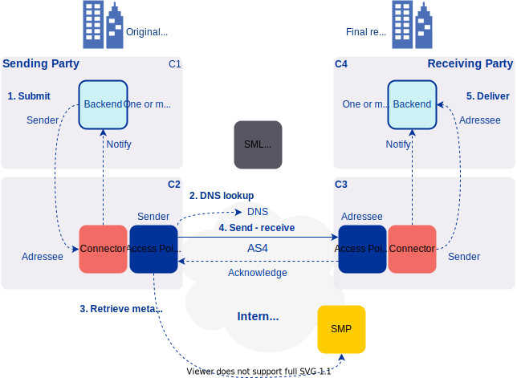

# Harmony eDelivery Access - Dynamic Discovery Configuration Guide <!-- omit in toc -->

Version: 1.0  
Doc. ID: UG-DDCG

---

## Version history <!-- omit in toc -->

 Date       | Version | Description                                                     | Author
 ---------- | ------- | --------------------------------------------------------------- | --------------------
 03.12.2021 | 1.0     | Initial version                                                 |
 
## License <!-- omit in toc -->

This document is licensed under the Creative Commons Attribution-ShareAlike 4.0 International License.
To view a copy of this license, visit <https://creativecommons.org/licenses/by-sa/4.0/>
 
## Table of Contents <!-- omit in toc -->

- [License](#license)
- [1 Introduction](#1-introduction)
  - [1.1 Target Audience](#11-target-audience)
  - [1.2 Terms and abbreviations](#12-terms-and-abbreviations)
  - [1.3 References](#13-references)
  - [1.4 Prerequisites](#14-prerequisites)
- [2. Dynamic Discovery for Sending Parties](#2-dynamic-discovery-for-sending-parties)
  - [2.1 Prerequisites](#21-prerequisites)
- [3. Dynamic Discovery for Receiving Parties](#3-dynamic-discovery-for-receiving-parties)
  - [3.1 Prerequisites](#31-prerequisites)
  - [3.2 Registering SMP in SML](#32-registering-smp-in-sml)
  - [3.3 Registering Final Recipient in SML](#33-registering-final-recipient-in-sml)
    - [3.3.1 Final Recipient in Access Point and AS4 Message](#331-final-recipient-in-access-point-and-as4-message)
  - [3.4 Registering Services in SMP](#34-registering-services-in-smp)
    - [3.4.1 Specifying Document Identifier Scheme and Document Identifier in AP PMode and AS4 Message](#341-specifying-document-identifier-scheme-and-document-identifier-in-ap-pmode-and-as4-message)
    - [3.4.2 Specifying Process Scheme and Process Identifier in AP PMode and in AS4 Message](#342-specifying-process-scheme-and-process-identifier-in-ap-pmode-and-in-as4-message)
 
## 1 Introduction

Harmony eDelivery Access supports static and dynamic discovery. This document describes configuration of participants and services for dynamic discovery. The configuration process differs between sending and receiving parties and therefore, this guide is divided in two different sections.

### 1.1 Target Audience

This guide describes the configuration steps that are required for enabling dynamic discovery on Harmony eDelivery Access Access Point and SMP.

The intended audience of this Dynamic Discovery Configuration Guide are Access Point and SMP system administrators responsible for configuring the Access Point and SMP software.

The document is intended for readers with a moderate knowledge of Linux server management, computer networks, and the eDelivery working principles.

### 1.2 Terms and abbreviations

The main terms used in this document are:

- SML - Service Metadata Locator, a component that manages DNS records for dynamic discovery;
- SMP - Service Metadata Provider, a component that provides a public API for service discovery that interested parties can use to access service metadata;
- AP - Access Point, a component that participants use to send and receive messages in an eDelivery network.

See eDelivery definitions documentation \[[TERMS](#Ref_TERMS)\].

### 1.3 References

1. \[TERMS\] CEF Definitions - eDelivery Definitions, <https://ec.europa.eu/cefdigital/wiki/display/CEFDIGITAL/CEF+Definitions#CEFDefinitions-eDeliveryDefinitions>
2. \[IG-AP\] Harmony eDelivery Access - Access Point Installation Guide. Document ID: [IG-AS](harmony-ap_installation_guide.md)
3. \[IG-SMP\] Harmony eDelivery Access - Service Metadata Publisher Installation Guide. Document ID: [IG-SMP](harmony-smp_installation_guide.md)

## 2. Dynamic Discovery for Sending Parties

### 2.1 Prerequisites

Before starting the dynamic discovery configuration process, please complete the Access Point installation according to the installation guide:

- Harmony eDelivery Access - Access Point Installation Guide \[[IG-AS](harmony-ap_installation_guide.md)\].

### 2.2 Configuring dynamic discovery in sender AP

Sender side parties (corners `C1` and `C2`) do not have to register themselves in SML or SMP. To use dynamic discovery
process sender AP has to configure its PMode. To use dynamic discovery `process` element in PMode must not contain `responderParties`
element. Correspondingly in the actual AS4 message sent `/UserMessage/PartyInfo/To` element must be empty.

## 3. Dynamic Discovery for Receiving Parties

### 3.1 Prerequisites

Before starting the dynamic discovery configuration process, please complete the Access Point and SMP installation according to the corresponding installation guide:

- Harmony eDelivery Access - Access Point Installation Guide \[[IG-AS](harmony-ap_installation_guide.md)\];
- Harmony eDelivery Access - Service Metadata Publisher Installation Guide \[[IG-SMP](harmony-smp_installation_guide.md)\].

### 3.2 Registering SMP in SML

First, the SMP server must be registered in SML. Please note that a single SMP instance can provide metadata for multiple SML domains. 

To register SMP to SML two certificates with private keys are needed and must be present in the SMP keystore (`/etc/harmony-smp/smp-keystore.jks`):

- Client certificate and private key for TLS connections to SML ("SML ClientCert" in the SMP UI)
- Metadata signing certificate and private key for signing service metadata ("Response signature Certificate" in the SMP UI)

Certificates used by SMP must be trusted by SML and Access Points using the SMP. More detailed certificate requirements depend on the eDelivery network. SMP keystore can be managed in the SMP admin UI by clicking the "Edit keystore" button under the "Domain" section.

An SMP server is registered in SML by completing the steps below:

- Log in to the SMP UI using a user with the `SYSTEM_ADMIN` role.
  - Only a user with the `SYSTEM_ADMIN` role can register, unregister and change the SMP registration.
- Open the "Domain" section.
- Click the "New" button and the "New Domain" dialog appears.
- Provide the following information:
  - Domain properties:
      - Domain Code
      - SML domain
      - Response signature Certificate (Signature CertAlias)
  - SML integration data:
    - SML SMP identifier
    - SML ClientCert Alias
      - SML clientCert Header is populated automatically once SML ClientCert Alias is selected.
- Click the "OK" button to close the "New Domain" dialog.
- Click the "Save" button to save the changes.
  - **Note:** Changes are not saved if the "Save" button is not clicked.
- Select the new domain and click the "Register" button to send a registration request to SML.

### 3.3 Registering Final Recipient in SML

Only the final recipient, corner `C4` in four corner topology, is registered in SML. In other words, the other parties - 
original sender (`C1`), initiator (`C2`) and responder (`C3`) - don't need to be registered in SML. Note that `C1` and
`C2`, as well as `C3` and `C4` can be the same organisation.

A final recipient is registered using its identifier. Allowed identifier types and values depend on the eDelivery 
network. Identifiers consist of identifier type and identifier value. These values may be represented as two separate 
fields or as a single field where type and value are concatenated.

In the SMP UI and documentation a final recipient is represented by "ServiceGroup". The final recipient is identified by the fields
"Participant identifier" and "Participant scheme".

A final recipient is registered in SML by completing the steps below:

- Log in to the SMP UI using a user with the `SMP_ADMIN` role.
  - Only a user with the `SMP_ADMIN` role can add, delete and modify final recipients.
- Open the "Edit" section.
- Click the "New" button and the "New ServiceGroup" dialog appears.
- Provide the following information:
  - Participant identifier
  - Participant scheme
    - Must start with `urn:oasis:names:tc:ebcore:partyid-type:(iso6523:|unregistered:)` OR must be up to 25 characters long with form `[domain]-[identifierArea]-[identifierType]` (e.g.: `busdox-actorid-upis`) and may only contain the following characters: [a-z0-9]. 
  - Owners
  - Domains
- Click the "OK" button to close the "New ServiceGroup" dialog.
- Click the "Save" button to save the changes.
  - **Note:** Changes are not saved if the "Save" button is not clicked.

#### 3.3.1 Final Recipient in Access Point and AS4 Message

In the Access Point (`C3`) configuration, the final recipient is represented as a plugin user. The recipient is 
identified by single field "Original user". This field must contain identifier type concatenated with identifier 
value, separated by `:`.

In AS4 messages the final recipient (and also original sender) can be represented in two ways:

- as a single identifier value, like in Access Point plugin user configuration;
- as a identifier value and corresponding type attribute.

Both these excerpts are valid and equal representations of the final recipient:

With type attribute:

    <Property name="finalRecipient" type="urn:oasis:names:tc:ebcore:partyid-type:iso6523:0088">8735822991022</Property>

As a single identifier value without type attribute:

    <Property name="finalRecipient">urn:oasis:names:tc:ebcore:partyid-type:iso6523:0088:8735822991022</Property>

### 3.4 Registering Services in SMP

Services provided by the final recipient are registered in SMP where interested parties can retrieve metadata about them.

A service is registered in SMP by completing the steps below:

- Log in to the SMP UI using a user with the `SMP_ADMIN` or `SERVICE_GROUP_ADMIN` (with permission to specific ServiceGroup) role.
  - Only a user with the `SMP_ADMIN` or `SERVICE_GROUP_ADMIN` (with permission to specific ServiceGroup) role can add, delete and modify services.
- Open the "Edit" section.
- On the row of the participant who owns the service, click the "Add service metadata" icon in the "Actions" column and the "New ServiceMetada" dialog appears.
- Click the "Metadata wizard" button and the "ServiceMetadaWizard" appears.
- Provide the following information:
  - Document identifier scheme
  - Document identifier
  - Process scheme
  - Process identifier
  - Transport profile
    - The default is `bdxr-transport-ebms3-as4-v1p0`
  - Endpoint URL
    - The URL of the Access Point (`C3`) where SOAP requests are sent, e.g., `https://<HOST>:8443/services/msh`.
  - Upload certificate
    - Certificate for encrypting messages. Note that this is the content encryption certificate of Access Point (`C3`), not the certificate of the final recipient.
  - Service description
  - Technical Contact URL
- Click the "OK" button to close the "ServiceMetadaWizard" dialog.
- Click the "OK" button to close the "New ServiceMetada" dialog.
- Click the "Save" button to save the changes.
  - **Note:** Changes are not saved if the "Save" button is not clicked.

### 3.5 Configuring dynamic discovery in sender AP

To use dynamic discovery process receiver AP has to configure its PMode. To use dynamic discovery `process` element in PMode must not contain `responderParties`
element. 

#### 3.5.1 Specifying Document Identifier Scheme and Document Identifier in AP PMode and AS4 Message

In PMode the following excerpt corresponds to document with scheme `docidscheme` and identifier `documentidvalue`:

		<actions>
			<action name="someAction" value="docidscheme::documentidvalue"/>
               
            ...

		</actions>

In AS4 message the same document type is referenced as:

        <CollaborationInfo>
            <Action>docidscheme::documentidvalue</Action>

            ...

        </CollaborationInfo>

#### 3.5.2 Specifying Process Scheme and Process Identifier in AP PMode and in AS4 Message

In PMODE the following excerpt corresponds to process with scheme `servicetype` and identifier `bdx:noprocess`:

        <services>
            <service name="someservicename" value="bdx:noprocess" type="servicetype"/>
        </services>

In AS4 message the same process is specified as:

        <CollaborationInfo>
            <Service type="servicetype">bdx:noprocess</Service>

             ...

        </CollaborationInfo>

