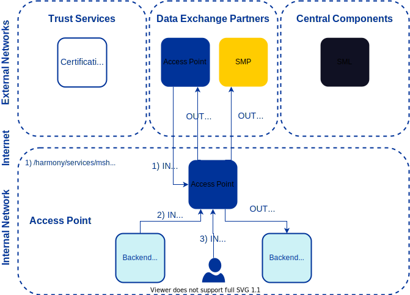

# Harmony eDelivery Access - Access Point Installation Guide <!-- omit in toc -->

Version: 1.00  
Doc. ID: IG-AP-D

---

## Version history <!-- omit in toc -->

Date       | Version | Description                                                  | Author
---------- |---------|--------------------------------------------------------------| --------------------
29.09.2023 | 1.0     | Initial version                                              | Jarkko Hyöty

## License <!-- omit in toc -->

This document is licensed under the Creative Commons Attribution-ShareAlike 4.0 International License.
To view a copy of this license, visit <https://creativecommons.org/licenses/by-sa/4.0/>

## Table of Contents <!-- omit in toc -->

<!-- vim-markdown-toc GFM -->

* [Introduction](#introduction)
  * [Target Audience](#target-audience)
  * [Terms and abbreviations](#terms-and-abbreviations)
  * [References](#references)
* [Network Diagram](#network-diagram)
* [Access Point setup](#access-point-setup)
  * [External MySQL 8 database setup](#external-mysql-8-database-setup)
  * [Configuration](#configuration)
    * [Volumes](#volumes)
    * [Advanced configuration](#advanced-configuration)
  * [Running the container](#running-the-container)
  * [Installing Custom Plugins](#installing-custom-plugins)
  * [Location of Configuration and Generated Passwords](#location-of-configuration-and-generated-passwords)
* [Logging](#logging)
* [Updating to a new version of the image](#updating-to-a-new-version-of-the-image)
* [Docker compose example](#docker-compose-example)

<!-- vim-markdown-toc -->

## Introduction

Harmony eDelivery Access Access Point is an AS4 Access Point for joining eDelivery policy domains. The Access Point is based on the Domibus open source project by the European Commission.

### Target Audience

This guide describes the how to configure and run a containerized version of the Harmony eDelivery Access Access Point.

The intended audience of this Installation Guide are Access Point system administrators responsible for installing and using the Access Point software.

The document is intended for readers with a moderate knowledge of Docker, computer networks, and the eDelivery working principles.

### Terms and abbreviations

See introduction to eDelivery and Harmony eDelivery Access \[[INTRODUCTION](#Ref_INTRODUCTION)\].

### References

1. <a id="Ref_INTRODUCTION" class="anchor"></a>\[INTRODUCTION\] Report: Introduction to eDelivery and Harmony eDelivery Access, <https://www.niis.org/niis-publications/2021/12/19/report-introduction-to-edelivery-and-harmony-edelivery-access>
2. <a id="Ref_DOMIBUS_ADMIN_GUIDE" class="anchor"></a>\[DOMIBUS_ADMIN_GUIDE\] Access Point Administration Guide - Domibus 5.1.0, <https://ec.europa.eu/digital-building-blocks/wikis/download/attachments/660440359/%28eDelivery%29%28AP%29%28AG%29%28Domibus%205.1%29%2819.6%29.pdf>
3. <a id="Ref_WS_PLUGIN" class="anchor"></a>\[WS_PLUGIN\] Access Point Interface Control Document - WS Plugin, <https://ec.europa.eu/digital-building-blocks/wikis/download/attachments/660440359/%28eDelivery%29%28AP%29%28ICD%29%28WS%20plugin%29%28Domibus%205.1%29%283.4%29.pdf>
4. <a id="Ref_PLUGIN_COOKBOOK" class="anchor"></a>\[PLUGIN_COOKBOOK\] Domibus Plugin Cookbook, <https://ec.europa.eu/digital-building-blocks/wikis/download/attachments/660440359/%28eDelivery%29%28AP%29%28Plugin-CB%29%28Domibus.5.1%29%286.4%29.pdf>
5. <a id="Ref_UG-DDCG" class="anchor"></a>\[UG-DDCG\] Harmony eDelivery Access - Dynamic Discovery Configuration Guide. Document ID: [UG-DDCG](dynamic_discovery_configuration_guide.md)
6. <a id="Ref_UG-SDCG" class="anchor"></a>\[UG-SDCG\] Harmony eDelivery Access - Static Discovery Configuration Guide. Document ID: [UG-SDCG](static_discovery_configuration_guide.md)
7. <a id="Ref_RFC5280" class="anchor"></a>\[RFC5280\] RFC 5280: Internet X.509 Public Key Infrastructure Certificate and Certificate Revocation List (CRL) Profile, <https://www.rfc-editor.org/rfc/rfc5280>
8. <a id="Ref_PS" class="anchor"></a>\[PS\] PrintableString, <https://en.wikipedia.org/wiki/PrintableString>

## Network Diagram

The network diagram below provides an example of an Access Point setup when dynamic discovery is used.



The table below lists the required connections between different components.

**Connection Type** | **Source** | **Target** | **Target Ports** | **Protocol** | **Note** |
-----------|------------|-----------|-----------|-----------|-----------|
Out | Access Point | Data Exchange Partner Access Point | 443, 8443, other | tcp | |
Out | Access Point | SMP | 443, 8443, other | tcp | |
Out | Access Point | Backend (push) | 80, 443, other | tcp | Target in the internal network |
In  | Data Exchange Partner Access Point | Access Point | 8443\* | tcp | URL path: `/services/msh` |
In  | Backend (submit, pull) | Access Point | 8443\* | tcp | Source in the internal network<br /><br />URL path: `/services/backend` |
In  | Admin | Access Point | 8443\* | tcp | Source in the internal network<br /><br />URL path: `/` |

\* The container listens on port 8443 (https), which needs to be exposed to a suitable port on the host.

It is strongly recommended to protect the Access Point from unwanted access using a firewall (hardware or software based). The firewall can be applied to both incoming and outgoing connections depending on the security requirements of the environment where the Access Point is deployed. It is recommended to allow incoming traffic to specific ports only from explicitly defined sources using IP filtering. **Special attention should be paid with the firewall configuration since incorrect configuration may leave the Access Point vulnerable to exploits and attacks.**

In addition, it's strongly recommended to use URL path filtering for the Access Point since the admin UI, backend interface and AS4 interface all run on the same port.

| **URL Path** | **Description** |
|--------------|-----------------|
| `/`          | Admin UI for managing the Access Point. |
| `/services/backend` |  Webservice interface (submit requests, pull messages) between the Access Point and backend. |
| `/services/msh` | AS4 interface between Access Points. |

## Access Point setup

### External MySQL 8 database setup

The Access Point container requires an external database.

Note. It is necessary to [populate MySQL time zone information tables](https://dev.mysql.com/doc/refman/8.0/en/time-zone-support.html#time-zone-installation), e.g. using the following command as root on the external database host:

```bash
mysql_tzinfo_to_sql /usr/share/zoneinfo/posix | mysql -u root mysql
```

The Harmony schema and user can be created using the following SQL DDL statements (adjust user and schema name as needed; the default _harmony_ap_ is used in the example):

```sql
-- mysql
create schema if not exists harmony_ap;
alter schema harmony_ap charset=utf8mb4 collate=utf8mb4_bin;
create user if not exists harmony_ap@'%';
alter user harmony_ap@'%' identified by '<password>';
grant all on harmony_ap.* to harmony_ap@'%';
```

See also the [Docker compose example](#docker-compose-example) for using a MySQL container as a database.

### Configuration

The Access Point image supports the following configuration parameters that can be supplied via environment variables and/or a configuration file mapped into the container. If both are used, environment variables take precedence.

See the Static Discovery Configuration Guide \[[UG-SDCG](static_discovery_configuration_guide.md)\] and the Dynamic Discovery Configuration Guide \[[UG-DDCG](dynamic_discovery_configuration_guide.md)\] for more information about how to configure different discovery options.

  | Parameter                      | Default    | Notes
  |--------------------------------|------------|--------------
  | DB_HOST                        | *required* | Database host name
  | DB_PORT                        | 3306       | Database port
  | DB_SCHEMA                      | harmony_ap | Database schema
  | DB_USER                        | harmony_ap | Database user
  | DB_PASSWORD                    | *required* | Database password
  | MAX_MEM                        | 512m       | Maximum (Java) heap for the application
  | PARTY_NAME\*                   | selfsigned | Party name of the Access Point owner organisation
  | SERVER_FQDN\*                  | *hostname* | Fully qualified domain name for the TLS certificate.
  | SERVER_DN\*                    | CN=*SERVER_FQDN* | TLS certificate subject DN. If omitted, derived from the FQDN.
  | SERVER_SAN\*                   | DNS:*SERVER_FQDN*| TLS certificate subject alternative name. If omitted, derived from the FQDN.
  | SECURITY_DN\*                  | CN=*PARTY_NAME* | Security (sign/encrypt) certificate subject DN. If omitted, derived from the party name.
  | SECURITY_KEYSTORE_PASSWORD\*   | *random*   | Access Point keystore password \*\*
  | SECURITY_TRUSTSTORE_PASSWORD\* | *random*   | Access Point truststore password \*\*
  | TLS_KEYSTORE_PASSWORD\*        | *random*   | TLS keystore password \*\*
  | TLS_TRUSTSTORE_PASSWORD\*      | *random*   | TLS truststore password \*\*
  | USE_DYNAMIC_DISCOVERY\*        | false      | Is dynamic discovery in use
  | SML_ZONE\*                     | *n/a*      | SML zone that you want to use; if unsure, please contact the domain authority of the policy
  | ADMIN_USER\*                   | harmony    | Initial admin user for admin UI
  | ADMIN_PASSWORD\*               | *random*   | Initial admin user password
  | HARMONY_PARAM_FILE             | *n/a*      | Path to (mapped) parameter file

\* Can be only set once when starting a container with empty configuration.
\*\* Use only [printable ASCII](https://en.wikipedia.org/wiki/ASCII#Printable_characters) characters in keystore passwords.

The above configuration parameters can also be passed via a configuration file mapped in the container. The location of the file inside the container is defined using the HARMONY_PARAM_FILE environment variable. For example:
```
# harmony.properties
DB_HOST=harmony-db
DB_PASSWORD=pass"word
ADMIN_PASSWORD=Secret#!
```
The values are _literal_ (except leading or trailing spaces are trimmed). A line feed (LF) separates the lines and is not part of the value. Empty lines and lines starting with `#` are ignored.

Using a parameter file:
```bash
docker run --rm -it \
  -e HARMONY_PARAM_FILE=/run/harmony.properties \
  -v /path/to/harmony.properties:/run/harmony.properties \
  -v harmony-ap-data:/var/opt/harmony-ap \
  niis/harmony-ap:2.1.0
```

#### Volumes

For persisting Access Point runtime state (including e.g. the various keystores),
one should map a volume over `/var/opt/harmony-ap`.

#### Advanced configuration

Issue the following command to initialize the Access Point configuration without starting the application and then modify the stored configuration as needed, for example:

```bash
docker run --rm -it  \
  -e DB_HOST=<db host> \
  -e DB_PASSWORD=<db password> \
  -e ADMIN_PASSWORD=<admin password> \
  -v harmony-ap-data:/var/opt/harmony-ap \
  niis/harmony-ap:2.1.0 init
```

```bash
docker run --rm -it \
  -v harmony-ap-data:/var/opt/harmony-ap \
  niis/harmony-ap:2.1.0 bash
```

### Running the container

Minimal example providing only the required parameters (the database must be available). The Access Point listens on port 8443 (HTTPS), which should be forwarded to a suitable host port.

```bash
docker run --name harmony-ap -d \
  -e DB_HOST=<db host> \
  -e DB_PASSWORD=<db password> \
  -e ADMIN_PASSWORD=<admin password> \
  -v harmony-ap-data:/var/opt/harmony-ap \
  -p 8443:8443 \
  niis/harmony-ap:2.1.0
```

### Installing Custom Plugins

The Access Point comes with one default plugin - the Web Service (WS) Plugin. See the WS Plugin documentation \[[WS_PLUGIN](#Ref_WS_PLUGIN)\] for more details.

Additional plugins can be added by customizing the Harmony Access Point docker image.

See the [Docker documentation](https://docs.docker.com/build/building/packaging/) for more information about creating Docker images and the Domibus Plugin Cookbook \[[PLUGIN_COOKBOOK](#Ref_PLUGIN_COOKBOOK)\] for more information on developing custom plugins.

Example `Dockerfile`:
```Dockerfile
FROM niis/harmony-ap:2.1.0

# additional plugins
COPY custom-plugin.jar  /opt/harmony-ap/plugins/lib
COPY custom-plugin.conf /opt/harmony-ap/plugins/config
```

### Location of Configuration and Generated Passwords

Access Point configuration files are located below the `/var/opt/harmony-ap` directory. See the Domibus Administration Guide \[[DOMIBUS_ADMIN_GUIDE](#Ref_DOMIBUS_ADMIN_GUIDE)\] for more details.

## Logging

The Access Point application logs to the standard output.

```bash
docker logs -f <container-name>
```

## Updating to a new version of the image

Stop the old container and run a new container from the new image, attaching the data volume(s)
from the old container.

For example, assuming the container name is `harmony-ap`:
```bash
docker stop harmony-ap
docker rename harmony-ap harmony-ap-old
docker run -d \
  --name harmony-ap \
  --volumes-from harmony-ap-old \
  -p 8443:8443 \
  niis/harmony-ap:<new_version>
docker rm harmony-ap-old
```

## Docker compose example

The following example defines an Access Point and a database using [Docker compose](https://docs.docker.com/compose/gettingstarted/):

```yaml
# Example harmony-ap compose file
services:
  harmony-ap:
    image: niis/harmony-ap:2.2.0
    depends_on:
      - harmony-db
    environment:
      - DB_HOST=harmony-db
      - DB_SCHEMA=harmony_ap
      - DB_PASSWORD=dbpassword
      - ADMIN_PASSWORD=Secret
      - USE_DYNAMIC_DISCOVERY=false
      - PARTY_NAME=org1_gw
      - SERVER_FQDN=harmony-ap
    volumes:
      - ap_data:/var/opt/harmony-ap
    ports:
      - "8443:8443"
    restart: on-failure
    mem_limit: 1500m
  harmony-db:
    image: mysql:8
    environment:
      - MYSQL_ROOT_PASSWORD=root_password
      - MYSQL_DATABASE=harmony_ap
      - MYSQL_USER=harmony_ap
      - MYSQL_PASSWORD=dbpassword
    command:
      - "--character-set-server=utf8mb4"
      - "--collation-server=utf8mb4_bin"
    volumes:
      - db_data:/var/lib/mysql
    restart: on-failure
    mem_limit: 512m
volumes:
  ap_data:
  db_data:
```
