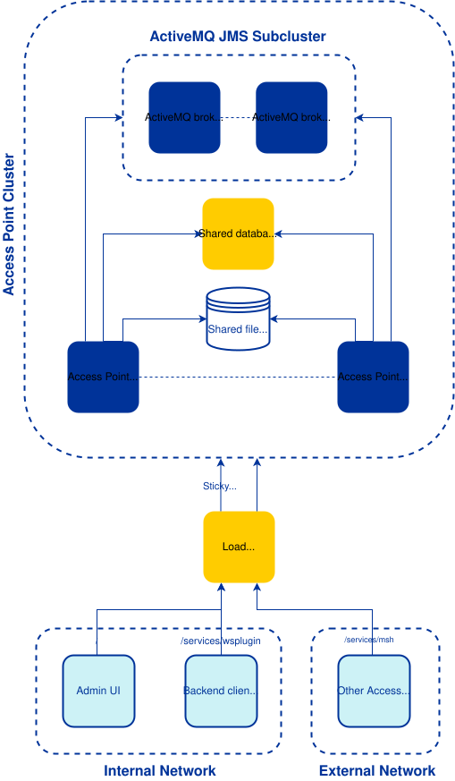

# Harmony eDelivery Access - Access Point Docker Installation Guide

Version: 2.0  
Doc. ID: IG-AP-D

---

## Version history

| Date       | Version | Description                                               | Author           |
|------------|---------|-----------------------------------------------------------|------------------|
| 29.09.2023 | 1.0     | Initial version                                           | Jarkko Hyöty     |
| 15.01.2024 | 1.1     | Update document title and links to external documents     | Petteri Kivimäki |
| 05.03.2024 | 1.2     | Added documentation for clustered environments            | Diego Martin     |
| 07.05.2024 | 1.3     | Added information about distributed file systems          | Diego Martin     |
| 09.05.2024 | 1.4     | Added instructions to use external load balancers         | Diego Martin     |
| 01.06.2024 | 1.5     | Update links to external documents                        | Petteri Kivimäki |
| 13.12.2024 | 1.6     | Add reference to the Logging Guide \[UG-AP-L\]            | Diego Martin     |
| 13.01.2025 | 1.7     | Update links to external documents                        | Diego Martin     |
| 23.07.2025 | 2.0     | Rewrite documentation to cover the new options introduced | Diego Martin     |

## License

This document is licensed under the Creative Commons Attribution-ShareAlike 4.0 International License.
To view a copy of this license, visit <https://creativecommons.org/licenses/by-sa/4.0/>

## Table of Contents

1. [Introduction](#1-introduction)  
  1.1 [Target Audience](#11-target-audience)  
  1.2 [Scope and Relation to Other Harmony Components](#12-scope-and-relation-to-other-harmony-components)  
  1.3 [Terms and abbreviations](#13-terms-and-abbreviations)  
  1.4 [References](#14-references)  
  1.5 [Environment Overview and Prerequisites](#15-environment-overview-and-prerequisites)  
    1.5.1 [System Requirements](#151-system-requirements)  
    1.5.2 [Database Prerequisites](#152-database-prerequisites)  
    1.5.3 [Docker and Host Setup](#153-docker-and-host-setup)
2. [Quick Start](#2-quick-start)  
  2.1 [Minimal Docker Run Command](#21-minimal-docker-run-command)  
  2.2 [What Happens on First Run](#22-what-happens-on-first-run)  
  2.3 [Accessing the Admin UI](#23-accessing-the-admin-ui)  
  2.4 [Explanation of Defaults and Next Steps](#24-explanation-of-defaults-and-next-steps)
3. [Data Persistence](#3-data-persistence)  
  3.1 [Why Persistence is Needed](#31-why-persistence-is-needed)  
  3.2 [Using Volumes for Persistence (Standalone Mode)](#32-using-volumes-for-persistence-standalone-mode)  
  3.3 [File Permissions and User Considerations](#33-file-permissions-and-user-considerations)  
  3.4 [Persistence in Cluster Mode](#34-persistence-in-cluster-mode)
4. [Configuration Overview](#4-configuration-overview)  
  4.1 [Configuration Methods: Environment Variables vs. Parameter file](#41-configuration-methods-environment-variables-vs-parameter-file)  
  4.2 [Common Configuration Parameters](#42-common-configuration-parameters)  
  4.3 [Directory Layout and Notable Files](#43-directory-layout-and-notable-files)
5. [Clustering and High Availability](#5-clustering-and-high-availability)  
  5.1 [Conceptual Overview](#51-conceptual-overview)  
  5.2 [Required Configuration for Clustering](#52-required-configuration-for-clustering)
6. [Message Broker Setup](#6-message-broker-setup)  
  6.1 [Embedded ActiveMQ (Default)](#61-embedded-activemq-default)  
  6.2 [External ActiveMQ (Connecting to a Broker Service)](#62-external-activemq-connecting-to-a-broker-service)  
  6.3 [Configuration Examples](#63-configuration-examples)  
  6.4 [Broker Security and Networking](#64-broker-security-and-networking)
7. [TLS and Certificates](#7-tls-and-certificates)  
  7.1 [Certificate Types in Harmony Access Point](#71-certificate-types-in-harmony-access-point)  
  7.2 [Providing and Replacing Certificates](#72-providing-and-replacing-certificates)  
  7.3 [Certificate Trust and Exchange](#73-certificate-trust-and-exchange)  
  7.4 [Managing Certificates in a Cluster](#74-managing-certificates-in-a-cluster)  
  7.5 [Summary of Certificate Management Best Practices](#75-summary-of-certificate-management-best-practices)
8. [Load Balancing and Proxy](#8-load-balancing-and-proxy)  
  8.1 [Sticky Sessions](#81-sticky-sessions)  
  8.2 [TLS Termination Options](#82-tls-termination-options)  
  8.3 [Load Balancer Configuration Tips](#83-load-balancer-configuration-tips)  
  8.4 [High Availability of the Load Balancer](#84-high-availability-of-the-load-balancer)  
  8.5 [Deployment Patterns](#85-deployment-patterns)
9. [Network Diagram](#9-network-diagram)  
  9.1 [Firewall and Security Recommendations](#91-firewall-and-security-recommendations)
10. [Logging and Log Management](#10-logging-and-log-management)  
  10.1 [Container vs Application Logs](#101-container-vs-application-logs)  
  10.2 [Accessing and Managing Logs](#102-accessing-and-managing-logs)  
  10.3 [Adjusting Log Levels and Configuration](#103-adjusting-log-levels-and-configuration)  
  10.4 [Difference Between Docker Logs and File Logs](#104-difference-between-docker-logs-and-file-logs)  
  10.5 [Integrating with Central Log Management](#105-integrating-with-central-log-management)  
  10.6 [Example Log Snippet Explained](#106-example-log-snippet-explained)  
  10.7 [Additional Logging Resources](#107-additional-logging-resources)
11. [Advanced Customization](#11-advanced-customization)  
  11.1 [Adding Plugins](#111-adding-plugins)  
  11.2 [Setting Java Memory and JVM Options](#112-setting-java-memory-and-jvm-options)  
  11.3 [Managing PMode configuration](#113-managing-pmode-configuration)  
  11.4 [Running the container in init mode](#114-running-the-container-in-init-mode)  
  11.5 [Recap of Customization Best Practices](#115-recap-of-customization-best-practices)
12. [Updating the Container](#12-updating-the-container)  
  12.1 [Preparation and Release Notes](#121-preparation-and-release-notes)  
  12.2 [Upgrade Procedure](#122-upgrade-procedure)  
  12.3 [Post-Upgrade](#123-post-upgrade)  
  12.4 [Cleaning Up After Upgrade](#124-cleaning-up-after-upgrade)  
  12.5 [Troubleshooting Upgrades](#125-troubleshooting-upgrades)
13. [Appendix](#13-appendix)  
  13.1 [Environment Variable Reference](#131-environment-variable-reference)  
  13.2 [Examples](#132-examples)  
  13.3 [Debugging and Logging Tips](#133-debugging-and-logging-tips)  
  13.4 [Common Issues and Troubleshooting](#134-common-issues-and-troubleshooting)

## 1 Introduction

**Harmony eDelivery Access Access Point** is an open-source solution for secure message exchange, used to connect organizations to eDelivery networks in compliance with the CEF eDelivery AS4 profile. It is based on the European Commission's Domibus project.

### 1.1 Target Audience

This documentation is written for technical users (system administrators, DevOps, and engineers) who have experience with Docker containers and basic network/system administration. Familiarity with eDelivery concepts (AS4 messaging, access points, and related components like Service Metadata Publishers) is helpful but not strictly required.

We assume readers know how to run Docker commands, manage volumes, and configure network ports.

### 1.2 Scope and Relation to Other Harmony Components

This guide specifically covers the **Harmony eDelivery Access Access Point** container, including how to install, configure, and operate it in Docker. The Harmony Access Point (AP) is the messaging server that sends and receives AS4 messages on behalf of an organization. It often works alongside other components such as **Harmony SMP** (Service Metadata Publisher), which publishes participant data (for dynamic discovery of recipients).

While AP is responsible for the secure exchange of payloads, SMP handles lookup of endpoints.

This document will focus on the Access Point container only, touching on its integration points (e.g., database, certificates) but not covering SMP deployment. The guide will clarify how Access Point fits into the overall eDelivery ecosystem and how it can be scaled or clustered in conjunction with supporting services.

### 1.3 Terms and abbreviations

See introduction to eDelivery and Harmony eDelivery Access \[[INTRODUCTION](#Ref_INTRODUCTION)\].

### 1.4 References

1. <a id="Ref_INTRODUCTION" class="anchor"></a>\[INTRODUCTION\] Report: Introduction to eDelivery and Harmony eDelivery Access, <https://www.niis.org/niis-publications/2021/12/19/report-introduction-to-edelivery-and-harmony-edelivery-access>
2. <a id="Ref_UG-DDCG" class="anchor"></a>\[UG-DDCG\] Harmony eDelivery Access - Dynamic Discovery Configuration Guide. Document ID: [UG-DDCG](dynamic_discovery_configuration_guide.md)
3. <a id="Ref_UG-AP-L" class="anchor"></a>\[UG-AP-L\] Harmony eDelivery Access - Access Point Logging Guide. Document ID: [UG-AP-L](harmony-ap_logging_user_guide.md)

### 1.5 Environment Overview and Prerequisites

Before running the Harmony Access Point in Docker, ensure your environment meets the prerequisites and that you understand the basic architecture.

**Supported Platforms:** The official Harmony Access Point Docker image is a Linux-based container. You can run it on any host OS that supports Docker. For development, Docker Desktop on any OS can be used, but production deployments typically use a Linux server or Kubernetes cluster.

#### 1.5.1 System Requirements

- **Docker Engine:** Install Docker (Engine or Docker CE) on the host, version 20.10 or later is recommended. Ensure you can run containers and have enough permissions (if on Linux, run as a user in the docker group). If you already have Docker installed, you can check your version with `docker --version`.
- **CPU Architecture:** The image supports both x86_64 and ARM64 architectures, so you can run it on standard servers or ARM-based machines (like AWS Graviton or Raspberry Pi) if needed.
- **Memory and CPU:** Access Point is a Java application (running on Tomcat). Allocate sufficient memory, and adjust related settings for production depending on load (the Java heap can be tuned as discussed later). CPU requirements are modest for light loads but scale with message throughput and any cryptographic operations.
- **Operating System:** Any OS that runs Docker. Linux hosts are recommended. The container image is based on a Linux distribution (Ubuntu 24.04) and does not require a specific host OS beyond Docker. If using a Linux host, ensure a 64-bit kernel and a file system that supports needed features for Docker volumes. If on Windows/Mac, use Docker's virtualization (WSL2, Hyper-V, etc.).
- **Network and Ports:** By default Access Point runs its web service over HTTPS on port **8443**. Ensure this port (or the host port you map it to) is open in your firewall for inbound connections from other eDelivery participants or users. If you plan to use the admin UI or receive messages, you'll typically expose 8443. If clustering, also ensure any additional ports for internode communication are open (for example, external load balancer's health checks, more on this in clustering section). Additionally, the MySQL database port (3306 by default) must be reachable from the container.

#### 1.5.2 Database Prerequisites

Harmony Access Point requires an SQL database for its metadata and message state. **MySQL 8.x** is the officially supported database engine. Before launching the container, set up a MySQL 8 database with the following:

- **MySQL Server 8:** Install MySQL 8 on a server accessible to the container. Ensure the server is configured to accept connections from the Docker host or network (e.g., not bound to localhost only).
- **Database Schema:** Create a database (schema) for Access Point. By default, the software expects a schema named `harmony_ap` (this can be changed if needed). You can create it manually or via environment variables in a Docker container as shown later in the examples. Make sure the schema's character set is UTF8 (`utf8mb4`) and collation `utf8mb4_bin`.
- **Database User:** Create a dedicated MySQL user for Access Point and grant it privileges on Access Point's schema. Using a strong password is recommended. By default, if you do not specify a DB user in configuration, the container will use `harmony_ap`, but you can change this via environment variables.
- **Time Zone Configuration:** It is required to [load time zone information into MySQL](https://dev.mysql.com/doc/refman/8.0/en/time-zone-support.html#time-zone-installation), as Access Point use time zone data for timestamp handling. On the MySQL server host, populate the time zone tables by running `mysql_tzinfo_to_sql` against the system zoneinfo database and loading it into MySQL. For example on Linux:
   ```bash
   mysql_tzinfo_to_sql /usr/share/zoneinfo | mysql -u root -p mysql
   ```
  This ensures MySQL knows about time zones. Also, it's recommended to set MySQL's server time zone to UTC.
- **Database Privileges:** The DB user should have privileges to create/alter/drop tables, indices, and perform CRUD operations. If upgrading from older versions or performing certain operations, additional privileges might be needed, but those should be revoked after.

#### 1.5.3 Docker and Host Setup

- **Docker Volumes:** Decide how you will manage persistent data (explained in detail in the Data Persistence section). A Docker named volume or a host directory with proper permissions to mount into the container at runtime might be needed. This is where Access Point will store its configuration and other runtime data.
- **Host Time:** It's recommended to synchronize your host system time via NTP or another time service. Accurate time is important for certificate validity and message timestamp checks. The container will use the host kernel's time.
- **Environment Configuration:** Identify the environment variable values you will use for configuration (database host, passwords, etc.). Having those ready (or stored in a `.env` file or Docker Compose file) will simplify the quick start.

## 2 Quick Start

This section provides a rapid introduction to running the Harmony Access Point in a Docker container with a minimal configuration. We will run a single Access Point instance connected to a MySQL database and verify that it starts up correctly, then access the web interface.

### 2.1 Minimal Docker Run Command

To start Access Point quickly, you can use a single `docker run` command. For example:

```bash
docker run -d --name harmony-ap \
  -p 8443:8443 \
  -v harmony-ap-data:/var/opt/harmony-ap \
  -e DB_HOST=db.example.com \
  -e DB_PASSWORD=<YourDBPassword> \
  -e ADMIN_PASSWORD=<YourAdminPassword> \
  niis/harmony-ap:<version>
```

Let's break down this command:

- **-d:** Runs the container in detached mode (in the background). This means the container will run without blocking your terminal, and you will need to use `docker logs` to see output. This flag is optional for the quick start.
- **--name harmony-ap:** Assigns a recognizable name to the container (optional but helps with management).
- **-p 8443:8443:** Publishes the container's HTTPS port to the host. In this case, we expose port 8443 on the host and forward it to port 8443 in the container. Access Point listens on 8443 for HTTPS by default. After starting, the service will be accessible at `https://<YourHost>:8443/`.
  - _Note:_ If you want the service on the standard HTTPS port 443, you can map `-p 443:8443`. This requires running Docker with a user with appropriate privileges. Alternatively, you can configure AP to listen on 443 internally, see the Appendix or how-to guides for changing ports.
- **-v harmony-ap-data:/var/opt/harmony-ap:** Mounts a Docker named volume called "harmony-ap-data" to the container's data directory. The path `/var/opt/harmony-ap` is where Access Point stores its configuration, keystores, and other mutable state inside the container by default. Using a volume ensures this data persists across container restarts or upgrades. You can substitute a host directory, e.g. `-v /path/on/host:/var/opt/harmony-ap`, but ensure permissions as described in the persistence section.
- **Database connection settings (-e DB_...):** These environment variables tell Access Point how to connect to MySQL. There are other variables you can set, like `DB_PORT`, `DB_SCHEMA`, or `DB_USER`, but we will use their default values. These are the minimum required for a quick start:
  - **DB_HOST:** The hostname or IP address of your MySQL server (in this example, `db.example.com`; for local testing it might be `localhost`).
  - **DB_PASSWORD:** The password for the database user. Replace `<YourDBPassword>` with the actual password or use an environment file to avoid putting secrets in the command line.
- **-e ADMIN_PASSWORD=...:** The initial password for the admin user. Replace `<YourAdminPassword>` with a strong password of your choice. This is the password you will use to log into Access Point's web interface. This is optional; if not set, Access Point will generate a random password on first run and log it to the console, but we set it here for convenience.
- **Image name niis/harmony-ap:<version>:** Specifies the Harmony Access Point Docker image from Docker Hub. Here we use the placeholder `<version>` tag for simplicity, but you should replace it with the actual version you want to run (e.g., `niis/harmony-ap:2.6.0`).

After running this command, Docker will download the image (if not already present) and start the container. You can verify it's running with `docker ps` (it should show a container named _harmony-ap_ up and listening on 8443).

If you prefer to use Docker Compose for easier management, here's a minimal `docker-compose.yml` example deploying a single Access Point instance and a MySQL database:

```yaml
services:
  harmony-ap:
    image: niis/harmony-ap:2.6.0
    ports:
      - "8443:8443"
    environment:
      - DB_HOST=harmony-db
      - DB_PASSWORD=changeme
      - DB_PASSWORD=<YourDBPassword> \
      - ADMIN_PASSWORD=<YourAdminPassword> \
    restart: unless-stopped
    volumes:
      - harmony-ap-data:/var/opt/harmony-ap

  harmony-db:
    image: mysql:8
    command:
      - "--character-set-server=utf8mb4"
      - "--collation-server=utf8mb4_bin"
    ports:
      - "3306:3306"
    environment:
      - MYSQL_RANDOM_ROOT_PASSWORD=true
      - MYSQL_DATABASE=harmony_ap
      - MYSQL_USER=harmony_ap
      - MYSQL_PASSWORD=changeme
    restart: on-failure
    volumes:
      - harmony-db-data:/var/lib/mysql

volumes:
  harmony-ap-data:
  harmony-db-data:
```

### 2.2 What Happens on First Run

On the first startup, the container will perform an initialization sequence:

- If the mounted volume is empty (first run), Access Point will generate default configuration files and security materials. This includes generating **self-signed certificates** for TLS and for message signing/encryption. It's possible to provide your own certificates, as explained later in the TLS and Certificates section. These are placed in the `/var/opt/harmony-ap/etc` directory (symlinked from `/etc/harmony-ap` inside the container). The self-signed certificate allows the service to run immediately with TLS and secure messaging capabilities, though it will not be trusted by clients until you replace it with a CA-signed cert (see TLS and Certificates section).
- The container will connect to MySQL using the provided environment variables. If the database schema is empty (first time setup), it will create the necessary tables and initial data. This includes default settings and an **administrator user account** for the admin UI.
- **Admin Credentials:** The admin account (used to log into Access Point's web interface) is created at first startup. The username is "harmony" by default (unless changed in configuration). For the initial password, if you did not specify one via environment, the system will generate a random password and log it. In that case, check the container logs for a message on first startup that displays the generated admin password. For security, as the password was logged to the console, you should change it via the admin UI. As a best practice, consider setting a strong password via the `ADMIN_PASSWORD` environment variable on first run so you know the credential upfront (the container will then use that instead of generating one, and it will not be logged).
- Once initialization is complete, Access Point will deploy its web application and start listening on port 8443. At this point, the container should be "Up" and healthy.

You can inspect the container logs with: `docker logs -f harmony-ap`. You should see messages indicating successful startup, database connection, etc. For instance, look for log lines about certificates creation and a final log indicating that the web application started successfully (e.g., a log saying the Tomcat server is started and listening).

### 2.3 Accessing the Admin UI

After the container is up, test access to the Harmony Access Point's web interface:

1. Open a web browser and navigate to `https://<HostIP>:8443/`. If you're on the same machine, you can use `https://localhost:8443/`. You should see the Harmony Access Point login page. (You may get a browser warning about the TLS certificate because it's self-signed by default; it's okay to proceed or add an exception for now in a test environment.)
2. Log in with the admin credentials. The default username is **harmony**. The password is whatever was set or generated in the initialization step:
   - If you used `-e ADMIN_PASSWORD=...` in the run command, use that password.
   - Otherwise, use the generated password (see the logs as noted above).
3. Upon first login, you will have access to the Admin Console UI. It's recommended to navigate to the User/Password section and change the admin password if it was auto-generated for security.

The admin UI allows you to configure Access Point (PMode configurations, certificate trusts, monitoring queues, etc.). However, many configurations can also be done by editing config files or using environment variables, as we'll cover.

### 2.4 Explanation of Defaults and Next Steps

By using the quick start above, you have a running Access Point with minimal configuration. It's using:

- **Self-signed TLS certificate:** Suitable for testing, but in production you will replace this with a certificate from a trusted CA (see TLS and Certificates).
- **Embedded default settings:** The container comes with embedded default configurations (such as a default logging configuration, default Tomcat configuration, etc.). These allow it to function out-of-the-box in a basic way. The quick setup doesn't include a PMode definition, so you will likely need to upload or configure your specific PMode (partnership agreements) via the UI or environment variables, and adjust other settings for your domain. The defaults are primarily for initial setup.
- **Internal ActiveMQ broker (embedded):** Access Point includes an internal JMS broker (Apache ActiveMQ) for handling message queues. By default, this broker runs in the same container using an embedded configuration. We will discuss how to customize or externalize this in the Message Broker Setup section.
- **Single-node deployment:** The quick start covers a standalone instance. If this node goes down, service is unavailable. For high availability, you can run multiple instances in a cluster with a shared database (and possibly shared storage), which we will cover in Clustering and High Availability.

At this point, you have a functional Access Point container. Next, we'll delve into how to persist its data and configure it in more detail, so that your setup is robust and tailored to your needs.

## 3 Data Persistence

Running Access Point in Docker requires careful handling of persistent data. Access Point stores essential data on the filesystem, for example, configuration files, security keys, logs, and (depending on configuration) message payloads or JMS data. If you run a container without preserving these, you would lose important data each time the container is removed or recreated. This section explains how and what to persist, and the options for doing so.

### 3.1 Why Persistence is Needed

Docker containers are ephemeral by default; any changes to the container's filesystem are lost when the container is stopped. The Harmony Access Point, however, is a stateful application:

- **Configuration files:** These include `domibus.properties` (the main configuration), XML files for plugins, keystore files for certificates (TLS and signing keys), truststore files, and Tomcat configuration (`server.xml`). These are generated or populated on first startup in the container's `/var/opt/harmony-ap/etc` directory.
-	**Security material:** The private keys and certificates are stored in keystore files on disk (e.g., `tls-keystore.p12`, `ap-keystore.p12`, and their corresponding truststores). Losing these would invalidate your node's identity and ability to decrypt messages.
-	**Message payloads and working files:** Harmony AP may store incoming message attachments (database only by default) or certain working data on disk (especially if not configured to use database storage for large objects). As message attachments could be written under the data directory if enabled, if those files disappear, you might lose the ability to resend or recover messages.
-	**JMS data (ActiveMQ):** The embedded ActiveMQ broker uses a file-based storage (KahaDB) to persist messages and transactions. This by default resides on the container's filesystem under the `/var/opt/harmony-ap/work` directory. If not persisted, a container restart could wipe in-transit messages or subscription info. Persisting the JMS store is important for reliability, particularly in production.

In summary, without using volumes, each restart would act like a fresh installation: new keys, empty config, etc., which is not acceptable in production. Therefore, **using Docker volumes or bind mounts for `/var/opt/harmony-ap` or configuring the container to use the database for persistence is essential for a stable deployment**. This ensures that all configuration, security material, and message state are retained across container restarts or upgrades.

### 3.2 Using Volumes for Persistence (Standalone Mode)

For a single-instance deployment, you can use either:

- **A Docker named volume** (as in the quick start example, "harmony-ap-data").
- **A bind mount to a host directory** (e.g., a path on the host filesystem).

**Docker Named Volume (Recommended for Simplicity):** This is a volume managed by Docker. If you ran the quick start command with `-v harmony-ap-data:/var/opt/harmony-ap`, Docker created a volume named harmony-ap-data. All the state (configs, keystores, etc.) is now stored there. You can list volumes with `docker volume ls` and examine it with `docker volume inspect harmony-ap-data`. The advantage of a named volume is Docker will maintain it even if the container is removed. On container upgrades, you simply attach the same volume to the new container, and all prior state is present.

**Host Directory Mount:** Alternatively, you might want the files directly accessible on the host (for backup or editing). In that case, create a directory on the host (e.g., `/srv/harmony-ap`) and mount it: `-v /srv/harmony-ap:/var/opt/harmony-ap`. Ensure that this directory has correct ownership and permissions as covered in the File Permissions and User Considerations section below. The container will write its configuration and data files there, and you can inspect or modify them directly on the host.

**Verifying Persistence:** After first run, if you inspect the volume or directory, you should see a structure like:

```
/srv/harmony-ap (or in volume)
├── conf
│   ├── server.xml (Tomcat configuration)
│   ├── web.xml (web application configuration)
│   └── ... (other config files)
├── etc
│   ├── domibus.properties
│   ├── tls-keystore.p12
│   ├── tls-truststore.p12
│   ├── ap-keystore.p12
│   ├── ap-truststore.p12
│   ├── logback.xml (logging configuration)
│   └── ... (other config files)
├── work (ActiveMQ broker data directory, e.g., KahaDB files)
├── log (if file logging is enabled, log files might appear here)
└── shared (if using shared storage in clustered setups)
```

All these reside under the `/var/opt/harmony-ap` inside the container, which is what you mounted to a volume or host directory.

By persisting this, you ensure that:

-	On container restart or re-creation, Access Point finds existing config and does **not** regenerate new certificates or overwrite settings (unless a version upgrade introduces changes, in which case it might upgrade the files in place).
-	The admin password and user accounts remain as configured (these are stored in the DB and possibly in hashed form in the DB; as long as you keep the same DB, those persist, but certain settings like authentication configuration in properties file also persist).
-	Any messages stored on disk remain available. For instance, if a large file was being transmitted and AP crashed, having the volume means the new instance can potentially resume or handle it (assuming proper clustering or manual intervention).
-	ActiveMQ message queues persist, preventing message loss in crash scenarios. If the container stops ungracefully, the JMS journal on disk can be recovered on next start.

### 3.3 File Permissions and User Considerations

By default, the container runs as a user named `harmony-ap` (non-root) for security. The default UID/GID of the harmony-ap user is **999**. This means your host directory should be writable by UID 999. You can set this by running on the host: `sudo chown -R 999:999 /srv/harmony-ap`. Also ensure permissions (at least 750 or 770 on directories) so the container user can read/write. If the permissions are wrong, the container may fail to start or initialize.

It's also possible to run the container under a custom user ID (for example, to better support NFS or CIFS mounts that might not easily map UID 999). If you need to run as a different UID, you can do so by using Docker's `--user`/`-u` flag or by configuring the container's security context (in Kubernetes, etc.):

```bash
docker run -d --name harmony-ap \
  -u 1000:1000 \
  -p 8443:8443 \
  -v /srv/harmony-ap:/var/opt/harmony-ap \
  -e DB_HOST=... \
  niis/harmony-ap:<version>
```
This assumes you've also chowned `/srv/harmony-ap` to 1000:1000 on the host.

When using **NFS or other distributed filesystems** for the volume (common in clustering, see below), a safe approach is running as the default user and having matching UID on the NFS. Keep in consideration that some distributed storage systems might not permit chown or certain operations by unknown UIDs.

### 3.4 Persistence in Cluster Mode

In a clustered setup (multiple Access Point containers working together), data persistence has an extra dimension:

- All nodes in the cluster must share certain data to stay in sync. Specifically, if using a file-based storage for messages or JMS, that storage must be accessible by all nodes. In practice, this means using a shared volume (network file system) for critical directories, or switching to database-backed storage to avoid file sharing.
- We will cover two clustering approaches in the Clustering section:
  1. **Shared File System Mode:** All AP instances mount the same volume or network file system path at `/var/opt/harmony-ap`. This way, they literally share the same configuration and data files. This ensures they use identical configurations and can see each other's files (attachments, etc.). It's simple but requires a reliable NFS/SMB or similar setup. In this mode, you might run containers on different hosts but point them to the same NFS server path. Be cautious with file locking and performance on NFS.
  2. **Database Storage Mode:** Harmony supports storing more data in the database (including certificates, secrets, etc.), which reduces the need for a shared filesystem. In this scenario, you could run multiple AP nodes with only the DB as the single source of truth. Harmony AP will share files like keystores and configuration files via the database, and each node can have its own local storage for temporary files. You also need to handle the JMS broker either via a shared persistent store or an external broker (discussed later). This mode can simplify deployment in cloud environments where a shared filesystem is not available, but it requires enabling the appropriate configuration for DB-based storage, for example, setting `CLUSTER_BACKEND=database` in the environment variables, as explained in the Clustering section.

In either cluster scenario, **the database is always shared** among the nodes; that's how they share state about messages, users, etc. Each node will connect to the same DB schema.

To summarize:

-	**Never run the container without some form of persistence in production**, or you will lose critical keys and config on restart.
-	For standalone, a local volume or host bind is fine.
-	For active-active cluster, plan a shared volume or ensure all nodes get the same config data via the available mechanisms (described in the Clustering section).
-	Ensure file permissions (UID/GID) are correct on the volumes for container's user.

## 4 Configuration Overview

Harmony Access Point is highly configurable. You can tweak settings via configuration files or via environment variables, which the Docker container supports for convenience. This section provides an overview of configuration methods, how they interact (precedence rules), common configuration parameters you might set, and the directory layout of configuration within the container.

### 4.1 Configuration Methods: Environment Variables vs. Parameter file

**1. Environment Variables:** The Docker image accepts various environment variables to configure common settings (database connection, passwords, clustering flags, etc.). This is the Docker-friendly way to inject config at runtime without editing files inside the container. On startup, the container's entrypoint script reads these variables and apply them. For example, by writing `DB_HOST` and `DB_PASSWORD` into `domibus.properties` or by setting system properties for the JVM. Environment variables are easy to set via `docker run -e` flags or in a Docker Compose file. A list of supported variables and their meanings is provided in the Appendix ("Environment Variable Reference").

**2. Parameter File:** The Docker container also supports a parameter file that contains key-value pairs for configuration, as an alternative to passing environment variables. You can create a text file with entries in `VAR=value` format and mount it into the container, then use the `HARMONY_PARAM_FILE` environment variable to tell the container to read from it. Lines starting with `#` are comments and ignored.

Example content (harmony.properties):
```properties
# harmony.properties
DB_HOST=db.example.com
DB_PASSWORD=changeme
ADMIN_PASSWORD=changeme
```

Then run the container with:
```bash
docker run -d --name harmony-ap \
  -p 8443:8443 \
  -v harmony-ap-data:/var/opt/harmony-ap \
  -v /path/to/harmony.properties:/etc/harmony.properties \
  -e HARMONY_PARAM_FILE=/etc/harmony.properties \
  niis/harmony-ap:<version>
```

**Precedence and Interaction:** If you provide the same setting via environment variable and in the parameter file, the environment variable takes precedence. For example, if `DB_PASSWORD` is defined in both, the value from the environment variable will be used. If certain settings are not provided via env vars, the container will use what's in the file. This allows flexibility: e.g., keep sensitive passwords in the file (which can be on a secure volume) while using env vars for less sensitive toggles.

Be cautious with secrets: environment variables can be viewed via `docker inspect` or in orchestrator dashboards, so some prefer to put secrets only in the parameter file.

### 4.2 Common Configuration Parameters

Some of the most common parameters you'll configure (via env or file) include:

- **Database Settings:** These are critical to set:
  - `DB_HOST` (or the more comprehensive `DB_URL`): The address of the MySQL server. If using `DB_URL` (a full JDBC URL), it overrides `DB_HOST`, `DB_PORT`, and `DB_SCHEMA`, allowing for complex connection strings or when using additional JDBC parameters.
  - `DB_PORT`: The port for the MySQL server (default is 3306).
  - `DB_SCHEMA`: The name of the database schema to use (default is `harmony_ap`).
  - `DB_USER` and `DB_PASSWORD`: The credentials for the database user. Default user is `harmony_ap` if not set; the password has no default and must be provided.
- **Administrator Account:** The admin user to access the admin UI. You can set `ADMIN_USER` and `ADMIN_PASSWORD` as environment variables to specify the initial admin UI user explicitly (otherwise `harmony` will be used as the username and a random password will be generated). On first startup the initial user will be created. After that, changing the admin credentials should be done via the application rather than via this env var. If the admin credentials are changed, it's recommended to also update the environment variables to match, as some operations rely on them.
- **Deployment Mode (Clustered or Not):** The environment variable `DEPLOYMENT_CLUSTERED` is a flag (true/false) that controls whether Access Point runs in clustered mode, which is false by default. Set it to true for multi-node clusters. In clustered mode, certain internal settings are adjusted (for example, Access Point will enable cache replication, avoids duplicate scheduled jobs, etc. more on that in the cluster section), and generally assumes other nodes are present.
- **Load Balancer handling TLS termination:** `LB_TLS_TERMINATION` is a boolean flag (true/false) to indicate the service is behind an external load balancer or reverse proxy that handles TLS termination. When this is true, the container will configure Tomcat to listen on HTTP (port 8080) rather than HTTPS, expecting that the external proxy provides the HTTPS. Essentially, it disables the internal TLS connector.
- **ActiveMQ Broker Configuration:** If using an external JMS broker or customizing the embedded one:
  - `ACTIVEMQ_BROKER_HOST`: Hostname(s) for the broker. By default, the AP uses an embedded broker (so this is typically not needed as it's set to 'localhost' by default). If you want the AP to connect to an external broker, set this to the broker host or a comma-separated list for a cluster (the container will construct a failover URL).
  - `ACTIVEMQ_BROKER_NAME`: Name of the broker instance. In a multi-broker scenario (external cluster), provide a comma-separated list of names corresponding to the hosts. It is used to identify the broker in logs and metrics.
  - `ACTIVEMQ_USERNAME`/`ACTIVEMQ_PASSWORD`: Credentials for the broker if needed. The embedded broker by default does **not** require auth for internal connections. If connecting to an external broker that has authentication, you'd set these.
  - You can also provide a custom ActiveMQ config for the embedded broker via `ACTIVEMQ_EMBEDDED_CONFIG_B64` (base64 of an ActiveMQ `activemq.xml`) if deep customization is needed.
- **Trust Store and Keystore Passwords:** By default, on first run the container generates random passwords for the keystores/truststores (for TLS and for AS4 signing) and stores them internally. If you want to control these or supply your own keystores, you can use:
  - `TLS_KEYSTORE_PASSWORD` / `TLS_TRUSTSTORE_PASSWORD`
  - `SECURITY_KEYSTORE_PASSWORD` / `SECURITY_TRUSTSTORE_PASSWORD`
  - (And corresponding base64 or path variables to supply the actual keystore content, as described in the TLS and Certificates section.)
- **Logging Level:** The environment variable `LOG_LEVEL` can set the Docker entrypoint's logging threshold. Acceptable values: `ERROR`, `WARN`, `INFO` (default), `DEBUG`. If you need more verbose logs (for troubleshooting), you can set this to `DEBUG`.

### 4.3 Directory Layout and Notable Files

Understanding the container's filesystem layout helps in locating and mounting the right files:

- **/var/opt/harmony-ap:** The persistent working directory of the container (we often refer to this as `HARMONY_BASE`). This is where all runtime data resides. Key subdirectories:
  - **conf/**: Tomcat server configuration files:
    - `server.xml`: Defines connectors (HTTPS on 8443, etc.) and references to Keystore/Truststore paths and passwords. After installation, you can find the TLS keystore and truststore settings here.
    - `web.xml`: Web application configuration (for example, session timeouts).
    - `catalina.properties` and `logging.properties`: Tomcat properties and logging configuration.
  - **etc/**: Harmony Access Point specific configuration:
    - `domibus.properties`: The main configuration file for Access Point, containing numerous settings including database, JMS, clustering, features toggles, etc.
    - `tls-keystore.p12`/`ap-keystore.p12`: The TLS keystore and truststore (for HTTPS).
    - `tls-truststore.p12`/`ap-truststore.p12`: The AS4 message-level signing/encryption keystore and truststore.
    - `logback.xml`: The logging configuration file for Harmony AP (Logback configuration).
    - `policies/`: Directory for policy files, which define security policies for Access Point.
    - `certs/`: Directory for public certificates.
    - `internal/`: Directory for internal configuration files used by Access Point, such as the ActiveMQ embedded broker configuration.
    - Other files/folders like client authentication for mTLS, web service plugin config, etc. (these come with defaults; advanced users may tweak them).
  - **work/**: ActiveMQ broker's data directory (persistent message queue storage, if using embedded broker).
  - **log/**: Default directory for log files _if_ file-based logging is enabled. By default, the container logs to stdout only, so this may remain mostly empty unless you configure a file appender in Logback.
  - **shared/**: In cluster mode with `filesystem` backend, this directory is used to share certain data among nodes (e.g., cluster state, the shared/secrets subfolder for encrypted secrets).

In summary, the main directory to care about is `/var/opt/harmony-ap` (persist it, back it up). The configuration can be done via environment for most high-level items, but for fine-grained settings you can either exec into the container to edit them (not recommended for long-term, since you'll likely redeploy containers) or mount replacements from the host for certain paths (for example, providing your own server.xml or logback.xml).

## 5 Clustering and High Availability

To achieve high availability and load balancing, you can deploy Harmony Access Point in a **clustered configuration**, meaning multiple container instances act as a single logical service. This ensures that if one instance fails, others continue processing messages, and it can also distribute load across nodes. Clustering in Harmony AP requires coordination via database, shared state, and synchronized configurations.

### 5.1 Conceptual Overview

When Access Point is deployed in a cluster, all nodes share the same **eDelivery domain configuration** (same participants, certificates, PMode, etc.) and collectively handle incoming/outgoing messages. The cluster appears as one endpoint to external partners (they will send to a single URL which is load-balanced across your nodes). Internally, the nodes must synchronize on various tasks:

- **Message State & Database:** All nodes connect to the same database. The database is the primary store for message metadata, user information, etc. This ensures any node can see the messages and their statuses regardless of which node processed it. For example, if Node A receives a message, it records it in the DB; Node B can see that record and could handle further actions if necessary (though usually the receiving node handles the full processing).
- **File Storage:** Message payloads (attachments) and certain artifacts may be stored on the filesystem, necessitating a shared file system in some configurations so that every node can access those files. If you disable database storage for payloads, then a shared filesystem is required so that, for instance, a message initiated on one node with files can be accessed by another node if needed (for retries or acknowledgments).
- **Cache and Coordination:** Access Point uses in-memory caches (for trust info, configuration, etc.) and has scheduled jobs (such as sending message retries, pulling messages from queues, etc.). In cluster mode, it enables a coordination mechanism so that these tasks are not duplicated across nodes or to ensure cache coherence. When clustering is enabled, the nodes will form a cache cluster where cache replication is used to share entries (like recently seen message IDs), elect a primary node for certain scheduled jobs (for example, to avoid multiple nodes sending the same retry), etc.
- **External JMS (ActiveMQ) brokers:** By default, each AP node runs its own embedded JMS broker. In a cluster, you might prefer a setup where multiple independent brokers won't process its own message queues without coordination. Instead of each node running an embedded broker, you can run an external ActiveMQ broker (or a network of brokers) that all AP nodes connect to as clients. All Access Point containers would have their JMS connection configured to point to this external broker. In this case, the AP containers do not run their own brokers, so they operate more like stateless web servers delegating JMS to the external service. The advantage is simplification of AP nodes (and better decoupling), but it introduces an additional component to manage (the external ActiveMQ). This approach might be useful in Kubernetes or cloud setups where you use a managed message broker service.

From a conceptual view: in cluster mode, the AP nodes are cooperating peers. There is _no strict primary-replica except for internal tasks_, all nodes can accept incoming AS4 messages and handle outgoing ones. However, for certain functions (like picking up messages from the database to send out, or triggering retries), one node might act as a scheduler at a time. The clustering ensures that if that node fails, another will take over those duties. This provides high availability.



### 5.2 Required Configuration for Clustering

To enable clustering, you need to configure each container instance appropriately:

- **Enable cluster mode**: Set `DEPLOYMENT_CLUSTERED=true` in all AP container instances. This flag switches the AP into clustered operation. **Important:** Do not point multiple AP instances to the same database without this flag enabled, as it could lead to inconsistent behavior or conflicts.
- **Use the same database**: All cluster nodes must use the same database (`DB_HOST`, `DB_SCHEMA`, etc. should be identical for all). The database acts as the central store for shared state.
- **Identify uniquely each node in the cluster**. Set a distinct `NODE_ID` environment variable for each instance (e.g., `NODE_ID=ap-node1`, `NODE_ID=ap-node2`, etc.). If not set, it will default to the container's hostname (which can change on each restart, making logs harder to follow). A consistent node ID helps in log analysis and in certain clustering decisions (the node with the lowest name runs may take certain roles).
- **Choose a shared secret key**: Define `CLUSTER_SECRET_KEY=<some strong random string>` and use the same value on all nodes. This key is used to encrypt any secrets that need to be shared via the database or file system.
- **Decide on filesystem vs database for files:** Choose how you'll handle file-based data:
  - If using a **shared filesystem**, mount the same volume(s)/path(s) on all nodes. Usually the entire `/var/opt/harmony-ap` is shared, depending on needs. This ensures consistency, all nodes use identical config and keystores and see the same files. This is the simplest way to guarantee they won't diverge. However, it introduces a single point of failure (the volume or NFS server) and requires that changes are writing to a place accessible by all.
  - If using **database storage for payloads and config** (like certificates, generated passwords, etc.)y, each node can operate independently with its own local storage for temporary files. To enable this, you would set the `CLUSTER_BACKEND` environment variable to `database` (the default is `filesystem`). This allows Access Point to store more data in the database rather than on disk, reducing the need for a shared filesystem. However, you still need to ensure that all nodes have access to the same database and share `/var/opt/harmony-ap/work` directory among all the nodes for ActiveMQ data if using embedded broker.
- **Configure the JMS broker to avoid conflicts:** Choose either the embedded or external.
  - If embedded, but you haven't mounted `/var/opt/harmony-ap`, mount a **shared volume for ActiveMQ data** to all containers. In Docker Compose, you might define a volume and mount it at, `/var/opt/harmony-ap/work` on all instances. This way, all broker instances use the same KahaDB files and lock.
  - If using an external broker, set `ACTIVEMQ_BROKER_HOST` and related variables so all nodes connect to the same broker service. Also ensure all nodes use the same `ACTIVEMQ_BROKER_USERNAME` and `ACTIVEMQ_BROKER_PASSWORD` if applicable.
- **Ensure time synchronization**: All nodes should have synchronized clocks (use NTP on hosts). This helps with log correlation and certain time-based features (like message expiration).
- **Load Balancing:** Deploy a load balancer in front of the nodes to distribute incoming traffic. The load balancer should direct AS4 traffic (the `/services/msh` endpoint) to all nodes (round-robin or any preferred algorithm). For the admin UI, configure the load balancer for sticky sessions (so that once an admin logs in, their subsequent requests go to the same node, or else they would have to log in again on a different node, see the Load Balancing and Proxy section for more details on this).

In summary, to set up clustering:

1. Use a single shared MySQL database for all instances.
2. Set the cluster-related env vars on each container (or in the parameter file): `DEPLOYMENT_CLUSTERED=true`, `CLUSTER_SECRET_KEY=<secret>`, `NODE_ID=<uniqueName>`, and possibly `CLUSTER_BACKEND=database` if not using a shared volume.
3. If using a shared volume for config/files, ensure all nodes mount it at `/var/opt/harmony-ap`. If not sharing a volume for config/files, but using embedded broker, ensure all nodes mount the same volume for ActiveMQ data at `/var/opt/harmony-ap/work`.
4. Set up a load balancer to route traffic to the nodes. Verify that an incoming AS4 message (from a partner or test client) can be handled by any node and that the state (message status) is visible from the admin UI regardless of which node you check.
5. Start the containers. On startup, they will detect cluster mode. The logs on each node should indicate that clustering is enabled and show the node joining the cluster.

Clustering can be complex to get right. The main complexity is ensuring the shared resources (DB, volumes) are correctly configured. It's recommended to test failover scenarios (stop one node, see others continue processing; failover the JMS broker if using external; etc.) in a staging environment.

## 6 Message Broker Setup

The Harmony Access Point uses a message broker (JMS, Java Message Service) to handle internal queuing of messages and asynchronous processing. Apache ActiveMQ is the broker technology used. Proper configuration of the message broker is crucial for reliability and performance, especially in a cluster.

There are two main setups for the JMS broker: using the **embedded ActiveMQ** (default) or an **external ActiveMQ** service. We will explain both, and how to set up ActiveMQ for high availability.

### 6.1 Embedded ActiveMQ (Default)

By default, when you run the container, it starts an embedded ActiveMQ broker within Access Point. This broker runs in the same JVM and is configured with default settings suitable for most moderate use cases. It handles queues such as:

- The send queue for outgoing AS4 messages.
- The receive queue for incoming message processing tasks (though incoming messages come in via HTTP, certain processing steps might be queued internally)
- Various internal tasks (e.g., trigger for retries, notifications).

In a **single-node** deployment, the embedded ActiveMQ works out-of-the-box and requires no special configuration. It stores its persistent data (message states, transactions) in the container's work directory (`/var/opt/harmony-ap/work`). If the container restarts, any in-flight JMS messages (like undelivered messages waiting to retry) will be retained on disk and resumed upon startup, as long as the work directory is persisted.

**How to configure:** Some configuration options for the embedded broker include:

- **Memory and Store Limits:** The ActiveMQ broker has internal memory usage limits for queue storage (beyond which it pages to disk) and a store limit for how much data to keep on disk. The defaults (which are 64 MB memory, and 512 MB store limit) can be adjusted by providing a custom `activemq.xml`. However, unless you expect to queue a large volume of messages or very large payloads, the defaults usually suffice.
- **JMX Monitoring:** The embedded broker exposes a JMX port (1199 by default, within the container) for management. This allows connecting JConsole or other JMX tools to monitor broker metrics. By default, this port is not exposed outside the container. If you need to monitor it externally, you would have to expose it (e.g., `-p 1199:1199`) and potentially secure it.

To customize the embedded broker, you can provide a base64-encoded `activemq.xml` configuration file via the environment variable `ACTIVEMQ_EMBEDDED_CONFIG_B64` or mount a custom `activemq.xml` file into the container at the location `ACTIVEMQ_EMBEDDED_CONFIG_PATH` (default is `/var/opt/harmony-ap/etc/activemq.xml`). The embedded broker will read this configuration on startup. The XML file should follow the standard ActiveMQ configuration format, allowing you to set parameters like memory limits, persistence options, and JMX settings.

**Using embedded brokers in an AP cluster:** In a cluster of Access Points, it's not recommended to run multiple embedded brokers unless you configure them to share the same data directory. If you do not share the data directory, each node will have its own broker instance, which can lead to message duplication or loss if not handled carefully.

### 6.2 External ActiveMQ (Connecting to a Broker Service)

Instead of using the embedded broker, you may configure Access Point to use an external ActiveMQ broker or cluster of brokers. In this scenario, the AP containers act purely as JMS clients. This setup might be chosen if:

- You already have an existing ActiveMQ (or Amazon MQ, etc.) service and want to reuse it.
- You want to offload JMS management from the AP containers for easier scaling of the AP itself.
- You need a more robust broker setup (e.g., network of brokers, dedicated hardware) to handle high loads or provide failover beyond what an embedded broker can do.

**High Availability External Broker:** To avoid a single point of failure, you should run ActiveMQ in a fault-tolerant mode. If you use a broker cluster externally, that's handled transparently by the broker. For instance, you could have an ActiveMQ Primary/Replica with shared database or shared disk outside AP. AP just connects to a failover URL including both. This is the recommended approach to ensure high availability of the JMS service.

**How to configure:** Set broker connection details via environment variables:

- `ACTIVEMQ_BROKER_HOST`: The hostname or IP of the external broker, which should be the same across all AP nodes. If you have multiple brokers, you can provide a comma-separated list. (e.g., `ACTIVEMQ_BROKER_HOST=broker1.example.com,broker2.example.com` to denote the broker cluster). Harmony will generate a failover URL with these hosts (e.g., `failover:(tcp://broker1.example.com:61616,tcp://broker2.example.com:61616)?randomize=false`).
- `ACTIVEMQ_BROKER_NAME`: A name for the broker instance, which should be the same across all AP nodes. If you have multiple brokers, it should contain the same number of brokers as the `ACTIVEMQ_BROKER_HOST` list and in the same order (for example, `ACTIVEMQ_BROKER_NAME=broker1,broker2`)
- `ACTIVEMQ_USERNAME` and `ACTIVEMQ_PASSWORD`: Credentials for connecting to the external broker if required.

### 6.3 Configuration Examples

**Example 1: Using a single external ActiveMQ broker:**

```yaml
environment:
  # ... Other configs ...
  ACTIVEMQ_BROKER_HOST: "activemq1.example.com"
  ACTIVEMQ_BROKER_NAME: "activemq1"
  ACTIVEMQ_USERNAME: "harmony"
  ACTIVEMQ_PASSWORD: "changeme"
```

In the examples folder, you can find an [example Docker Compose setup](https://github.com/nordic-institute/harmony-common/tree/main/doc/examples/cluster_with_external_broker) that includes a Harmony AP cluster of two nodes, connecting to an external ActiveMQ broker and a MySQL database. Nginx is used as a load balancer in front of the AP nodes. Check the `README.md` in that folder for details on how to run it.

**Example 2: Cluster of AP nodes with external ActiveMQ in primary/replica mode:**

```yaml
environment:
  # ... Other configs ...
  ACTIVEMQ_BROKER_HOST: "activemq1.example.com,activemq2.example.com"
  ACTIVEMQ_BROKER_NAME: "activemq1,activemq2"
  ACTIVEMQ_USERNAME: "harmony"
  ACTIVEMQ_PASSWORD: "changeme"
```

In the examples folder, you can find an [example Docker Compose setup](https://github.com/nordic-institute/harmony-common/tree/main/doc/examples/cluster_with_external_brokers_cluster) which is a slightly modified version of the previous example, but with two ActiveMQ brokers configured in a primary/replica setup. The Harmony AP nodes connect to both brokers, allowing for failover and load balancing. This setup is more resilient to broker failures. Check the `README.md` in that folder for details on how to run it.

**Testing External Broker Setup:** If the external broker is not reachable when AP starts, the AP will log errors on JMS initialization and will periodically retry connecting. Ensure the network connectivity (e.g., if using Docker, the container can reach the broker host and port) and that any firewalls allow the connection.

### 6.4 Broker Security and Networking

**Firewall Ports:** When using an external broker, ensure the broker port (61616 by default) is open between the AP container and the broker host. If the broker runs on another machine or container, the AP must be able to reach it. Conversely, if using embedded broker with a shared store, ensure the shared storage is on a secure network since that becomes a critical link. If you want to monitor or connect to the broker(s), you'd have to expose the JMX port (default 1199) and secure it.

**Broker Authentication:** It's good practice to secure the broker with a username/password (and even client certificate authentication if possible), especially if it's a multi-tenant broker. The AP supports setting the credentials as described. The broker should be configured to only allow connections from known hosts or require authentication to prevent unauthorized access to your message queues.

**Tuning:** For very large deployments, consider tuning ActiveMQ prefetch and concurrent consumers for the JMS queues. By default, the AP is tuned to a balance suitable for moderate traffic. If you have thousands of messages per hour, you might need to tweak these in `domibus.properties` (some JMS properties can be set there) or via ActiveMQ config. This is advanced use-case specific.

**Cleaning Up JMS Data:** ActiveMQ will keep data about messages that are not yet acknowledged or that are persistent. The AP will normally consume and acknowledge messages, so the disk store should not grow unbounded. If you notice persistent growth of the work/activemq-data files, it may indicate stuck messages or unacknowledged messages (or just many messages being processed). Monitoring via JMX or the ActiveMQ web console (if enabled) can help diagnose that.

Wrap-up: In most cases, the default embedded broker will work without issue. Consider externalizing it if you want to optimize throughput or have an existing broker infrastructure. Always test the chosen setup under load to ensure it meets your performance and reliability needs.

## 7 TLS and Certificates

Transport Layer Security (TLS) and certificate management are critical in an eDelivery Access Point, as they ensure secure communication between participants. Harmony Access Point uses TLS for its HTTPS interface and also uses certificates for message-level security (signing and encryption of AS4 messages). This section discusses the types of certificates and keystores involved, how to configure and mount them in the Docker setup, and considerations for TLS termination.

### 7.1 Certificate Types in Harmony Access Point

There are **two sets of key pairs** (and corresponding certificates) used by Access Point:

1. **TLS Certificiate (HTTPS):** This certificate is used to secure the HTTPS connection to your Access Point (the transport layer security). It identifies your Access Point service to others and is used in the TLS handshake when another Access Point or user connects to your node on port 8443. In eDelivery deployments, this is usually an X.509 certificate issued by a trusted Certificate Authority (CA) recognized by your partners (sometimes a public CA, or a private CA within a network). The private key and cert for TLS are stored in the TLS keystore (by default `tls-keystore.p12`) and trusted CAs are in the TLS truststore (by default `tls-truststore.p12`).
2. **AS4 Message Signing/Encryption Certificate:** This certificate (sometimes called the "message security certificate") is used at the message layer (within the AS4 protocol) to sign outgoing messages and to decrypt incoming messages. It ensures message integrity and confidentiality. Typically, this is a different certificate from the TLS certificate and is often issued by a different CA (for example, an eDelivery-specific PKI). The public part of this certificate will need to be shared with your communication partners (usually via an SMP or other means), so they can encrypt messages to you and trust your signatures. Likewise, you'll import partner certificates into your truststore to trust their message signatures. By default, the private key for message security is stored in `ap-keystore.p12`, and trusted partner certificates (or their CA) would be in `ap-truststore.p12`.

In summary:

- `tls-keystore.p12`: Contains your HTTPS server certificate and private key (and possibly intermediate CA chain).
- `tls-truststore.p12`: Contains certificates of CAs or partner client certs that you trust for TLS connections. In many cases, this might remain empty or just contain the public CA if mutual TLS is used.
- `ap-keystore.p12`: Contains your AS4 message-level signing/encryption certificate and private key.
- `ap-truststore.p12`: Contains certificates that you trust for validating incoming AS4 messages (e.g., the public certificates of partner APs or the CAs that issue partner certificates).

By default, these files are created in format PKCS#12 on first run with placeholder self-signed credentials (with alias "selfsigned" and the default party name, etc.). The container's logs on first startup will usually mention that no keystore was found and one was created. This is fine for initial testing, but you can provide your own certificates or replace them with real ones as described in the next section.

### 7.2 Providing and Replacing Certificates

To use real certificates, you have a few options:

**Option 1: Provide via environment variables**: The container can accept base64-encoded keystores and truststores through environment variables. This is convenient for automation (you can store the base64 in a secure config and feed it to the container). The relevant variables are:

- `TLS_KEYSTORE_B64` and `TLS_TRUSTSTORE_B64` for the TLS PKCS#12 keystore/truststore.
- `SECURITY_KEYSTORE_B64` and `SECURITY_TRUSTSTORE_B64` for the AS4 message-level PKCS#12 keystore/truststore.

```yaml
environment:
  # ... Other configs ...
  TLS_KEYSTORE_B64: "MIINdAIBAz[...]79AgIIAA=="
```

The installer will decode it and create the corresponding files in the expected locations.

**Option 2: Mount Keystore/Truststore Files**: You can mount your certificate files into the container. For example, if you have `mykeystore.p12` on the host, you could do:

```bash
-v /path/on/host/mykeystore.p12:/var/opt/harmony-ap/etc/tls-keystore.p12
```

This will overlay the existing certificate, if any, with your file. However, note that if you mount only specific files into a directory that is already a volume, it might not work as expected (when a directory is volume-mounted, individual file mounts might be overshadowed). Typically, you either volume mount the whole `/var/opt/etc/harmony-ap` (which contains the keystore) or you ensure that directory is not already volume and just mount files. Since we are mounting often `/var/opt/harmony-ap/` as a volume, the contents inside come from there. So a strategy can be:

- Prepare the volume data in advance (populate the `/var/opt/harmony-ap/` files on host) before first run. Or
- Run once to get initial files, stop container, replace files on volume with yours, then start again.
- Alternatively, you can mount the keystores/truststores at a different path, in that case you would need to set the environment variables to point to them. For example, if you mount your keystore at `/custom/path/tls-keystore.p12`, you would set `TLS_KEYSTORE_PATH=/custom/path/tls-keystore.p12` in the environment variables. Same applies to the other stores (`TLS_TRUSTSTORE_PATH`, `SECURITY_KEYSTORE_PATH`, `SECURITY_TRUSTSTORE_PATH`).

**Option 3: Import into existing keystores/truststores:** You could import certificates into the existing keystores/truststores file using keytool or openssl inside the container. This can be done either by `docker exec` into the running container or by mounting the volume and doing it from the host (since it's just a file).

- For example, to import a new TLS certificate into the existing truststore, you could run:
  ```bash
  docker exec -it harmony-ap-container-name keytool -importcert -file /path/to/your/cert.crt -keystore /var/opt/harmony-ap/etc/tls-truststore.p12 -storetype PKCS12 -alias your-cert-alias
  ```
- Once the certificate is imported, you need to restart the container for changes to take effect:
  ```bash
  docker restart harmony-ap-container-name
  ```

**Permissions:** After placing new keystore/truststore files, set their ownership to `harmony-ap` (UID 999) and permissions as needed (`chmod 0640`, `chown harmony-ap`). The container will **not** start if it cannot read the keystore due to permission issues (and if too open permissions, the security manager will refuse it). Use the same mode as existing files (generally owner read/write, group read, others none).

**Passwords:** When generating on the first run of the container, you can either let the installer generate a random password for the TLS and security stores, or you can provide your own passwords via environment variables so the container can use those passwords when generating or accepting the provided stores. When letting the installer generate the stores, the passwords won't be shown in the logs for security reasons, but you can find them in their respective configuration files.

- The TLS connector in Tomcat, configured in `server.xml`, uses the password from the `TLS_KEYSTORE_PASSWORD` and `TLS_TRUSTSTORE_PASSWORD` environment variables.
- For the AS4 message-level signing/encryption stores, configured in `domibus.properties`, the passwords are taken from the `SECURITY_KEYSTORE_PASSWORD` and `SECURITY_TRUSTSTORE_PASSWORD` environment variables.

Given that the keystore/truststore passwords are sensitive, you should keep them secret and not hard-code them or share them publicly. If you use environment variables, ensure they are set securely in your deployment scripts or orchestration tools.

### 7.3 Certificate Trust and Exchange

In an operational network, exchanging certificates with partners is crucial:

- The AS4 signing certificate (your public key) needs to be shared with others. Typically, this is done via the SMP (Service Metadata Publisher) in eDelivery: you publish your certificate there so others can find it. If not using [dynamic discovery](#Ref_UG-DDCG), you'd manually send them your certificate.
- The AS4 truststore (`ap-truststore.p12`) on your side should contain either the exact certificates of partners or the CA certificates that sign the partners certificates (depending on your trust model). For example, if all participants certificates are issued by a certain CA, just import that CA into `ap-truststore.p12`. If not, you'll import each partner's certificate (or their root).
-	The TLS certificate similarly might need to be trusted by partners. Usually for TLS, it's easiest if you use a certificate from a well-known CA that is already trusted by common trust stores (e.g., Let's Encrypt or a government CA). Then partners don't need to import your TLS cert specifically. If you use a private CA for TLS, you'll have to distribute that CA cert to partners to add to their `tls-truststore.p12`.
-	The TLS truststore (`tls-truststore.p12`) on your side should include any custom CAs or partner client certificates if mutual TLS is required. If your deployment requires client-certificate authentication on the TLS layer (some eDelivery networks do), then each partner's TLS certificate (or their CA) should be in your TLS truststore.

Keep these truststores up to date as partners join or certificates get renewed.

### 7.4 Managing Certificates in a Cluster

If running multiple AP nodes:

- All nodes must use the **same TLS certificate** (otherwise, if your LB does pass-through TLS, different backends might present different certs, which is not what you want unless you have a special setup). If you have an LB doing TLS offload, it presents one cert to clients anyway.
- All nodes must use the **same AS4 signing certificate** (technically, you could have each node use a different certificate, but then you'd have to register all of those in SMP and trust stores, which is unnecessary complexity. It's easier to have one key/cert for the organization's AP function and all nodes use it). By sharing the volume or distributing the same `ap-keystore.p12`/`ap-truststore.p12` to each node via base64-encoded environment variables, you ensure this.
- Truststores (for both TLS and AS4) should contain the same set of trusted certs on all nodes. If using shared volume, that's automatic. If not, ensure you update the environment variables with the base64-encoded on all nodes with the new version when adding a new trusted partner certificate. If [Dynamic Discovery](#Ref_UG-DDCG) with SMP is used, the truststore might just contain the root CAs and the actual partner cert verification is done by checking chain to those CAs or by verifying signatures with keys fetched from SMP (depending on config).
- Likewise, when renewing your own certificates (TLS or AS4), you will update the keystore on the shared volume (affecting all nodes) or update the base64-encoded environment variables on all nodes, ideally in a coordinated fashion.

It's worth mentioning that the installation separates the Distinguished Name (DN) configured for TLS vs the one for signing cert. This just means your two certs can have different subject DN as they probably should (e.g., TLS cert might have `CN=ap.yourdomain.com`, whereas signing cert might have `CN=YourOrg AS4, OU=eDelivery`, etc.). The installer allows that; if generating keystores/truststores, you anyway have full control over DNs when creating CSRs.

### 7.5 Summary of Certificate Management Best Practices

- Generate CSRs (Certificate Signing Requests) from the keystores and obtain CA-signed certificates for both TLS and AS4. You can generate a key pair and CSR using keytool or openssl, or even use the self-signed as a starting point (though typically you create a fresh key).
-	Always keep backups of your keystore files and passwords in a secure location. Losing them can mean losing access to encrypted data or requiring re-exchange of certificates.
-	Use strong passwords for all keystores and don't expose them unnecessarily (the environment variable or param file approach should be handled securely).
-	When updating/renewing certificates:
-	You can import the new cert into the existing keystore (under a new alias) and update config to use it, or simpler, replace the keystore file entirely if that's easier in Docker (just make sure to update passwords and references).
-	Plan the rollout so that partners have your new certificate before you switch, to avoid downtime (for AS4 cert, use dual-certificate approach: overlap the old and new during transition).
-	Similarly, update your truststores as partners update their certificates.

Proper certificate management ensures that your Access Point can establish trust with others in the network and maintain secure communications at both transport and message layers.

## 8 Load Balancing and Proxy

Deploying the Harmony Access Point behind a load balancer or reverse proxy is common for production setups, especially when clustering. In this section, we'll outline typical deployment patterns and how certain configuration variables affect behavior in those scenarios.

### 8.1 Sticky Sessions

The admin UI uses HTTP sessions for login, which are stored in-memory on each Tomcat instance (session data is not shared across the cluster). If you have multiple AP nodes behind a load balancer, you should configure the load balancer to use session stickiness (affinity) for the admin UI traffic. This means once an admin user is logged in on Node A, all their subsequent requests (within that session) should go to Node A. Otherwise, if a request goes to Node B, that node won't recognize the session (since it doesn't have the session data) and the user might appear logged out or encounter an error. Most load balancers support sticking sessions either via a special cookie or by IP affinity.

For AS4 message traffic (which is SOAP over HTTP to the `/services/msh` endpoint), stickiness is not required because each message is a single independent HTTP exchange with its own security context (messages do not rely on HTTP sessions or cookies). In fact, it's beneficial to load-balance these evenly across nodes. They are stateless from the HTTP perspective (all necessary state is in the message itself and the database).

For the backend interface (the WSPlugin endpoint `/services/wsplugin` for message submission and pulling), no session state is maintained across calls either, so those can also be balanced without stickiness. If you have a long-running HTTP pull request, the LB should keep it on one node for that request, but subsequent pulls from the same backend client don't have to hit the same node, as each pull is independent.

See the Network Diagram section for more details.

### 8.2 TLS Termination Options

In some deployments, especially in cloud or DMZ setups, you might terminate TLS at a reverse proxy or load balancer, and have it forward plain HTTP to the Access Point containers. The environment variable `LB_TLS_TERMINATION` (boolean flag, false by default) is specifically aimed at adjusting how Access Point configures Tomcat and listens when behind an external load balancer. When enabled, AP assumes that it is not directly exposed to the internet and a reverse proxy or load balancer is handling incoming requests, and it will handle TLS termination and forward requests to the AP nodes. By enabling this environment variable, SSL will be disabled on the AP and will listen on HTTP (port 8080) instead of HTTPS (port 8443). Therefore, your container should expose port 8080 (`-p 8080:8080`) instead of 8443.

There are a couple of ways to handle TLS (HTTPS) when using a load balancer or proxy:

**TLS Offloading at LB (HTTPS termination at the load balancer):** The load balancer handles all HTTPS handshakes with clients using the TLS certificate, and AP nodes need to trust that certificate. The LB should also ideally be configured to only allow trusted traffic to the AP (since it's now unencrypted HTTP between LB and AP, keep that internal).

If you require mutual TLS with clients, you can still do it at the LB: the LB would validate client certificates. But passing that auth info to AP is not straightforward unless the LB can put it in a header (which is a security concern). In practice, if mutual TLS is needed end-to-end, many opt for TLS passthrough so that AP can handle it.

**TLS Passthrough:** The load balancer simply passes the encrypted traffic to the AP nodes, and each AP node handles TLS with its own certificate. In this case, each AP node must have the same TLS certificate (so that regardless of which node the LB routes to, the client sees the same certificate). This typically means sharing the `tls-keystore.p12` across nodes. The advantage is that AP still gets to see the client certificate if mutual TLS is used, and AP can know the original source IP (some LBs support passing that through via the PROXY protocol). The disadvantage is that TLS session resumption does not work unless sticky sessions are enabled which might cause performance issues and/or uneven load distribution, also some LBs (like some cloud LBs) don't support TLS passthrough if you want to do smarter L7 routing.

In clustered environments, the environment variable `DEPLOYMENT_CLUSTERED` will be already set to `true`, which indicates that the Access Point is running behind LB and the LB handles TLS. So it's not required to set `LB_TLS_TERMINATION=true` if you are already clustered.

### 8.3 Load Balancer Configuration Tips

**Max Request Size:** AS4 messages can be large (hundreds of MB or more). Configure your load balancer or proxy to allow large HTTP request/response sizes. For example, if using Nginx as a reverse proxy, increase `client_max_body_size` to an appropriate value or set it to 0 (unlimited) if you expect very large payloads.

**Timeouts:** Large file transfers can take time. Increase the idle timeouts on your load balancer to accommodate this. For instance, some cloud load balancers have a default 60 second idle timeout, which may be too short. You might set it to several minutes or more, depending on expected file sizes and network speeds (e.g., a 500 MB upload over a slow line might take many minutes).

**Health Checks:** Set up the load balancer health checks to monitor the AP nodes. A simple approach is to have it check the `/` (root) URL, which returns the login page (HTTP 200 for the HTML). Alternatively, you can use `/ext/monitoring/application/status`. If the health check fails (node down or not responsive), the LB should stop sending traffic to that node.

**Firewall and Access Control:** If your AP nodes are in a private network behind the LB, ensure that firewall rules only allow traffic to them from the LB (and perhaps from internal admin networks). Similarly, the database should only allow connections from the AP nodes. (This is covered more in the Network Diagram and security recommendations.)

### 8.4 High Availability of the Load Balancer

In a production environment, it's crucial to ensure that the load balancer itself is highly available, as it can become a single point of failure if not configured redundantly. If the load balancer goes down, all access to the Access Point will be disrupted, even if the AP nodes are running fine. There are several strategies to achieve high availability for the load balancer:

- Using a pair of load balancers (with VRRP or similar for an on-premise setup).
- In cloud environments, use the cloud provider's highly available LB service.

Using DNS round-robin directly to nodes is generally not recommended because you would lack health checks and the session stickiness for admin UI.

### 8.5 Deployment Patterns

Here are a couple of common patterns:

1. **Single Node with Reverse Proxy:** Even for a single AP instance, you might put Nginx or Apache HTTPd in front to handle things like URL filtering or to serve as a WAF. In this case, configure the proxy to allow only necessary paths as described below in the Network Diagram section (i.e., maybe block admin UI from certain networks).
2. **Cluster with Load Balancer(s):** As described, multiple AP nodes, one load-balanced endpoint (e.g., `ap.example.com`). Typically deployed in a DMZ or cloud. This is the recommended production setup for HA.
3. **Geographically Distributed Setup:** In some cases, organizations deploy AP nodes in different data centers or countries for resilience. They might use global DNS load balancing or have separate endpoints per region. This gets into complex territory because eDelivery typically expects one URL per participant. Usually, a single cluster across sites or an active-passive DR setup is used instead of active-active geo distribution, to avoid complexity in certificate management and endpoint advertisement.

The specifics of load balancer configuration will vary by product (Nginx, HAProxy, AWS ALB, etc.), so we do not cover them in depth here. Consult your load balancer's documentation for how to implement the above concepts (stickiness, health checks, timeouts, etc.).

## 9 Network Diagram

The following network diagram provides an example of an Access Point setup when [dynamic discovery](#Ref_UG-DDCG) is used, showing how the components typically interact in a deployment.


The table below lists the required network connections between different components and notes about access control for each:

| **Connection Type** | **Source**                    | **Target**                         | **Target Port(s)**    | **Protocol** | **Note**                                                                                                              |
|---------------------|-------------------------------|------------------------------------|-----------------------|--------------|-----------------------------------------------------------------------------------------------------------------------|
| Outbound            | Access Point                  | Data Exchange Partner Access Point | 443, 8443 (HTTPS)     | TCP          | Outgoing AS4 messages sent to partner's HTTPS endpoint (port depends on partner)                                      |
| Outbound            | Access Point                  | SMP (Service Metadata Publisher)   | 443, 8443 (HTTPS)     | TCP          | Outgoing metadata fetch (if using dynamic discovery)                                                                  |
| Outbound            | Access Point                  | Backend (push callbacks)           | 80, 443, (HTTP/HTTPS) | TCP          | Outgoing push delivery to backend system (if push mode is used)                                                       |
| Outbound            | Access Point                  | Database (MySQL)                   | 3306                  | TCP          | Outgoing connection to the MySQL database server                                                                      |
| Inbound             | Partner Access Point          | Access Point (AS4 interface)       | 8443\* (HTTPS)        | TCP          | Incoming AS4 messages. URL path: `/services/msh`. Should be accessible from the internet (or at least from partners). |
| Inbound             | Backend System (submit, pull) | Access Point (WS interface)        | 8443\* (HTTPS)        | TCP          | Incoming from internal network. URL path: `/services/wsplugin` (or `/services/backend` if legacy).                    |
| Inbound             | Administrator (web browser)   | Access Point (Admin UI)            | 8443\* (HTTPS)        | TCP          | Incoming from internal/admin network. URL path: `/` (the admin console web app).                                      |

\* The container listens on port 8443 for HTTPS by default (when not behind an external TLS terminator). This port can be mapped to a different host port (e.g., 443) or changed via configuration. In cluster mode behind a load balancer, the load balancer might handle port 443 externally and forward to 8443 or 8080 on the nodes.

### 9.1 Firewall and Security Recommendations

It is strongly recommended to protect the Access Point with network firewalls and strict access rules:

**Restrict Inbound Traffic:** Only allow necessary ports/protocols from expected sources. For example, only allow inbound HTTPS (8443 or 443) to the Access Point from the internet for the AS4 interface (`/services/msh`), and perhaps from specific internal IPs for the admin UI and backend interface. If possible, isolate the admin UI so it's not reachable from the internet at all (e.g., only via VPN or internal network).

**Restrict Outbound Traffic:** The Access Point container should generally only initiate outbound connections to known systems (the database, partner APs on their HTTPS, SMP services, etc.). If possible, configure egress rules so that, for instance, the AP can only talk out on port 3306 to the DB host, and 443 to known partner IP ranges or the open internet if needed for all partners.

**Web Application Firewall (WAF):** Consider placing a WAF in front of the Access Point (or as part of your load balancing solution) to filter and monitor incoming HTTP(S) traffic. This can provide protection against common web exploits or attacks against the admin UI.

**URL Path Filtering:** Because the admin UI, backend interface, and AS4 interface all run on the same port, use either the reverse proxy or the application firewall to restrict access by URL path:

- `/` (Admin UI): Should be accessible only to administrators (e.g., only from specific IPs or VPN).
- `/services/wsplugin` (Backend integration API): Should be accessible only from your internal network or specific backend systems. If you are not using the WSPlugin interface (e.g., if using a different plugin or only sending via the admin UI), you could block this entirely. This endpoint is also published as `/services/backend` but deprecated, for legacy compatibility.
- `/services/msh` (AS4 message interface): Needs to be accessible from the internet (or at least by all your partners), since this is how other Access Points will send you messages.

**Database Access:** The database server should accept connections only from the Access Point nodes (and maybe an admin workstation for maintenance). For example, configure MySQL to only allow the AP's host or Docker network, and firewall off port 3306 from any other source.

**Internal Ports:** If running clustering with an external JMS broker or other internal services, secure those ports similarly (e.g., allow ActiveMQ port only from AP nodes).

Misconfiguring the firewall can leave the Access Point vulnerable. A common mistake would be exposing the admin UI to the internet or allowing the database to be accessed externally. Following the principle of least privilege, expose only what is necessary and to only who needs it.

## 10 Logging and Log Management

Logging is crucial for monitoring the health of the Access Point, troubleshooting issues, and auditing events. In the Harmony Access Point Docker container, there are two primary sources of log output:

- **Container logs:** These are messages produced by the container's startup scripts and Docker environment (mostly during initialization).
- **Application logs:** These are produced by the Access Point application (Tomcat and the Harmony AP software) and are managed by Logback (the logging framework in use).

By default, all logs are sent to the console (stdout), which Docker captures. This means you can view them with `docker logs` and they will be collected by Docker or any logging driver you have configured. In production, it's common to forward container logs to a centralized logging system (for example, using ELK/Elastic Stack, Splunk, or a cloud logging service) for easier search and retention.

### 10.1 Container vs Application Logs

When the container starts, you will initially see log lines from the container's entrypoint script. These have a format including a timestamp (in UTC, by default) and a component tag. For example:

```plaintext
2025-07-26T22:31:10.771287Z INFO  [37d1834586db] [harmony-entrypoint] Starting Harmony Access Point
2025-07-26T22:31:10.773127Z INFO  [37d1834586db] [harmony-entrypoint]     User UID: 999
2025-07-26T22:31:10.774962Z INFO  [37d1834586db] [harmony-entrypoint]     User GID: 999
2025-07-26T22:31:10.810753Z INFO  [37d1834586db] [config-environment] Reading parameters from /etc/harmony.properties...
...
2025-07-26T22:31:10.861570Z INFO  [37d1834586db] [config-structure] Configuring access point
2025-07-26T22:31:10.916276Z INFO  [37d1834586db] [config-database-dbcli] Waiting for database harmony-db:3306 to become available...
2025-07-26T22:31:16.965206Z INFO  [37d1834586db] [config-database-dbcli] Database is available
...
2025-07-26T22:31:16.976941Z INFO  [37d1834586db] [init-logback] Logback configured at: /var/opt/harmony-ap/etc/logback.xml
```

These lines (as shown in the example above) come from the shell scripts and initialization routines of the container. They cover events like reading configuration, waiting for the database to be available, generating or loading keystores, running database migrations, etc. The prefix `[harmony-entrypoint]`, `[config-...]`, `[init-...]`, `[svc-...]` indicates which part of the initialization is logging.

Once the application (Tomcat + Harmony AP) starts up, the logging format and content change to the application's Logback format. You will see logs from Tomcat itself (Catalina) and the Harmony AP modules. For example:

```plaintext
2025-07-26 22:31:34,955 [harmony_ap@172.18.0.2] [default] [] [] [main]  INFO e.d.c.s.DomibusQuartzStarter:562 - Found Quartz job: alertRetryJob from group: DEFAULT
...
2025-07-26 22:31:34,972 [harmony_ap@172.18.0.2] [default] [] [] [main]  INFO e.d.c.s.DomibusQuartzStarter:167 - Quartz scheduler started for domain [default]
2025-07-26 22:31:34,990 [harmony_ap@172.18.0.2] [] [] [] [main]  INFO e.d.p.w.i.WSPluginInitializer:39 - Publishing the WS Plugin endpoints
2025-07-26 22:31:35,070 [harmony_ap@172.18.0.2] [] [] [] [main]  INFO e.d.c.s.DomibusApplicationContextListener:231 - Publishing the /msh endpoint
2025-07-26 22:31:35,071 [harmony_ap@172.18.0.2] [] [] [] [main]  INFO e.d.c.s.DomibusApplicationContextListener:157 - Finished processing ContextRefreshedEvent
2025-07-26 22:31:35.81Z INFO [main] org.apache.coyote.AbstractProtocol.start Starting ProtocolHandler ["https-jsse-nio-8443"]
2025-07-26 22:31:35.90Z INFO [main] org.apache.catalina.startup.Catalina.start Server startup in [10375] milliseconds
```

**Key point:** When you run `docker logs harmony-ap`, you see a unified stream of both these sources interleaved in chronological order. After startup, most new log entries will be from the application (because the entrypoint script finishes and hands off to Tomcat).

### 10.2 Accessing and Managing Logs

**Real-time viewing:** Use `docker logs -f harmony-ap` to follow the log output in real time. This is useful for watching what happens as you send or receive messages.

**Docker logging driver:** If you're running in Docker in production, consider using a logging appender that forwards logs to a central system. For instance, on Kubernetes, logs are collected by the cluster automatically (and you might integrate with Elastic Stack (ELK), etc.). On Docker standalone, you could use the `awslogs` driver, `syslog` driver, etc., if needed.

**Log retention:** By default, Docker will keep all stdout output unless configured otherwise. Over time, this could fill up disk. It's wise to configure log rotation for Docker container logs. For example, if using Docker's JSON file logging, you can set a max file size and max files in the `daemon.json` or docker-compose (logging section). In Kubernetes, you set log retention at the node level.

**Centralized logging (ELK, etc.):** Many deployments send container logs to Elasticsearch via Logstash/Fluentd, and use Kibana for searching. The output is already structured enough (with clear timestamps and sometimes thread or component tags) to filter. You might want to add more structure (e.g., JSON logging) if needed, but that requires adjusting the Logback config to output JSON.

### 10.3 Adjusting Log Levels and Configuration

The Harmony Access Point uses Logback as the logging framework. The default configuration (located in `logback.xml` in the `/var/opt/harmony-ap/etc` directory) sets logging levels for various packages:

- The container logs are set to `INFO`.
-	The application log level is set to `INFO`.

If you need to troubleshoot an issue, you might temporarily raise the log level to `DEBUG` for certain components. To debug request/responses, you might increase logging for `org.apache.cxf` in `logback.xml` from `WARN` (default) to `INFO`:

```xml
<logger name="org.apache.cxf" level="INFO">
    <appender-ref ref="stdout"/>
</logger>
```

**Ways to adjust logging:**

**Environment variable LOG_LEVEL:** This enviroment variable influences the default logging threshold in the container's startup scripts. For example, setting `LOG_LEVEL=DEBUG` will make the entrypoint scripts log debug information.

**Editing logback.xml:** You can mount a custom logback.xml or use an environment variable to override it. Specifically, the container supports:

- `LOGBACK_CONFIG_B64`: Base64-encoded custom `logback.xml` content. If you set this, on startup the container will decode it and replace the `/var/opt/harmony-ap/etc/logback.xml`.
- `LOGBACK_CONFIG_PATH`: Alternatively, you could mount a file and point this variable to it, if not using the default path.

After adjusting logs, you will often not need to leave `DEBUG` on in production as it can generate a lot of output (and sensitive information might appear, like message contents or passwords in debug logs). Use it when needed and revert to `INFO` or `WARN` for normal operations.

### 10.4 Difference Between Docker Logs and File Logs

By default, the container is configured to log to console (stdout) only, and not to create separate log files on disk (the `/var/opt/harmony-ap/log/` directory remains mostly empty). This is typical for Docker, as the container's stdout is the primary log.

However, you can configure file logging if required:

- The `logback.xml` can be modified to add a File appender. For example, you could log `INFO` and above to console, and also append to a rolling file under `/var/opt/harmony-ap/log/`.
- If you do this, remember to persist the `log/` directory (it's under the main volume already). You might also need to manage rotation (Logback can be configured to rotate files based on size or date).

If using file logs, you would then have to gather them from the container (e.g., via docker cp or mounting the log directory to the host). Many find it easier to stick with console logging and use external tools to collect logs.

### 10.5 Integrating with Central Log Management

As mentioned, using a centralized logging system is highly recommended for production. Harmony AP logs are text-based, but they include useful markers such as the thread name, which often contains the database tenant or domain. They also include message IDs in some logs.

You might want to parse logs for certain events:

-	Alerts or errors (e.g., search for "ERROR" or "WARN" logs).
-	Specific message IDs (to trace a message flow, e.g., search for a message ID or exchange ID across logs).
-	Security events (failures in signing or authentication attempts).
-	Administrative actions (like user logins to admin UI are logged).

In the examples folder, you can find an [example Docker Compose setup](https://github.com/nordic-institute/harmony-common/tree/main/doc/examples/centralized_logging) that shows how to set up a centralized logging stack using the ELK stack (Elasticsearch, Logstash, Kibana) with Harmony Access Point.

Ensure your log management solution retains logs for an appropriate period (for auditing, e.g., keep at least 90 days or as compliance dictates).

### 10.6 Example Log Snippet Explained

Below is an excerpt of a container startup log showing both entrypoint and application logs intermingled, with explanations:

```plaintext
2025-07-26T22:31:10.771Z INFO  [harmony-entrypoint] Starting Harmony Access Point
2025-07-26T22:31:10.813Z INFO  [config-environment] Set environment variable: DB_PASSWORD
2025-07-26T22:31:16.965Z INFO  [config-database-dbcli] Database is available
2025-07-26T22:31:17.000Z INFO  [init-domibus-crtcli] No keystore found and no base64 provided. Creating new keystore. [store=/var/opt/harmony-ap/etc/ap-keystore.p12]
2025-07-26T22:31:19.178Z INFO  [init-database] Database not initialized. Running migrations for the first time
2025-07-26 22:31:24,509 [main]  INFO org.apache.catalina.startup.VersionLoggerListener.log Server version name:   Apache Tomcat/9.0.107
2025-07-26 22:31:24,714 [main]  INFO org.apache.tomcat.util.net.AbstractEndpoint.logCertificate Connector [https-jsse-nio-8443], TLS certificate [selfsigned] configured from keystore [/var/opt/harmony-ap/etc/tls-keystore.p12]
2025-07-26 22:31:26,896 []  INFO e.d.c.l.LogbackLoggingConfigurator:54 - Using the logback configuration file from [/var/opt/harmony-ap/etc/logback.xml]
2025-07-26 22:31:33,461 [harmony_ap@172.18.0.2]  INFO e.d.c.s.DomibusSessionConfiguration:73 - Session cookie name set to [JSESSIONID].
2025-07-26 22:31:35.081Z INFO  [main] org.apache.coyote.AbstractProtocol.start Starting ProtocolHandler ["https-jsse-nio-8443"]
2025-07-26 22:31:35.090Z INFO  [main] org.apache.catalina.startup.Catalina.start Server startup in [10375] milliseconds
```

Explanation

- Lines with the log level after the timestamp (all prior to the Tomcat startup). They show the container setting up configuration, waiting for the DB (Database is available), and doing first-time tasks like generating keystores and running DB migrations.
- Once we see the date formatted with a space and comma (e.g., 2025-07-26 22:31:24,509), that's the application logging (Tomcat starting up). Tomcat prints its version, configures the TLS connector (you see it recognized the "selfsigned" certificate alias).
- Then `LogbackLoggingConfigurator` logs that it's using the custom `logback.xml` (meaning our volume-provided or default logback config).
- Finally, Tomcat logs that the protocol handler (HTTPS connector) started.

By studying the logs, an administrator can tell:

- That the container started successfully and is listening on HTTPS.
- The version of the software.
- Any potential warnings.
- If there were errors (none in this snippet, but they'd appear similarly).

### 10.7 Additional Logging Resources

For more in-depth information on the logging subsystem and how to interpret various log messages, refer to the [Access Point Logging Guide](#Ref_UG-AP-L). That guide provides details on log categories, how to enable audit logging, and examples of typical log entries for message flow.

In summary, log management in Harmony AP involves:

-	Capturing logs (Docker stdout or file).
-	Adjusting verbosity when needed.
-	Protecting and monitoring those logs (since they may contain sensitive info like message IDs or even content in debug mode).
-	Using logs to troubleshoot issues (e.g., communication errors with partners, configuration mistakes, etc., will be evident in the logs).

## 11 Advanced Customization

The Harmony Access Point container is designed to be usable out-of-the-box, but advanced users may require custom modifications. For example, adding custom plugins, tuning Java memory settings, or altering certain default behaviors. This section covers some of these advanced customization scenarios.

### 11.1 Adding Plugins

Harmony AP supports plugins to integrate with back-end systems or to customize certain behaviors (e.g., delivering messages to a back-office system, custom authentication, etc.). By default, the image comes with the WS plugin built-in (which provides the /services/wsplugin endpoints for backend integration). If you have a custom plugin (which is typically a .jar file plus maybe config), you have a couple of options to include it:

**Build a derived image with the plugin:** Create your own Dockerfile that uses `niis/harmony-ap` as the base and then copy your plugin files into the appropriate directory. For example:

```dockerfile
FROM niis/harmony-ap:<version>
COPY my-custom-plugin.jar /opt/harmony-ap/plugins/lib/
COPY plugin-config.xml /opt/harmony-ap/plugins/config/
```

This approach bakes the plugin into the image. You would then deploy using your custom image. It's straightforward and ensures the plugin is always present.

**Mount plugins at runtime:** Alternatively, you could mount a volume or host folder containing the plugin JAR and any config into the container's plugins folder. For example:

```bash
-v /host/plugins:/opt/harmony-ap/plugins
```

This would inject your plugin without creating a new image. One challenge here is that the container's `/opt/harmony-ap/plugins/lib` already contains the `ws-plugin.jar`. If you mount a directory onto `plugins/lib`, you might override the entire directory. To avoid that, you could mount the individual file (some Docker versions allow mounting a single file) or use a content init container (in Kubernetes, for instance) to inject the file onto a volume that is shared with the AP container. In Docker Compose, a named volume for plugins could be populated by one container and then used by the AP container.

**Activation:** Ensure that any plugin configuration (e.g., enabling it in `domibus.properties` or providing necessary properties) is done. For example, a plugin might require certain properties like URLs or credentials for a backend. You can set them via environment variables (using the `domibus_*` dynamic mapping, explained below) or by editing the file on the volume.

### 11.2 Setting Java Memory and JVM Options

The Java Virtual Machine (JVM) running the Access Point can be tuned via the JAVA_OPTS environment variable. By default, the container sets `-Xms256m -Xmx512m -XX:+UseParallelGC -XX:+ExitOnOutOfMemoryError -XX:MaxMetaspaceSize=256m`.

For production, you might need to adjust the JVM settings depending on your expected load:

- If you plan to handle large messages or high throughput, consider increasing the heap. For example, `-Xmx2g` for 2 GB heap.
- Ensure the container has enough memory limit if you set a higher heap (avoid hitting Docker memory limits, as the JVM will not know about cgroup limits).
- `MaxMetaspaceSize` can also be increased if you deploy additional libraries or large plugins (though 256m is usually fine).
- You might also consider enabling G1GC (`-XX:+UseG1GC`) for better pause-time behavior if heap is large.

To set `JAVA_OPTS`, you can override it by environment:

```yaml
environment:
  JAVA_OPTS: "-Xms512m -Xmx1024m -XX:+UseG1GC -XX:+ExitOnOutOfMemoryError -XX:MaxMetaspaceSize=256m"
```

This will replace the default. Be sure to include `-XX:+ExitOnOutOfMemoryError` (or handle OOM in some way) so that the container will die if the JVM runs out of memory rather than hang in an unresponsive state.

If you want to change any of the default JVM options, or add new ones, remember to include all the existing options in your `JAVA_OPTS` variable, as the default ones will not be automatically included if you only specify new ones.

### 11.3 Managing PMode configuration

The PMode (Processing Mode) configuration defines the agreements, roles, and messaging parameters between sending and receiving parties. By default, Harmony AP does not come with a pre-configured PMode, and you will need to create your own PMode definitions based on your requirements.

You can manage PMode configurations in several ways:

- Set the environment variable `PMODE_CONFIG_B64` with the base64-encoded content of your custom `pmode.xml`. The container will decode it and place it in the expected location.
- Mount a custom `pmode.xml` file into the container at `PMODE_CONFIG_PATH` which by default is `/var/opt/harmony-ap/etc/pmode.xml`.

This mechanism is mainly for automating deployment. Harmony AP will check if there is any change in the PMode configuration and will reupload it automatically. In clustered deployments, this action will be performed by the primary node, ensure that all nodes have the same PMode configuration to avoid inconsistencies. In order to perform this action, the variables `ADMIN_USER` and `ADMIN_PASSWORD` must be set, as the PMode upload requires admin credentials.

Alternatively, you can use the Admin UI to create and manage PMode configurations interactively. In the Admin UI, navigate to the "PMode Management" section, where you can create new PMode definitions, edit existing ones, and upload them directly. In that case, you do not need to set the `PMODE_CONFIG_B64` or mount a custom `pmode.xml`, as the Admin UI will handle the storage and retrieval of PMode configurations.

### 11.4 Running the container in init mode

In some scenarios, you might want to initialize the container (set up config and database) without actually starting the server. The Harmony AP image supports an "init" mode via the command:

```bash
# Example Docker command for init mode
docker run -d --name harmony-ap -p 8443:8443 \
  -v harmony-ap-data:/var/opt/harmony-ap \
  -e DB_HOST=... \
  niis/harmony-ap:<version> init
```

```yaml
# Example Docker Compose service for init mode
harmony-ap-init:
  image: niis/harmony-ap:<version>
  command: init
  environment:
    DB_HOST: ...
```

This will run the entrypoint through the configuration steps, set up the files, run DB migrations, and then exit before starting Tomcat. After that, you could make any additional changes (for instance, edit the `domibus.properties` or drop in additional files) on the volume, and then start the container normally.

This approach can be useful for baking in certain config in a CI/CD pipeline or for troubleshooting init steps separately from runtime.

### 11.5 Recap of Customization Best Practices

**Do not edit container internal files that are not on the volume:** If you want to change something in `/opt/harmony-ap` (the read-only part of the image), consider whether there's an environment variable or volume override for it. Most config is designed to be overridden via the volume (in `/var/opt/harmony-ap`). If you really must change something in `/opt/harmony-ap` (like adding an extension), it's probably better to build a custom image.

**Keep customizations documented:** If you change `domibus.properties` or other files, note what was changed, in case you need to reapply it after an upgrade.

**Leverage environment variables for simplicity:** Many settings can be adjusted without cracking open config files, which is particularly convenient when deploying via Docker orchestration (you can keep all config in the YAML/compose).

**Test with your data and use cases:** If you add a plugin, test it thoroughly with the container. If you change memory settings, monitor the garbage collection to ensure it's performing well. If you alter logging, verify that you still capture what you need. Additionally, any custom changes you make (like adding plugins or adjusting config files) should be tested in a staging environment first.

Customizing the container can significantly enhance its integration into your environment (for example, automatic PMode loading and external logging), but always balance customization with maintainability (the more you change, the more to carry forward during upgrades). When upgrading the AP version, you must ensure that your customizations are carried forward or re-applied if needed (like re-building your custom image on the new base, or merging config file changes if the new version's default config changed). For example, if Harmony AP updates `logback.xml` in a new version to add new log categories, and you have an old custom `logback.xml`, you might miss those changes unless you merge them.

## 12 Updating the Container

Harmony Access Point periodically releases new versions with improvements, security fixes, and new features. When a new version is available, is recommended to update your container to that version. This section provides guidelines on performing an update (upgrade) of the container.

### 12.1 Preparation and Release Notes

1. **Read Release Notes:** Always start by reading the release notes for the new version (available on the NIIS Confluence). Pay attention to any breaking changes or special migration steps. The release notes will instruct you to add or change certain configuration values, or to run additional scripts if needed.
2. **Backup:** Prior to updating, take backups:
   -	**Database Backup:** Perform a SQL dump or snapshot of the database. The update might involve DB schema changes (applied via Liquibase automatically), and having a backup allows you to rollback if needed by restoring the DB.
   -	**Configuration Backup:** Since your config is probably on a volume, you can back up that volume (e.g., tar the `/var/opt/harmony-ap` directory, or if using named volume, use `docker run --rm -v harmony-ap-data:/data alpine tar czf /host/backup.tgz /data` as one approach).
   -	Also note down the current image version for reference.
3. **Maintenance Window:** Plan for a maintenance window or at least a brief downtime. In a cluster, you might do rolling upgrades, but as a safe measure, it's often simpler to stop all nodes, upgrade, then start them (especially if DB schema changes are not backward compatible).

### 12.2 Upgrade Procedure

For a non-clustered environment (single instance):

-	Stop the running container: `docker stop harmony-ap` (or however it's named).
-	Optionally, remove the stopped container (since you'll re-create it): `docker rm harmony-ap`.
-	Pull the new image: `docker pull niis/harmony-ap:<new-version>`.
-	Modify your run command or compose file to use the new image tag.
-	Start a container with the same volume and environment variables as before, unless there is any change related to the environment variables in the Release Notes. For example:
  ```bash
  docker run -d --name harmony-ap \
    -p 8443:8443 \
    -v harmony-ap-data:/var/opt/harmony-ap \
    -e DB_HOST=... -e DB_USER=... -e DB_PASSWORD=... \
    -e (other envs) \
    niis/harmony-ap:<new-version>
  ```

For a clustered environment:

- You have to be careful that all nodes run the same version once the DB schema is upgraded. Typically, you would:
  1. Stop all but one node (so that one node can perform the DB migration).
  2. Start that one node with the new image. It will apply DB migrations. Make sure it starts successfully.
  3. Start the other nodes with the new image, pointing to the same persisted volume or updating their config as needed.
  - Alternatively, if downtime is acceptable, stop all nodes, then start all nodes with new version simultaneously (they'll coordinate the DB migration safely among themselves).
- Rolling upgrade (without downtime) is tricky if the new version's DB changes aren't backward compatible. It's not generally recommended unless the release notes explicitly state that mixed versions can co-exist temporarily.

### 12.3 Post-Upgrade

Once the new container(s) are up:

- Check the logs for any errors or warnings during startup. Look for messages indicating successful database migrations or configuration loading.
- Access the Admin UI and verify that it loads correctly. Check the version number to confirm you are running the expected version. Verify that all configured PModes look correct.
- Test sending and receiving messages between your AP and a known test partner or loopback if available to ensure that the Access Point is functioning as expected. If you have automated tests, run them to verify basic functionality.
- Check that any custom changes (plugins, log settings) still work. For example, if you replaced `logback.xml` and the new version has new log categories, you might not capture them. Adjust if needed.
- If something fails, you can rollback: stop the new container, restore DB from before upgrade (if changes applied) and run the old container image again. That's why backups are critical.

### 12.4 Cleaning Up After Upgrade

If the release notes indicate any deprecated settings or files, you can clean them. For example, if a property is no longer needed, you might remove it from `domibus.properties` to avoid confusion (the release notes will mention if something is deprecated).

If new features are available, consider enabling/configuring them after upgrade (for instance, if the new version introduced a new feature, it might be off by default so as not to change behavior, but you might want to turn it on).

Finally, ensure your environment documentation is updated: note the version numbers, any changes you did, and new backup of config after upgrade.

### 12.5 Troubleshooting Upgrades

If the new container fails to start:

- Check logs to identify why. Common issues:
  - **Database migration failure:** Maybe due to a missing DB privilege. The log might show a specific SQL error. You might need to temporarily grant a permission or manually apply a script. In worst case, restore the DB backup and contact support for the issue.
  - **Configuration error:** Perhaps a previously optional setting is now required, and the absence of it in your config causes a failure. The logs or error message should hint at what's missing. Add it (via env or file) and retry.
  - **Port binding or other environment issue:** If the new version added a component that uses an extra port or something, ensure it doesn't conflict with your environment.

If you need to rollback:

- Stop the new container(s).
- Restore the database from backup (if any migrations occurred, since the old version likely cannot run on a newer schema).
- Run the old image container again (with the old version tag). Since your volume still has the old config and keystores, it should work. If any new files were added to your volume by the new version, the old version will typically ignore them, but there's a small chance of incompatibility if, say, the new version upgraded a config file in a non-backward-compatible way. This is rare, as most config changes maintain backward compatibility or are additive.

Keep in mind that not all upgrades allow a simple rollback because of data migrations. It's best to test upgrades in a test environment that mirrors production, to catch any issues.

Finally, update your documentation (if you maintain internal docs) to note that the system is now on the new version and any changes that came with it.

## 13 Appendix

In this appendix, we provide supplementary information including a table of environment variables for quick reference, example Docker Compose configurations, and some tips for debugging and accessing logs.

### 13.1 Environment Variable Reference

Below is a reference table of common environment variables supported by the Harmony AP Docker container, along with their descriptions and default values:

#### 13.1.1 Database Configuration

| Variable          | Description                                                                                              | Default Value              | Required    |
|-------------------|----------------------------------------------------------------------------------------------------------|----------------------------|-------------|
| `DB_URL`          | Full JDBC URL for the database. If set, it overrides `DB_HOST`, `DB_PORT`, and `DB_SCHEMA`.              | —                          | Conditional |
| `DB_HOST`         | Database hostname or IP address. If `DB_URL` is set, this variable is ignored, otherwise it is required. | —                          | Conditional |
| `DB_PORT`         | Database port number. If `DB_URL` is set, this variable is ignored.                                      | `3306` (MySQL)             | No          |
| `DB_SCHEMA`       | Database schema name. If `DB_URL` is set, this variable is ignored.                                      | `harmony_ap`               | No          |
| `DB_USER`         | Database user name.                                                                                      | `harmony_ap`               | No          |
| `DB_PASSWORD`     | Database user password.                                                                                  | —                          | **Yes**     |
| `DB_DRIVER_CLASS` | JDBC driver class name. Supported drivers: `com.mysql.cj.jdbc.Driver`, `org.mariadb.jdbc.Driver`.        | `com.mysql.cj.jdbc.Driver` | No          |

#### 13.1.2 Core Access Point settings

| Variable                    | Description                                                                                           | Default Value                         | Required |
|-----------------------------|-------------------------------------------------------------------------------------------------------|---------------------------------------|----------|
| `ADMIN_USER`                | Admin user for the Access Point.                                                                      | `harmony`                             | No       |
| `ADMIN_PASSWORD`            | Admin password for the Access Point. Generated automatically if not set.                              | *generated*                           | No       |
| `USE_DYNAMIC_DISCOVERY`     | Enables dynamic discovery. See [Dynamic Discovery Configuration Guide](#Ref_UG-DDCG)                  | `false`                               | No       |
| `SML_ZONE`                  | SML zone that you want to use; if unsure, please contact the domain authority of the policy.          | —                                     | No       |
| `PRESERVE_BACKUP_FILE_DATE` | Controls whether backup tries to preserve file modification data. Some filesystems do not allow this. | *calculated*                          | No       |
| `APPLICATION_CONFIG_PATH`   | Path to the `domibus.properties` file.                                                                | `HARMONY_BASE/etc/domibus.properties` | No       |

#### 13.1.3 Clustering and HA

| Variable                | Description                                                                                                   | Default Value | Required    |
|-------------------------|---------------------------------------------------------------------------------------------------------------|---------------|-------------|
| `DEPLOYMENT_CLUSTERED`  | Enables the features required to have a net of nodes operating as a single application.                       | `false`       | No          |
| `CLUSTER_BACKEND`       | Selects the backend to share secrets among the cluster. Backends available: `filesystem`, `database`, `none`. | `filesystem`  | No          |
| `CLUSTER_SECRET_KEY`    | Key used to encrypt the secrets shared among the cluster. Mandatory when `DEPLOYMENT_CLUSTERED` is enabled.   | —             | Conditional |
| `CLUSTER_SECRET_BACKUP` | If a secret is updated, backup the existing version.                                                          | `true`        | No          |
| `NODE_ID`               | Logical node ID. Used to identify the node in the cluster                                                     | hostname      | No          |

**Clustering with Volume Backend:**

| Variable                 | Description                                                         | Default Value                   | Required |
|--------------------------|---------------------------------------------------------------------|---------------------------------|----------|
| `CLUSTER_VOLUME_SHARED`  | Shared dir when backend volume is used. Used to store runtime data. | `/var/lib/harmony-ap/shared`    | No       |
| `CLUSTER_VOLUME_SECRETS` | Directory used to save secrets.                                     | `CLUSTER_VOLUME_SHARED/secrets` | No       |

#### 13.1.4 Certificates & TLS

| Variable     | Description                                        | Default Value            | Required |
|--------------|----------------------------------------------------|--------------------------|----------|
| `PARTY_NAME` | Short name of the Access Point owner organisation. | `selfsigned`             | No       |
| `CERT_ALIAS` | Alias for generated certificates.                  | `PARTY_NAME`             | No       |
| `CERT_DIR`   | Export location for public certs.                  | `HARMONY_BASE/etc/certs` | No       |

**TLS certificates:**

| Variable                  | Description                                                                | Default Value                                  | Required |
|---------------------------|----------------------------------------------------------------------------|------------------------------------------------|----------|
| `TLS_FQDN`                | Fully qualified domain name for the TLS certificate.                       | *hostname*                                     | No       |
| `TLS_DNAME`               | Distinguished Name for TLS cert. If omitted, derived from the FQDN.        | `CN=TLS_FQDN`                                  | No       |
| `TLS_SAN`                 | Subject Alternative Names for TLS cert. If omitted, derived from the FQDN. | `DNS:TLS_FQDN`                                 | No       |
| `TLS_KEYSTORE_B64`        | Base64-encoded TLS keystore (PKCS#12).                                     | —                                              | No       |
| `TLS_KEYSTORE_PATH`       | Path to the TLS keystore on the filesystem. Can be mounted.                | `HARMONY_BASE/etc/tls-keystore.p12`            | No       |
| `TLS_KEYSTORE_PASSWORD`   | Password for TLS keystore.                                                 | *generated*                                    | No       |
| `TLS_TRUSTSTORE_B64`      | Base64-encoded TLS truststore (PKCS#12).                                   | —                                              | No       |
| `TLS_TRUSTSTORE_PATH`     | Path to the TLS truststore on the filesystem. Can be mounted.              | `HARMONY_BASE/etc/tls-truststore.p12`          | No       |
| `TLS_TRUSTSTORE_PASSWORD` | Password for TLS truststore.                                               | *generated*                                    | No       |
| `TLS_PUBLIC_CERT_NAME`    | Exported public cert filename prefix.                                      | `tls`                                          | No       |
| `TLS_PUBLIC_CERT_PATH`    | Path to the exported public certificate.                                   | `CERT_DIR/TLS_PUBLIC_CERT_NAME-CERT_ALIAS.cer` | No       |

**AS4 signing certificates:**

| Variable                       | Description                                                               | Default Value                                       | Required |
|--------------------------------|---------------------------------------------------------------------------|-----------------------------------------------------|----------|
| `SECURITY_DNAME`               | Distinguished Name for AS4 cert. If omitted, derived from the party name. | `CN=PARTY_NAME`                                     | No       |
| `SECURITY_KEYSTORE_B64`        | Base64-encoded AS4 signing/encryption keystore (PKCS#12).                 | —                                                   | No       |
| `SECURITY_KEYSTORE_PATH`       | Path to AS4 keystore. on the filesystem. Can be mounted.                  | `HARMONY_BASE/etc/ap-keystore.p12`                  | No       |
| `SECURITY_KEYSTORE_PASSWORD`   | Password for AS4 keystore.                                                | *generated*                                         | No       |
| `SECURITY_TRUSTSTORE_B64`      | Base64-encoded AS4 truststore (PKCS#12).                                  | —                                                   | No       |
| `SECURITY_TRUSTSTORE_PATH`     | Path to AS4 truststore. Can be mounted.                                   | `HARMONY_BASE/etc/ap-truststore.p12`                | No       |
| `SECURITY_TRUSTSTORE_PASSWORD` | Password for AS4 truststore.                                              | *generated*                                         | No       |
| `SECURITY_PUBLIC_CERT_NAME`    | Exported public cert filename prefix.                                     | `security`                                          | No       |
| `SECURITY_PUBLIC_CERT_PATH`    | Path to the exported public certificate.                                  | `CERT_DIR/SECURITY_PUBLIC_CERT_NAME-CERT_ALIAS.cer` | No       |

#### 13.1.5 Tomcat and Java settings

| Variable             | Description                                                                 | Default Value                      | Required |
|----------------------|-----------------------------------------------------------------------------|------------------------------------|----------|
| `LB_TLS_TERMINATION` | Indicates if TLS is terminated at an external LB.                           | `false`                            | No       |
| `SERVER_PORT`        | Port used to publish Harmony Access Point.                                  | `8443` (HTTPS) or `8080` (HTTP).   | No       |
| `CATALINA_TEMP_DIR`  | Tomcat temporary directory.                                                 | `/var/tmp/harmony-ap`              | No       |
| `JAVA_OPTS`          | Additional JVM options (memory settings, etc.) to pass to the Java process. | See default in section 11.2 above  | No       |

#### 13.1.6 Messaging broker

| Variable                 | Description                                                                                       | Default Value       | Required |
|--------------------------|---------------------------------------------------------------------------------------------------|---------------------|----------|
| `ACTIVEMQ_JMX_PORT`      | Port used in the ActiveMQ/s JMX monitoring URI.                                                   | `1199`              | No       |

**Messaging broker with embedded broker:**

| Variable                        | Description                                 | Default Value                            | Required |
|---------------------------------|---------------------------------------------|------------------------------------------|----------|
| `ACTIVEMQ_EMBEDDED_CONFIG_B64`  | Base64-encoded embedded broker config file. | —                                        | No       |
| `ACTIVEMQ_EMBEDDED_CONFIG_PATH` | Template for embedded broker config file.   | `HARMONY_BASE/etc/internal/activemq.xml` | No       |
| `ACTIVEMQ_WORK_LOCATION`        | Location for the broker data.               | `HARMONY_BASE/work`                      | No       |

**Messaging broker with external broker:**

| Variable                  | Description                                | Default Value | Required |
|---------------------------|--------------------------------------------|---------------|----------|
| `ACTIVEMQ_BROKER_HOST`    | Hostname(s) for the ActiveMQ broker.       | `localhost`   | No       |
| `ACTIVEMQ_BROKER_NAME`    | Broker name(s) corresponding to the hosts. | host name     | No       |
| `ACTIVEMQ_TRANSPORT_PORT` | Port for ActiveMQ broker.                  | `61616`       | No       |
| `ACTIVEMQ_USERNAME`       | Username for broker connection.            | —             | No       |
| `ACTIVEMQ_PASSWORD`       | Password for broker connection.            | —             | No       |

#### 13.1.7 PMode management

| Variable               | Description                                               | Default Value                | Required |
|------------------------|-----------------------------------------------------------|------------------------------|----------|
| `PMODE_CONFIG_B64`     | Base64-encoded PMode XML.                                 | —                            | No       |
| `PMODE_CONFIG_PATH`    | Path to the PMode file on the filesystem. Can be mounted. | `HARMONY_BASE/etc/pmode.xml` | No       |
| `PMODE_ADMIN_USER`     | Temporary admin user for PMode upload.                    | `pmode_uploader`             | No       |
| `PMODE_ADMIN_PASSWORD` | Temporary admin password for PMode upload.                | *generated*                  | No       |
| `PMODE_MAX_RETRIES`    | How many times to retry PMode upload if AP not ready.     | `60`                         | No       |
| `PMODE_RETRY_INTERVAL` | Interval between retries for PMode upload in seconds.     | `5`                          | No       |

#### 13.1.8 Logging configuration

**Logback configuration:**

| Variable              | Description                                                 | Default Value                  | Required |
|-----------------------|-------------------------------------------------------------|--------------------------------|----------|
| `LOGBACK_CONFIG_B64`  | Base64-encoded custom Logback configuration.                | —                              | No       |
| `LOGBACK_CONFIG_PATH` | Path to the logback file on the filesystem. Can be mounted. | `HARMONY_BASE/etc/logback.xml` | No       |

**Docker image logging configuration:**

| Variable            | Description                                               | Default Value            | Required |
|---------------------|-----------------------------------------------------------|--------------------------|----------|
| `LOG_TIMESTAMP_FMT` | Date format for logs created by the Docker initialization | `%Y-%m-%dT%H:%M:%S.%6NZ` | No       |
| `LOG_LEVEL`         | Log threshold: `ERROR`, `WARN`, `INFO`, `DEBUG`.          | `INFO`                   | No       |

#### 13.1.9 Key directories

Is not recommended to change these, but you can if needed.

| Variable       | Description                                   | Default Value         | Required |
|----------------|-----------------------------------------------|-----------------------|----------|
| `HARMONY_BASE` | Base directory for runtime data (persistent). | `/var/opt/harmony-ap` | No       |
| `HARMONY_HOME` | Installation directory (read-only binaries).  | `/opt/harmony-ap`     | No       |
| `TEMP_DIR`     | Working directory for entrypoint scripts.     | `/tmp/harmony-ap`     | No       |

#### 13.1.10 Dynamic mapping of environment variables to configuration parameters

Any environment variable starting with `domibus_` (note the underscore) will be interpreted by the entrypoint as a directive to set a corresponding property in `domibus.properties`. The rule is that it will convert underscores to dots. For example::

```
domibus_passwordPolicy_defaultPasswordExpiration=0
→ domibus.passwordPolicy.defaultPasswordExpiration=0
```

This is a powerful feature for advanced configuration, essentially allowing you to set any property via env var. Use it carefully and ensure the property name is correct and that you don't accidentally override something unintentionally. The container won't validate these against a known list; it will blindly put them in the file.

### 13.2 Examples

Examples of how to run the Access Point in different environments are provided in the folder `examples` in the repository.

**Running an example:** In order to execute any environment, you need a system with [Docker](https://docs.docker.com/engine/install/) installed. To run the example, follow these steps:

1. Save the files from the example folder to a local folder. For example, you can create a folder named `local-ap-env` and save the files there.
2. Check the `README.md` file in the example folder for specific instructions on how to run the environment. The `README.md` file will provide you with the necessary commands and configurations to start the environment.

### 13.3 Debugging and Logging Tips

Here are some useful tips for debugging issues and accessing logs:

- **View Container Logs:** Use `docker logs -f <ap_container>` to follow the logs of the Access Point container. On startup, watch for any exceptions or errors. The logs will show key events like database connection success, schema updates, plugin deployments, etc. For example, if the DB connection fails (wrong credentials or host), you'll see an error in the logs indicating so, fix the env vars and restart.
- **Enabling Debug Logging:** If you need more verbose logs (for instance, to debug why a message isn't being sent), you can increase log levels. You can set the `LOG_LEVEL` environment variable to `DEBUG` to get more detailed logs in the Docker image. For the application logs, the easiest method is to edit the `logback.xml`:
  -	Find the logger for the package you are interested in. For example, to debug AS4 messaging, look for the logger related to `org.apache.cxf` and change its level to `INFO` or `DEBUG`. Apply changes and restart the container.
  -	**Caution:** Debug logs, especially full message dumps, can be very verbose and include sensitive data. Use only in non-prod or for short periods.
- **Inspecting the Database:** If you suspect a database issue (like user not created, or message stuck), you can connect to MySQL and inspect tables. For instance, there's a table for users (to verify admin user exists).
  - Connect with you MySQL client or use `docker exec -it <mysql_container> mysql -u harmony_ap -p` to open a MySQL shell (use the DB password). Then `USE harmony_ap;`, `SHOW TABLES;`, etc.
  - **Do not modify data manually** unless you know what you're doing (e.g., clearing a stuck message status for testing could be okay, but be careful).

### 13.4 Common Issues and Troubleshooting

Here are some useful tips for debugging issues:

**Container starts then exits quickly:**  Do `docker logs` to see why. Possibly DB connection failed (check network or credentials), or volume permission issue (check the logs for file permission errors). If permission, ensure `/var/opt/harmony-ap` is owned by UID 999 on host. Setting `LOG_LEVEL=DEBUG` can help see more details.

**Messages failing with security errors:** Likely certificate/trust issues. Check that your truststore contains the partner's certificate or the partner's certificate is valid. The error in logs will say something about signature verification or decryption. Enabling debug on security can help. Ensure your own certs are correct (did you accidentally use wrong key?). Use the Admin UI's certificate section to verify if needed.

**Cannot log in to Admin UI (wrong password):** If you forgot the admin password and there is no other admin that can reset it through the UI, you can reset it by connecting to the DB and updating the `USER_PASSWORD` field the `TB_USER` table (which is hashed). To hash the new password:
  ```bash
  docker exec -it <ap_container> \
    java -cp "/opt/harmony-ap/webapps/ROOT/WEB-INF/lib/*" \
      eu.domibus.api.util.BCryptPasswordHash "new_password"
  ```
Best is not to lose it: set via env on first install or note the generated one from logs after first run.

**Cannot log in to Admin UI (credentials expired):** If your admin password has expired and there is no other admin that can reset it through the UI, you can fix it by connecting to the DB and updating the `PASSWORD_CHANGE_DATE` field in the `TB_USER` table.

Alternatively, you can modify the password policy in `domibus.properties` to allow longer expiration times or disable expiration for the users. This can be done by setting the `domibus.passwordPolicy.expiration` property to a higher value (in days) or to `0` to disable expiration entirely, by default it is set to `90` days. Be cautious as this setting will apply to all users, not just this admin.

**The container or DB uses high CPU:** Use monitoring. For the container, a common culprit for high CPU could be the JVM doing garbage collection if memory is constrained. Check if heap is thrashing (enable GC logging with `-Xlog:gc`). Also check if there is a lot of activity (like thousands of messages, maybe the default pool sizes cause contention). Profiling would be needed for deeper performance tuning, which is advanced.

**Memory issues:** OutOfMemory errors in logs (or container getting killed if you have memory limits) indicate you might need to raise the heap or memory limit. Check for memory leaks by enabling verbose GC logs or using a profiling tool if possible. If it's just load, allocate more RAM. The -XX:+ExitOnOutOfMemoryError flag will cause the container to exit on OOM, which is good for Kubernetes to then restart it.

**Clearing stuck messages:** If a message is stuck in SEND_ENQUEUED or similar for a long time, it might mean the JMS broker didn't process it (maybe the JMS connection is broken). Try restarting the container or broker. There's also a "stuckMessagesJob" (Quartz job) that should retry or fail them after a threshold.

**Time zone and timestamp issues:** Ensure MySQL time zone data is loaded (as mentioned in prerequisites). If not, you might see warnings about time zone when the AP starts up or when storing certain data.


By following this guide and using these tips, you should be able to configure, run, and maintain the Harmony eDelivery Access Point in Docker confidently, and troubleshoot any issues that arise.