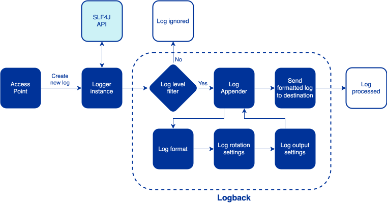
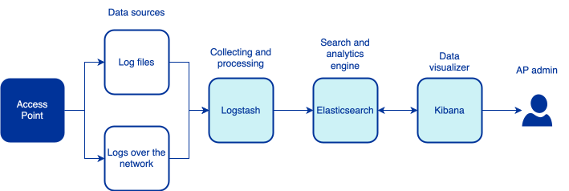

# Harmony eDelivery Access - Access Point Logging Guide

Version: 1.2  
Doc. ID: UG-AP-L

---

## Version history

| Date       | Version | Description                                                                   | Author       |
|------------|---------|-------------------------------------------------------------------------------|--------------|
| 13.12.2024 | 1.0     | Initial version                                                               | Diego Martin |
| 13.01.2025 | 1.1     | Update `org.apache.cxf` logger definition to match latest version             | Diego Martin |
| 30.07.2025 | 1.2     | Added direct Logstash logging from Logback; updated config and input sections | Diego Martin |

## License

This document is licensed under the Creative Commons Attribution-ShareAlike 4.0 International License.
To view a copy of this license, visit <https://creativecommons.org/licenses/by-sa/4.0/>

## Table of Contents

* [1 Introduction](#1-introduction)
  * [1.1 Target Audience](#11-target-audience)
  * [1.2 Terms and abbreviations](#12-terms-and-abbreviations)
  * [1.3 References](#13-references)
* [2 How the logging system works](#2-how-the-logging-system-works)
  * [2.1 Log lifecycle](#21-log-lifecycle)
* [3 Logback configuration in Harmony AP](#3-logback-configuration-in-harmony-ap)
  * [3.1 Logback configuration in Harmony AP Linux package](#31-logback-configuration-in-harmony-ap-linux-package)
    * [3.1.1 Viewing logs](#311-viewing-logs)
    * [3.1.2 Modifying the Logback configuration](#312-modifying-the-logback-configuration)
    * [3.1.3 Log rotation](#313-log-rotation)
  * [3.2 Logback configuration in Harmony AP Docker image](#32-logback-configuration-in-harmony-ap-docker-image)
    * [3.2.1 Viewing logs](#321-viewing-logs)
    * [3.2.2 Modifying the Logback configuration](#322-modifying-the-logback-configuration)
* [4 Enable logging of full messages for debugging](#4-enable-logging-of-full-messages-for-debugging)
* [5 Centralized logging](#5-centralized-logging)
  * [5.1 Sending logs from AP to Elasticsearch with Logstash](#51-sending-logs-from-ap-to-elasticsearch-with-logstash)
    * [5.1.1 Input configuration](#511-input-configuration)
      * [5.1.1.1 5.1.1.1 Send logs directly from Logback to Logstash](#5111-send-logs-directly-from-logback-to-logstash)
      * [5.1.1.2 Reading logs from log files](#5112-reading-logs-from-log-files)
      * [5.1.1.2 Using the GELF input plugin](#5113-using-the-gelf-input-plugin)
    * [5.1.2 Filter configuration](#512-filter-configuration)
    * [5.1.3 Output configuration](#513-output-configuration)
  * [5.2 Indexing and storing logs in Elasticsearch](#52-indexing-and-storing-logs-in-elasticsearch)
  * [5.3 Visualizing logs with Kibana](#53-visualizing-logs-with-kibana)
  * [5.4 Example Docker environment of Harmony AP with ELK stack](#54-example-docker-environment-of-harmony-ap-with-elk-stack)

## 1 Introduction

Harmony eDelivery Access Access Point (AP) generates logs that provide insights into the application's behavior, system events, and error messages. These logs are crucial for ensuring the system operates as intended.

This document provides guidance on how the AP generates logs and how to improve further the logging system.

### 1.1 Target Audience

This documentation is written for technical users (system administrators, DevOps, and engineers) who deploy or operate Harmony AP. Familiarity with the ELK stack is helpful but not strictly required.

### 1.2 Terms and abbreviations

The main terms used in this document are:

- **AP** - Access Point, a component that participants use to send and receive messages in an eDelivery network.
- **Logback** - A logging framework for Java applications. It provides a standardized way to log messages, helping developers capture, format, and manage logs for monitoring, diagnostics, and auditing.
- **SLF4J** - Simple Logging Facade for Java, a logging facade used by Logback. It provides a simple and consistent API for logging and can work with various logging frameworks, including Logback.
- **Standard Output (`stdout`)** - The default output stream where log messages are printed. Standard output typically refers to the console or terminal where the server process is running, enabling administrators to view logs in real time.
- **ELK** - ElasticSearch, Logstash, and Kibana, a set of tools used to collect, parse, and visualize logs.
- **GELF** - Graylog Extended Log Format, a structured log format used by Graylog for capturing logs.

### 1.3 References

1. <a id="Ref_IG-AP-D" class="anchor"></a>\[IG-AP-D\] Harmony eDelivery Access - Access Point Docker Installation Guide. Document ID: [IG-AP-D](harmony-ap_docker_installation_guide.md)
2. <a id="Ref_LOGBACK" class="anchor"></a>\[LOGBACK\] Logback Manual, <https://logback.qos.ch/manual/index.html>
3. <a id="Ref_LOGSTASH" class="anchor"></a>\[LOGSTASH\] Logstash Reference, <https://www.elastic.co/guide/en/logstash/current/index.html>
4. <a id="Ref_ELASTICSEARCH" class="anchor"></a>\[ELASTICSEARCH\] Elasticsearch Guide, <https://www.elastic.co/guide/en/elasticsearch/reference/current/index.html>
5. <a id="Ref_KIBANA" class="anchor"></a>\[KIBANA\] Kibana Guide, <https://www.elastic.co/guide/en/kibana/current/index.html>

## 2 How the logging system works

The logging system captures log messages generated by the AP and its underlying libraries, formats them, and directs them to various output destinations. Harmony AP uses Logback as its logging framework.

### 2.1 Log lifecycle

The log lifecycle consists of the following steps:

1. **Log generation**: AP generates log messages at various points in its execution. These messages can be at different log levels, such as `INFO`, `WARN`, `ERROR`, etc. These messages are created using an SLF4J `Logger` instance, which is the logging facade used by Logback.
2. **Log capture**: Logback checks the `Logger` log level of the message against its configured minimum log level in the Logback configuration to determine if the message should be processed. If the log level meets or exceeds the configured threshold, the message is processed further.
3. **Log appending**: Captured log messages are then sent to the appropriate appenders configured in Logback for the `Logger` instance. An appender is a component that determines how logs are formatted, rotated, and delivered to their destinations:
   - **Log formatting**: The log message is formatted according to the configuration specified in the appender. The formatting adds metadata like timestamps, log levels, thread information, and contextual data to log messages.
   - **Log rotation**: Logback can optionally manage log rotation by creating new log files when the current log file reaches a certain size or age. This feature helps prevent log files from becoming too large and consuming too much disk space.
   - **Log output**: Defines how processed log messages are sent to the output destination specified. This could be the console, a file, a remote server, or any other output destination configured in Logback.



For more information on Logback, refer to the Logback Manual \[[LOGBACK](#Ref_LOGBACK)\].

## 3 Logback configuration in Harmony AP

The configuration of Logback can vary depending on the deployment environment. The following sections describe how logging works in the Linux package and Docker image of Harmony AP.

### 3.1 Logback configuration in Harmony AP Linux package

The default configuration file for Logback is available in the [logback.xml](https://github.com/nordic-institute/harmony-common/blob/main/packaging/ap/config/logback.xml).

#### 3.1.1 Viewing logs

The logs are sent to the standard output or `stdout`, so they can be viewed in the terminal of the host where the AP is running by executing the following command:

```bash
journalctl -u harmony-ap
```

Logs are also saved in the following files located in the `/var/log/harmony-ap` directory:

- `security.log`: This log file contains all the security related information. For example, you can find information about the clients who connect to the application.
- `business.log`: This log file contains all the business-related information. For example, when a message is sent or received, etc.
- `domibus.log`: This log file contains both the security and business logs plus miscellaneous logs like debug information, logs from one of the framework used by the application, etc.
- `domibus-error.log`: This log file contains all the errors which occurred in Harmony including errors from third party libraries used by Harmony.
- `statistics.log`: This log file includes information on the occurrence of different events (receive message, submit message, etc.).

#### 3.1.2 Modifying the Logback configuration

Logback configuration in the Harmony AP Linux package is located at `/etc/harmony-ap/logback.xml`. To apply changes:

1. Edit the `logback.xml` file on the host machine.
2. Save the changes and restart the Harmony AP service:
   ```bash
   systemctl restart harmony-ap
   ```

#### 3.1.3 Log rotation

Log rotation is the process of managing log files to prevent them from becoming too large and consuming too much disk space. Log rotation is essential to ensure that log files are manageable and that the system does not run out of disk space.

By default, AP linux package uses the same configuration for all the logs saved into files:

- Maximum file size: Each log file can grow up to 30MB before a new file is created.
- Maximum history: Up to 60 days worth of log files are retained.
- Total size cap: The total size of all log files is capped at 20GB. If this limit is reached, older files are deleted to make room for new ones, independently of the maximum history setting.

The following example shows the default configuration for log rotation:

```xml
<rollingPolicy class="ch.qos.logback.core.rolling.SizeAndTimeBasedRollingPolicy">
  <fileNamePattern>${logdir}/statistics-%d{yyyy-MM-dd}.%i.log</fileNamePattern>
  <maxFileSize>30MB</maxFileSize>
  <maxHistory>60</maxHistory>
  <totalSizeCap>20GB</totalSizeCap>
</rollingPolicy>
```

### 3.2 Logback configuration in Harmony AP Docker image

The default configuration file for Logback is available in the [logback.xml](https://github.com/nordic-institute/harmony-common/blob/main/packaging/ap/docker/logback.xml).

#### 3.2.1 Viewing logs

Logs are sent to the standard output (`stdout`), this allows the logs to be captured by Docker and viewed using the `docker logs` command:

```bash
docker logs -f <container-name>
```

Since Docker handles log files, Logback does not save logs to the file system.

#### 3.2.2 Modifying the Logback configuration

To customize the Logback settings in the Harmony AP Docker image, you can choose one of the following methods:

-	Using the `LOGBACK_CONFIG_B64` environment variable by providing a custom Logback configuration file encoded in Base64 using this variable.
-	Mounting a custom configuration file into the container at the location specified by the `LOGBACK_CONFIG_PATH` environment variable. By default, this path is: `/var/opt/harmony-ap/etc/logback.xml`

For detailed instructions, refer to the _Adjusting Log Levels and Configuration_ section in the Access Point Docker Installation Guide [IG-AP-D](#Ref_IG-AP-D).

## 4 Enable logging of full messages for debugging

By default, AP logs do not include messages sent/received by the Access Point. In some situations, logging the full messages might be required for debugging purposes. In that case, the logging configuration can be changed.

The following steps describe how to enable logging of full messages in Harmony AP:

1. Open the Logback configuration file (`logback.xml`). Refer to the section on modifying the Logback configuration for the [Linux package](#312-modifying-the-logback-configuration) or [the Docker image](#322-modifying-the-logback-configuration) to locate the file.
2. Locate the logger configuration for the `org.apache.cxf` package.
3. Change the log level from `WARN` to `INFO`:
   ```xml
   <!-- In order to enable logging of request/responses please change the loglevel to INFO -->
   <logger name="org.apache.cxf" level="INFO">
     <appender-ref ref="stdout"/>
   </logger>
   ```
4. Restart the service if required by the *Modifying the Logback configuration* instructions for the deployment environment. 

## 5. Centralized logging

To monitor the system's status, users typically need to manually access the logs on the machine running AP. While this approach may suffice for some systems, it can be inefficient for others, particularly when managing multiple AP instances.

A centralized logging system is recommended to address this potential issue. It aggregates logs from one or more services, including AP instances, into a single platform. This approach simplifies system performance monitoring, troubleshooting, and log analysis.

The ELK stack is a popular solution for centralized logging, and this documentation focuses on its implementation. ELK combines tools for collecting, parsing, and visualizing logs from multiple sources. It consists of three components:

- **Elasticsearch**: A distributed search and analytics engine for storing and indexing log data.
- **Logstash**: A data processing pipeline for ingesting, processing, and forwarding logs to Elasticsearch.
- **Kibana**: A visualization tool for exploring and analyzing log data stored in Elasticsearch.

The following diagram illustrates the flow of logs from AP to the ELK stack:



### 5.1 Sending logs from AP to Elasticsearch with Logstash

To set up the ELK stack, the first step is installing and configuring Logstash. This section details how to configure Logstash to receive logs from AP and send them to Elasticsearch for storage and analysis. If the ELK stack isn't installed, refer to the provided [Docker setup example](#54-example-docker-environment-of-harmony-ap-with-elk-stack) for a quick start.

Logstash configuration consists of three main components:

1. **Input**: Defines how Logstash receives log messages.
2. **Filter**: Defines how Logstash parses and processes log messages.
3. **Output**: Defines where Logstash sends processed messages.

For additional details, refer to the [Logstash documentation](#Ref_LOGSTASH).

#### 5.1.1 Input configuration

The input configuration specifies how Logstash should receive log messages. Logstash supports various [input plugins](https://www.elastic.co/guide/en/logstash/current/input-plugins.html) that allow it to receive logs from different sources, we will focus on reading logs from log files and gelf as those are the most relevant for AP.

##### 5.1.1.1 Send logs directly from Logback to Logstash

Sending logs directly from the application provides the most efficient and real‑time integration with the ELK stack. Log events are encoded as JSON by Logback using the `logstash‑logback‑encoder` library and transmitted to Logstash. Because the logs are structured, they do not require parsing with Grok patterns.

By using this method, only logs generated by the application are sent to Logstash, logs from the system running the application won't be included. This method is suitable for both the Linux package and the Docker image of Harmony AP.

To use this method, define an appender in a custom `logback.xml` configuration that sends log events to Logstash. The following example illustrates how to configure a `LogstashTcpSocketAppender` with a `LoggingEventCompositeJsonEncoder`. It emits a rich JSON document including timestamp, level, thread, logger name, contextual data (MDC) and exception information:

```xml
<appender name="logstash" class="net.logstash.logback.appender.LogstashTcpSocketAppender">
  <!-- Destination can be a single host:port or a comma‑separated list for high availability -->
  <destination>logstash:5014</destination>

  <!-- Encode logging events as JSON.  Providers define the fields included in the JSON document -->
  <encoder class="net.logstash.logback.encoder.LoggingEventCompositeJsonEncoder">
    <providers>
      <timestamp>
        <fieldName>@timestamp</fieldName>
        <pattern>yyyy-MM-dd'T'HH:mm:ss.SSSZ</pattern>
      </timestamp>
      <logLevel fieldName="level"/>
      <threadName fieldName="thread"/>
      <loggerName fieldName="logger" shortenedLoggerNameLength="1"/>
      <pattern>
        <pattern>{ "line": "%domibusLine" }</pattern>
      </pattern>

      <!-- Include MDC context fields such as user, domain and message identifiers -->
      <mdc>
        <includeMdcKeyName>d_user</includeMdcKeyName>
        <includeMdcKeyName>d_domain</includeMdcKeyName>
        <includeMdcKeyName>d_messageId</includeMdcKeyName>
        <includeMdcKeyName>d_messageEntityId</includeMdcKeyName>
      </mdc>
      <message/>
      <stackTrace fieldName="exception"/>
    </providers>
  </encoder>
</appender>

<!-- Attach the appender to the relevant loggers.  This example sends all Domibus logs to Logstash. -->
<logger name="eu.domibus" level="INFO">
  <appender-ref ref="logstash"/>
</logger>
```

The official `logstash-logback-encoder` documentation provides more details on how to configure the appender and encoder: [Logstash Logback Encoder](https://github.com/logfellow/logstash-logback-encoder/blob/logstash-logback-encoder-7.4/README.md)

Once the appender is configured, Logstash should be set up to receive logs from the application. To configure Logstash you can use, for example, the [TCP input plugin](https://www.elastic.co/guide/en/logstash/current/plugins-inputs-tcp.html) or the [UDP input plugin](https://www.elastic.co/guide/en/logstash/current/plugins-inputs-udp.html). Also, the `json_lines` codec can be used to decode the logs sent by the appender. The `json_lines` codec ensures that each JSON object produced by the appender is decoded correctly. The following example shows how to configure Logstash to receive logs over TCP:

```
input {
  tcp {
    port => 5014         # must match the destination specified in the Logback configuration.
    codec => json_lines  # decode newline‑delimited JSON logs
  }
}
```

Sending logs directly from the application provides near real‑time ingestion into the ELK stack and reduces the need for additional collectors. Because events are already encoded as JSON, there is no need to define complex parsing rules in Logstash.

In this setup, Logstash becomes an optional component, as the application can send logs directly to Elasticsearch. However, Logstash is still useful for advanced processing, filtering, and enrichment of log messages before they are sent to Elasticsearch. Logstash provides also buffering, retry logic, and rate-limiting, which can be beneficial in production environments.

##### 5.1.1.2 Reading logs from log files

For systems that log to files, Logstash's [file input plugin](https://www.elastic.co/guide/en/logstash/current/plugins-inputs-file.html) can read logs directly from the filesystem. This plugin tails log files and supports log rotation.

By using this method, you can digest any logs that are written to a file, including logs from the system running the application, not just the application logs. This method is suitable for both the Linux package and the Docker image of Harmony AP.

Example Logstash configuration for reading logs from a file:

```conf
input {
  file {
    path => "/var/log/harmony-ap/domibus.log"
    codec => json
    start_position => "beginning"
    type => "harmony"
    sincedb_path => "/usr/share/logstash/sincedb"
  }
}
```

Here, we specify the log file's path, the codec for parsing log messages, the starting position when reading a file for the first time, the type of log messages for further processing, and the `sincedb` file path for tracking the log file's position. 

In more complex setups, integrating Filebeat into the system can be beneficial. Filebeat can read logs from files and either forward them to Logstash for advanced processing or send them directly to Elasticsearch when advanced log content processing is unnecessary. For more information, refer to the [Filebeat documentation](https://www.elastic.co/guide/en/beats/filebeat/current/index.html).

###### 5.1.1.3 Using the GELF input plugin

The [gelf input plugin](https://www.elastic.co/guide/en/logstash/current/plugins-inputs-gelf.html) enables Logstash to receive logs in GELF (Graylog Extended Log Format) format over the network.

By using this method, you can digest any logs produced by any Docker container that uses the GELF logging driver. This method is only suitable for the Docker image of Harmony AP.

Example configuration for receiving GELF logs:

```conf
input {
  gelf {
    port => 12201
  }
}
```

This configuration listens for GELF messages on port `12201`, which is the default GELF port.

To send logs to Logstash in GELF format from Docker, configure the Docker container's logging driver. For example:

```yaml
harmony-ap:
  image: niis/harmony-ap:<image tag>
  environment:
    - DB_HOST=harmony-db
    - DB_SCHEMA=harmony_ap
    - DB_PASSWORD=dbpassword
    - ADMIN_PASSWORD=Secret
    - USE_DYNAMIC_DISCOVERY=false
    - PARTY_NAME=org1_gw
    - SERVER_FQDN=harmony-ap
  logging:
    driver: gelf
    options:
      gelf-address: "udp://127.0.0.1:12201"
      tag: "harmony-ap"
```

#### 5.1.2 Filter configuration

Filter configuration defines how Logstash parses and processes log messages. Logstash provides various [filter plugins](https://www.elastic.co/guide/en/logstash/current/filter-plugins.html) that allow it to parse, transform, and enrich log messages. The filter configuration is optional.

When logs are emitted via Logstash using the JSON encoders described above, each event arrives as a structured JSON document. In many cases no additional parsing is necessary; you can directly use the fields created by the encoder in Kibana and Elasticsearch. However, filters remain useful for enriching logs (for example by adding geographic information or user details) or for renaming fields.

If your logs are unstructured, or you read text log files, you can use Grok filters to parse the log messages. The log structure is set by Logback in the encoder pattern used by the appender that generates the logs to be parsed. This information can be found in the Logback configuration file of Harmony AP for the [Linux package](#31-logback-configuration-in-harmony-ap-linux-package) or the [Docker image](#32-logback-configuration-in-harmony-ap-docker-image).

Depending on the log message structure, use the appropriate filter plugins to parse the log messages.

For example, given a Logback encoder pattern like the following, which is used in the AP Docker image:

```
%d{ISO8601} [%X{d_user}] [%X{d_domain}] [%X{d_messageId}] [%X{d_messageEntityId}] [%thread] %5p %c{1}:%domibusLine - %m%n
```

Using the [Grok filter plugin](https://www.elastic.co/guide/en/logstash/current/plugins-filters-grok.html), this Grok pattern could parse those log messages:

```conf
filter {
  grok {
    match => {
      "message" => "^%{TIMESTAMP_ISO8601:timestamp} \[%{DATA:d_user}\] \[%{DATA:d_domain}\] \[%{DATA:d_messageId}\] \[%{DATA:d_messageEntityId}\] \[%{DATA:thread}\]%{SPACE}%{LOGLEVEL:log_level} %{DATA:logger_class}:%{NUMBER:line_number} - %{GREEDYDATA:log_message}$"
    }
  }
}
```

Once the log messages are parsed, the individual fields are ready to be used for further processing in Logstash or stored in Elasticsearch as queryable fields for analysis, metrics, and visualization through Kibana.

#### 5.1.3 Output configuration

Output configuration specifies where processed logs are sent, by configuring [output plugins](https://www.elastic.co/guide/en/logstash/current/output-plugins.html).

Example configuration for sending logs to Elasticsearch:

```conf
output {
  elasticsearch {
    hosts => ["http://elasticsearch:9200"]
    user => "elastic"
    password => "password"
  }
}
```

Each log processed by Logstash is converted into a JSON document and send to the configured outputs. This document contains the log message fields extracted by Logstash during the parsing along with any additional field that was added during the processing.

### 5.2 Indexing and storing logs in Elasticsearch

Elasticsearch stores the documents sent by Logstash in indexes. Each document contains the fields extracted by Logstash. The data can be queried in real-time on large volumes due to efficient indexing.

The stored information can be queried through the APIs using Elasticsearch's query language, enabling users to search, filter, and aggregate log messages based on various criteria.

For more information on Elasticsearch, refer to the [Elasticsearch documentation](#Ref_ELASTICSEARCH).

### 5.3 Visualizing logs with Kibana

Kibana is a data visualization tool that allows users to explore, visualize, and analyze log data stored in Elasticsearch. Kibana provides an interface for creating dashboards, visualizations, alerts, reports, etc., based on the log data stored in Elasticsearch.

For more information on Kibana, refer to the [Kibana documentation](#Ref_KIBANA).

### 5.4 Example Docker environment of Harmony AP with ELK stack

To set up a Harmony AP instance with the ELK stack, you can use the provided setup that can be found in [this folder](examples/centralized_logging). Check the `README.md` in that folder for details on how to run it.
