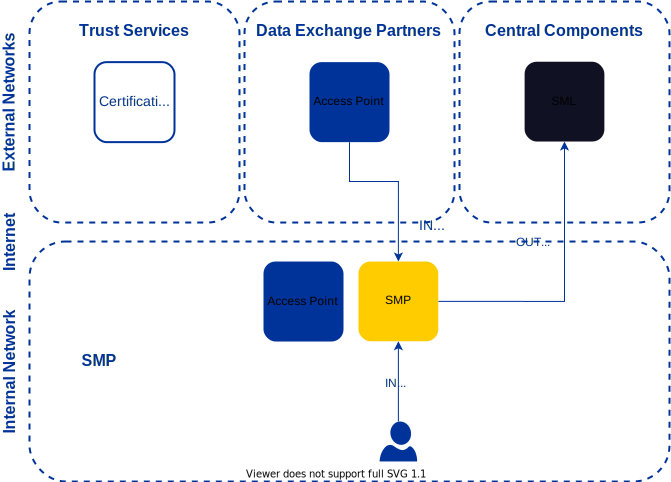

# Harmony eDelivery Access - Service Metadata Publisher Installation Guide <!-- omit in toc -->

Version: 1.2  
Doc. ID: IG-SMP

---

## Version history <!-- omit in toc -->

 Date       | Version | Description                                                     | Author
 ---------- | ------- | --------------------------------------------------------------- | --------------------
 15.11.2021 | 1.0     | Initial version                                                 |
 20.12.2021 | 1.1     | Add section [2.4 Preparing OS](#24-preparing-os)                | Petteri Kivimäki
 21.12.2021 | 1.2     | Add section [2.11 Securing SMP user interface](#211-securing-smp-user-interface) | Andres Allkivi
 
## License <!-- omit in toc -->

This document is licensed under the Creative Commons Attribution-ShareAlike 4.0 International License.
To view a copy of this license, visit <https://creativecommons.org/licenses/by-sa/4.0/>
 
## Table of Contents <!-- omit in toc -->

- [License](#license)
- [1 Introduction](#1-introduction)
  - [1.1 Target Audience](#11-target-audience)
  - [1.2 Terms and abbreviations](#12-terms-and-abbreviations)
  - [1.3 References](#13-references)
- [2 Installation](#2-installation)
  - [2.1 Prerequisites to Installation](#21-prerequisites-to-installation)
  - [2.2 Network Diagram](#22-network-diagram)
  - [2.3 Requirements for the Access Point](#23-requirements-for-the-smp)
  - [2.4 Preparing OS](#24-preparing-os)
  - [2.5 Setup Package Repository](#25-setup-package-repository)
  - [2.6 SMP Installation](#26-smp-installation)
  - [2.7 Starting harmony-ap service and enabling automatic startup](#27-starting-harmony-smp-service-and-enabling-automatic-startup)
  - [2.8 Post-Installation Checks](#28-post-installation-checks)
  - [2.9 Changes made to system during installation](#29-changes-made-to-system-during-installation)
  - [2.10 Location of configuration and generated passwords](#210-location-of-configuration-and-generated-passwords)
  - [2.11 Securing SMP user interface](#211-securing-smp-user-interface)

## 1 Introduction

Harmony eDelivery Access Service Metadata Publisher (SMP) enables dynamic discovery in eDelivery policy domains. Harmony eDelivery Access SMP is based on the SMP open source project by the European Commission.

### 1.1 Target Audience

This guide describes installation and post-installation procedures for Harmony eDelivery Access SMP.

The intended audience of this Installation Guide are SMP system administrators responsible for installing and using the SMP software.

The document is intended for readers with a moderate knowledge of Linux server management, computer networks, and the eDelivery working principles.

### 1.2 Terms and abbreviations

See eDelivery definitions documentation \[[TERMS](#Ref_TERMS)\].

### 1.3 References

1. <a id="Ref_TERMS" class="anchor"></a>\[TERMS\] CEF Definitions - eDelivery Definitions, <https://ec.europa.eu/cefdigital/wiki/display/CEFDIGITAL/CEF+Definitions#CEFDefinitions-eDeliveryDefinitions>
2. <a id="Ref_SMP_ADMIN_GUIDE" class="anchor"></a>\[SMP_ADMIN_GUIDE\] SMP Administration Guide - SMP 4.X, <https://ec.europa.eu/cefdigital/wiki/download/attachments/82773286/%28eDelivery%29%28SMP%29%28AG%29%28CEF%20SMP%204.1.1%29%283.1%29.pdf>
3. <a id="Ref_UG-DDCG" class="anchor"></a>\[UG-DDCG\] Harmony eDelivery Access - Dynamic Discovery Configuration Guide. Document ID: [UG-DDCG](dynamic_discovery_configuration_guide.md)

## 2. Installation

### 2.1 Prerequisites to Installation

The SMP is officially supported on the following platforms:

* Ubuntu Server 20.04 Long-Term Support (LTS) operating system on a x86-64 platform.

The software can be installed both on physical and virtualized hardware.

*Note*: If MySQL database engine is already installed then installation requires that `root` user can access database using UNIX
socket peer authentication without password.

*Note*: SMP and Access Point must not be installed on the same host because they both use port `8443`.

### 2.2 Network Diagram

The network diagram below provides an example of an SMP setup when dynamic discovery is used.



The table below lists the required connections between different components.

**Connection Type** | **Source** | **Target** | **Target Ports** | **Protocol** | **Note** |
-----------|------------|-----------|-----------|-----------|-----------|
Out | SMP | SML | 443, 8443, other | tcp | |
In  | Data Exchange Partner Access Point | SMP | 8443 | tcp | URL paths: `/{participantIdentifier}` and `/{participantIdentifier}/services/{documentIdentifier}` |
In | Admin | SMP | 8443 | tcp | Source in the internal network<br /><br />URL paths: `/` and `/ui` |

It is strongly recommended to protect the SMP from unwanted access using a firewall (hardware or software based). The firewall can be applied to both incoming and outgoing connections depending on the security requirements of the environment where the SMP is deployed. It is recommended to allow incoming traffic to specific ports only from explicitly defined sources using IP filtering. **Special attention should be paid with the firewall configuration since incorrect configuration may leave the SMP vulnerable to exploits and attacks.**

In addition, it's strongly recommended to use URL path filtering for the SMP since the admin UI and metadata query interface run on port `8443`.

**Port** | **URL Path** | **Description** |
---------|----------|-----------------|
 8443    | `/` | Landing page. |
 8443    | `/ui` | Admin UI for managing the SMP. |
 8443    | `/{participantIdentifier}` |  Service group query interface. |
 8443    | `/{participantIdentifier}/services/{documentIdentifier}` |  Metadata query interface. |

### 2.3 Requirements for the SMP

Minimum recommended hardware parameters:

* the server’s hardware (motherboard, CPU, network interface cards, storage system) must be supported by Ubuntu in general;
* a 64-bit dual-core Intel, AMD or compatible CPU; AES instruction set support is highly recommended;
* 4 GB RAM;
* a 100 Mbps network interface card.

Requirements to software and settings:

* an installed and configured Ubuntu 20.04 LTS x86-64 operating system;
* if the SMP is separated from other networks by a firewall and/or NAT, the necessary connections to and from the SMP are allowed;
* if the SMP has a private IP address, a corresponding NAT record must be created in the firewall;
* enabling auxiliary services which are necessary for the functioning and management of the operating system (such as DNS, NTP, and SSH) stay outside the scope of this guide.

### 2.4 Preparing OS

Some virtual machines may not be able to supply enough entropy that's required in key generation. It's recommended to
check the level of available entropy before the installation. It can be done by issuing the command below:

```
cat /proc/sys/kernel/random/entropy_avail
```

If the number returned by the command is less than 200, it indicates that there's not enough entropy available for 
the key generation. In that case, it's strongly recommended to install the `rng-tools` package before installing SMP:

```
sudo apt-get install rng-tools
```

### 2.5 Setup Package Repository

Add the Harmony eDelivery Access repository’s signing key to the list of trusted keys:
```
curl https://artifactory.niis.org/api/gpg/key/public | sudo apt-key add -
```

The repository key details:

- Hash: `935CC5E7FA5397B171749F80D6E3973B`
- Fingerprint: `A01B FE41 B9D8 EAF4 872F  A3F1 FB0D 532C 10F6 EC5B`
- 3rd party key server: [Ubuntu key server](https://keyserver.ubuntu.com/pks/lookup?search=0xfb0d532c10f6ec5b&fingerprint=on&op=index)

Add Harmony eDelivery Access package repository:
```
sudo apt-add-repository -y "deb https://artifactory.niis.org/harmony-release-deb $(lsb_release -sc)-current main"
```

Update package repository metadata:
```
sudo apt update
```

### 2.6 SMP Installation

Issue the following command to install the Harmony eDelivery Access SMP:
```
sudo apt install harmony-smp
```

Upon the first installation of the SMP, the system asks for the following information.

- `Distinguished Name` for generated self-signed content and transport certificates;
  - For example: `CN=example.com, O=My Organisation, C=FI`;
  - *Note:* different eDelivery policy domains may have different requirements for the `Distinguished Name`. If you're not sure about the requirements, please contact the domain authority of the policy domain where the SMP is registered.
- do you want the SMP installation to publish information to some Service Metadata Locator (SML);  
  - if yes then: 
    - full URL of the SML server;
    - full URL of this SMP server as seen from public Internet;
    - public IP address of this SMP server (reachable from public Internet);
- username of the administrative user - username to use to log in to administrative UI;
- initial password for the administrative user.

See the Dynamic Discovery Configuration Guide \[[UG-DDCG](dynamic_discovery_configuration_guide.md)\] for more information about how to configure dynamic discovery.

### 2.7 Starting harmony-smp Service and Enabling Automatic Startup 

To start `harmony-smp` service issue the following command:
```
sudo systemctl start harmony-smp
```

If you want `harmony-smp` service start at system startup issue the following command:
```
sudo systemctl enable harmony-smp
```

### 2.8 Post-Installation Checks

Ensure that the `harmony-smp` service is in the `running` state (example output follows):
  ```
  sudo systemctl list-units "harmony-smp*"

  UNIT                           LOAD   ACTIVE SUB     DESCRIPTION
  harmony-smp.service             loaded active running Harmony eDelivery Access - SMP
  ```

Ensure that the administrative user interface at `https://<host>:8443/` can be opened in a Web browser. To log in, use the administrative username and password chosen during the installation. While the user interface is still starting up, the Web browser may display a connection refused -error.

### 2.9 Changes Made to System During Installation

In addition to installing required dependencies, the installation process completes the following steps:
- creates linux user `harmony-smp` that is used to run the SMP service;
- creates MySQL database user `harmony_smp` and generates random password for it;
- creates MySQL database schema `harmony_smp` and populates it with needed metadata;
- loads initial configuration into database;
- generates self-signed certificates for content encryption and for transport encryption;
- installs `systemd` service `harmony-smp` but does not enable or start it.

### 2.10 Location of Configuration and Generated Passwords 

All SMP configuration files are located in the `/etc/harmony-smp` directory. See the SMP Administration Guide \[[SMP_ADMIN_GUIDE](#Ref_SMP_ADMIN_GUIDE])\] for more details.

During the installation process, multiple random passwords are generated.

| **Password purpose** | **Password location** |
|---|---|
| Password for `harmony-smp` MySQL user  | Configuration file: `/etc/harmony-smp/tomcat-conf/context.xml` |
| Content encryption keystore password | MySQL database table `SMP_CONFIGURATION` with key `smp.keystore.password`. **Note:** when the service is started the password will be encrypted. Content of this keystore can be changed using UI.|
| TLS keystore password | Configuration file: `/etc/harmony-smp/tomcat-conf/server.xml` |

### 2.11 Securing SMP user interface

For security reasons, it is highly recommended not to expose all SMP endpoints to public internet. Since all SMP endpoints
use the port `8443`, an application level firewall or proxy is needed.

To better protect SMP, a reverse proxy can be deployed between SMP and internet. For dynamic discovery purposes only
the endpoint for reading service metadata must be publicly accessible. SMP publishes service metadata from request path
`/{serviceGroupId}/services/{serviceMetadataId}`. Note that only `GET` requests should be publicly accessible. Instead, 
`PUT` and `DELETE` requests to the same path should be protected.

Here's an example configuration excerpt for NGINX HTTP server. The example assumes that `192.168.0.1` is address of SMP 
server behind reverse proxy: 

```
location ~ [^\/]*\/services\/[^\/]*$
{
  # this proxy_pass only applies to GET requests (all others are caught by limit_except below)
  proxy_pass http://192.168.0.1:8080
  
  limit_except GET {
    # deny all EXCEPT GET requests
    deny all;
  }
}
```

When SMP is behind a reverse proxy SSL connections have to be terminated at proxy and SMP reconfigured to accept plain
HTTP connections. Edit `/etc/harmony-smp/tomcat-conf/server.xml` and add additional connector for plain http connections:

```
<Connector port="8080" protocol="org.apache.coyote.http11.Http11AprProtocol"
           maxThreads="150"/>
```

For security reasons unencrypted connections should be used only between reverse proxy and SMP. To enforce this add
remote address valve to `Host` element in `server.xml`, enabling HTTP port access only from proxy.

Example assuming proxy IP address is 192.168.1.1:

```
<Valve className="org.apache.catalina.valves.RemoteAddrValve"
  addConnectorPort="true"
  allow="(.*;8443|192.168.1.1;8080)$"
/>
```

Please note that when registering SMP with SML, the externally visible address and hostname has to be used, i.e., the
address and hostname of reverse proxy, not address and hostname of SMP.