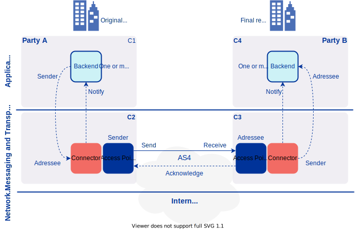

# Harmony eDelivery Access - Static Discovery Configuration Guide <!-- omit in toc -->

Version: 1.6  
Doc. ID: UG-SDCG

---

## Version history <!-- omit in toc -->

 Date       | Version | Description                                                                                                                         | Author
 ---------- |---------|-------------------------------------------------------------------------------------------------------------------------------------| --------------------
 30.12.2021 | 1.0     | Initial version                                                                                                                     | Petteri Kivimäki
 08.01.2022 | 1.1     | Remove sections about creating TLS truststore manually, update One-Way SSL configuration instructions, update example configuration | Petteri Kivimäki
 16.02.2022 | 1.2     | Minor updates on SSL configuration details                                                                                          | Petteri Kivimäki
 22.05.2023 | 1.3     | Updates on importing TLS certificates, changing the sign key alias and references                                                   | Petteri Kivimäki
 30.05.2023 | 1.4     | Update WS Plugin interface path                                                                                                     | Petteri Kivimäki
 14.09.2023 | 1.5     | Notes about using the containerized version                                                                                         | Jarkko Hyöty
 14.09.2023 | 1.6     | Default to PKCS12 keystores                                                                                                         | Jarkko Hyöty

## License <!-- omit in toc -->

This document is licensed under the Creative Commons Attribution-ShareAlike 4.0 International License.
To view a copy of this license, visit <https://creativecommons.org/licenses/by-sa/4.0/>
 
## Table of Contents <!-- omit in toc -->

<!-- vim-markdown-toc GFM -->

* [1 Introduction](#1-introduction)
  * [1.1 Target Audience](#11-target-audience)
  * [1.2 Terms and abbreviations](#12-terms-and-abbreviations)
  * [1.3 References](#13-references)
* [2. Configure Static Discovery](#2-configure-static-discovery)
  * [2.1 Prerequisites](#21-prerequisites)
    * [Note about Using Harmony Access Point Container Version](#note-about-using-harmony-access-point-container-version)
  * [2.2 Change the Sign Key Alias](#22-change-the-sign-key-alias)
  * [2.3 TLS Configuration](#23-tls-configuration)
    * [2.3.1 One-Way SSL](#231-one-way-ssl)
    * [2.3.2 Two-Way SSL](#232-two-way-ssl)
  * [2.4 Import Trusted Certificates to Truststores](#24-import-trusted-certificates-to-truststores)
    * [2.4.1 Import Trusted Sign Certificates](#241-import-trusted-sign-certificates)
    * [2.4.2 Import Trusted TLS Certificates](#242-import-trusted-tls-certificates)
  * [2.5 Export Certificates from Keystores](#25-export-certificates-from-keystores)
    * [2.5.1 Export Sign Certificates](#251-export-sign-certificates)
    * [2.5.2 Export TLS Certificates](#252-export-tls-certificates)
  * [2.6 Create Plugin Users](#26-create-plugin-users)
* [3. Example Configuration](#3-example-configuration)
  * [3.1 Prerequisites](#31-prerequisites)
  * [3.2 PMode Configuration](#32-pmode-configuration)
  * [3.3 Create Plugin Users](#33-create-plugin-users)
    * [3.3.1 Access Point 1](#331-access-point-1)
    * [3.3.2 Access Point 2](#332-access-point-2)
  * [3.4 Export Certificates](#34-export-certificates)
    * [3.4.1 Access Point 1](#341-access-point-1)
    * [3.4.2 Access Point 2](#342-access-point-2)
  * [3.5 Import Certificates](#35-import-certificates)
    * [3.5.1 Access Point 1](#351-access-point-1)
    * [3.5.2 Access Point 2](#352-access-point-2)
  * [3.6 Configure One-Way SSL](#36-configure-one-way-ssl)
  * [3.7 Apply Changes](#37-apply-changes)
  * [3.8 Send Test Message](#38-send-test-message)

<!-- vim-markdown-toc -->

## 1 Introduction

Harmony eDelivery Access supports static and dynamic discovery. This document describes configuration of participants and services for static discovery. This guide is divided in two different sections, a configuration guide and a practical configuration example.



### 1.1 Target Audience

This guide describes the configuration steps that are required for configuring static discovery on Harmony eDelivery Access Access Point.

The intended audience of this Static Discovery Configuration Guide are Access Point system administrators responsible for configuring the Access Point software.

The document is intended for readers with a moderate knowledge of Linux server management, computer networks, and the eDelivery working principles.

### 1.2 Terms and abbreviations

The main terms used in this document are:

- AP - Access Point, a component that participants use to send and receive messages in an eDelivery network.

See eDelivery documentation \[[TERMS](#Ref_TERMS)\].

### 1.3 References

1. <a id="Ref_TERMS" class="anchor"></a>\[TERMS\] eDelivery Documentation, <https://ec.europa.eu/digital-building-blocks/wikis/display/DIGITAL/eDelivery>
2. <a id="Ref_IG-AP" class="anchor"></a>\[IG-AP\] Harmony eDelivery Access - Access Point Installation Guide. Document ID: [IG-AS](harmony-ap_installation_guide.md)
3. <a id="Ref_DOMIBUS_ADMIN_GUIDE" class="anchor"></a>\[DOMIBUS_ADMIN_GUIDE\] Access Point Administration Guide - Domibus 5.1.0, <https://ec.europa.eu/digital-building-blocks/wikis/download/attachments/660440359/%28eDelivery%29%28AP%29%28AG%29%28Domibus%205.1%29%2819.6%29.pdf>
4. <a id="Ref_WS_PLUGIN" class="anchor"></a>\[WS_PLUGIN\] Access Point Interface Control Document - WS Plugin, <https://ec.europa.eu/digital-building-blocks/wikis/download/attachments/660440359/%28eDelivery%29%28AP%29%28ICD%29%28WS%20plugin%29%28Domibus%205.1%29%283.4%29.pdf>

## 2. Configure Static Discovery

### 2.1 Prerequisites

Before starting the static discovery configuration process, please complete the Access Point installation according to the installation guide:

- Harmony eDelivery Access - Access Point Installation Guide \[[IG-AS](harmony-ap_installation_guide.md)\].
  - During the installation, when the system asks do you want the Access Point installation to use dynamic discovery, please answer **No**.

Also, completing the configuration steps require command line access with root permissions to the host server.

The table below gives an overview of different keystore and truststore files that are accessed during the configuration process.

| **Keystore/truststore file**         | **Password location**                    | **Password property** | **Description** |
|--------------------------------------|------------------------------------------|-----------------------|----------------- |
| `/etc/harmony-ap/ap-keystore.p12`    | `/etc/harmony-ap/domibus.properties`     | `domibus.security.keystore.password` | Keystore for sign key and certificate. |
| `/etc/harmony-ap/ap-truststore.p12`  | `/etc/harmony-ap/domibus.properties`     | `domibus.security.truststore.password` | Truststore for trusted public sign certificates. |
| `/etc/harmony-ap/tls-keystore.p12`   | `/etc/harmony-ap/tomcat-conf/server.xml` | `keystorePass` | Keystore for TLS key and certificate. |
| `/etc/harmony-ap/tls-truststore.p12` | `/etc/harmony-ap/tomcat-conf/server.xml` | `truststorePass` | Truststore for trusted public TLS certificates. |


#### Note about Using Harmony Access Point Container Version

Harmony Access Point configuration is located at `/var/opt/harmony-ap/etc` instead of `/etc/harmony-ap` (for convinience, `/etc/harmony-ap` is a symbolic link to that directory).

The commands in the guide need to be executed inside the container. For example:

```bash
sudo keytool -keystore /etc/harmony-ap/ap-keystore.p12 -storepass <ap_keystore_password> -list
```

Can be run inside the container with [`docker exec`](https://docs.docker.com/engine/reference/commandline/exec/) (using "sudo" in the container is unnecessary):

```bash
docker exec -it <container name> keytool -keystore /etc/harmony-ap/ap-keystore.p12 -storepass <ap_keystore_password> -list
```

If editing configuration files manually is needed, files can be copied to/from a container using [`docker cp`](https://docs.docker.com/engine/reference/commandline/cp/).

### 2.2 Change the Sign Key Alias

Sign and TLS keys are automatically created during the Access Point installation process. The installation process 
prompts for the Access Point owner Party Name that is used as an alias for the keys. Sometimes, the Party Name of the
owner may not be known during the installation. In that case, `selfsigned` is used as the default value. In that case,
the sign key alias must be manually updated later, because it must match the party name of the Access Point owner. Instead, if 
the correct Party Name is set during the installation process, no manual configuration steps regarding the sign key alias
are required later.

The party name is defined in the `PMode` configuration file. See the Domibus Administration Guide 
\[[DOMIBUS_ADMIN_GUIDE](#Ref_DOMIBUS_ADMIN_GUIDE)\] for more details.

For example, this block from a `PMode` file is taken from an Access Point owned by a party whose party name is 
`org1_gw`. In this case, the alias of the sign key must be should `org1_gw`. If the Party Name wasn't set to `org1_gw`
 during the installation process, it must manually changed from `selfsigned` to `org1_gw`.

```xml
<?xml version="1.0" encoding="UTF-8"?>
<db:configuration xmlns:db="http://domibus.eu/configuration" party="org1_gw">
.
.
<parties>
    <partyIdTypes>
        <partyIdType name="partyTypeUrn" value="urn:oasis:names:tc:ebcore:partyid-type:unregistered"/>
    </partyIdTypes>
    <party name="org2_gw"
            endpoint="https://<HOST_OR_IP>:8443/services/msh">
        <identifier partyId="harmony-org2" partyIdType="partyTypeUrn"/>
    </party>
    <party name="org1_gw"
            endpoint="https://HOST_OR_IP:8443/services/msh">
        <identifier partyId="harmony-org1" partyIdType="partyTypeUrn"/>
    </party>
</parties>
```

The sign key is stored in `/etc/harmony-ap/ap-keystore.p12`. The password of the keystore can be found in the
`/etc/harmony-ap/domibus.properties` file in the `domibus.security.keystore.password` property or in the Properties
section of the Harmony Access Point UI. The alias is updated using the command below:

```bash
sudo keytool -changealias -alias "selfsigned" -destalias "<party_name>" -keypass <ap_keystore_password> -keystore /etc/harmony-ap/ap-keystore.p12 -storepass <ap_keystore_password>
```

Using the UI, reload the keystore to apply the changes:
1. Click Certificates/Keystores
2. Click "Reload KeyStore"

Also, the `domibus.security.key.private.alias` property must be updated with the new alias. The property value can 
be updated following the steps below:

1. Click Properties.
2. Search for `domibus.security.key.private.alias`.
3. Update the Property Value field with the new alias.
4. Click Save.

### 2.3 TLS Configuration

Harmony Access Points supports two possible configurations, One-Way SSL (default) and Two-Way SSL. See the Domibus 
Administration Guide \[[DOMIBUS_ADMIN_GUIDE](#Ref_DOMIBUS_ADMIN_GUIDE)\] for more details.

The TLS configuration is read from the `/etc/harmony-ap/clientauthentication.xml` file. The content of the file depends
on the configuration that's used.

**Note:** In the `/etc/harmony-ap/clientauthentication.xml` configuration examples, the `disableCNCheck` attribute specifies 
whether it is checked if the host name specified in the URL matches the host name specified in the Common Name (CN) of
the server's TLS certificate. In the examples the value is `true` which means that the check is disabled. However, in 
production environment the value should be set to `false`. In the default configuration the value of the `disableCNCheck` 
attribute is `false`.

#### 2.3.1 One-Way SSL

When One-Way SSL is used (default), the sender validates the signature of the receiver using the public certificate of 
the receiver. The public certificate of the receiver is expected to be present in the `/etc/harmony-ap/tls-truststore.p12` 
file. 

In the default configuration the value of the `disableCNCheck` attribute is `false`. However, if self-signed certificates 
are used, the value of the `disableCNCheck` attribute might need to be set to `true`. In that case, the 
`/etc/harmony-ap/clientauthentication.xml` file should look like this:

```xml
<http-conf:tlsClientParameters disableCNCheck="true" secureSocketProtocol="TLSv1.2"
                               xmlns:http-conf="http://cxf.apache.org/transports/http/configuration"
                               xmlns:security="http://cxf.apache.org/configuration/security">
    <security:trustManagers>
        <security:keyStore type="PKCS12" password="<tls_truststore_password>"
                           file="/etc/harmony-ap/tls-truststore.p12"/>
    </security:trustManagers>
</http-conf:tlsClientParameters>
```

Restart the `harmony-ap` service to apply the changes:

Ubuntu:
```bash
sudo systemctl restart harmony-ap
```

Docker container:
```bash
docker restart <container name>
```

#### 2.3.2 Two-Way SSL

In Two-Way SSL, both the sender and the receiver sign the request and validate the trust of the other party.
The public certificate of the receiver is expected to be present in the `/etc/harmony-ap/tls-truststore.p12` file. Also,
the private key of the sender that's stored in the `/etc/harmony-ap/tls-keystore.p12` file is configured. In the example
below, the use of self-signed certificates is enabled (`disableCNCheck="true"`). The 
`/etc/harmony-ap/clientauthentication.xml` file should look like this:

```xml
<http-conf:tlsClientParameters disableCNCheck="true" secureSocketProtocol="TLSv1.2"
                               xmlns:http-conf="http://cxf.apache.org/transports/http/configuration"
                               xmlns:security="http://cxf.apache.org/configuration/security">
    <security:trustManagers>
        <security:keyStore type="PKCS12" password="<tls_truststore_password>"
                           file="/etc/harmony-ap/tls-truststore.p12"/>
    </security:trustManagers>
    <security:keyManagers keyPassword="<tls_keystore_password>">
        <security:keyStore type="PKCS12" password="<tls_keystore_password>"
                           file="/etc/harmony-ap/tls-keystore.p12"/>
    </security:keyManagers>
</http-conf:tlsClientParameters>
```

Also, the Tomcat connector defined in the `/etc/harmony-ap/tomcat-conf/server.xml` must be updated. The `clientAuth` 
property must be set to `true`.

**Note:** Setting `clientAuth` to `true` affects all the Access Point's HTTP interfaces - including the admin UI and 
backend interface. In practise, after the change Two-Way SSL is required for the admin UI and backend interface too.

```xml
<Connector
           SSLEnabled="true"
           protocol="org.apache.coyote.http11.Http11NioProtocol"
           port="8443"
           maxThreads="200"
           scheme="https"
           secure="true"
           keystoreFile="/etc/harmony-ap/tls-keystore.p12"
           keystorePass="<tls_keystore_password>"
           truststoreFile="/etc/harmony-ap/tls-truststore.p12"
           truststorePass="<tls_truststore_password>"
           clientAuth="true"
           sslProtocol="TLS"
    />
```

Restart the `harmony-ap` service to apply the changes:

Ubuntu:
```bash
sudo systemctl restart harmony-ap
```

Docker container:
```bash
docker restart <container name>
```

### 2.4 Import Trusted Certificates to Truststores

Public certificates of trusted data exhange parties must be imported to sign and TLS truststores. The certificates 
may be self-signed or issued by a trusted certification authority. Self-signed certificates must be
imported to the truststore directly. Instead, certificates issued by a trusted certificate authority may be imported
directly or alternatively, the root certificate of the certificate authority may be imported. Please note that it's not
recommended to use self-signed certificates in production environments.

Depending on the trust model of the eDelivery policy domain where the Access Point is registered, certificate validation and
checks can be adjusted using the following properties in the `/etc/harmony-ap/domibus.properties` file:

| **Property** | **Default value** | **Description** |
|---|---|---|
| `domibus.sender.trust.validation.truststore_alias` | `true` | When enabled, Domibus will verify before receiving a message, that the sender's certificate matches the certificate in the truststore, loaded based on the alias (party name). |
| `domibus.sender.trust.validation.expression` | ` ` | When this property is not empty Domibus will verify before receiving a message, that the subject of the sender's certificate matches the regular expression. |
| `domibus.sender.certificate.subject.check` | `false` | When enabled, Domibus will verify before receiving a message, that the alias (party name) is present in the signing certificate subject. |
| `domibus.sender.trust.validation.onreceiving` | `true` | If activated Domibus will verify before receiving a message, the validity and authorization on the sender's certificate. When disabled, none of the other checks are performed on the sender's certificate. |

See the Domibus Administration Guide \[[DOMIBUS_ADMIN_GUIDE](#Ref_DOMIBUS_ADMIN_GUIDE)\] for more details regarding different configuration alternatives.

#### 2.4.1 Import Trusted Sign Certificates

The channel where trusted sign certificates of data exchange parties are distributed or published varies between 
different eDelivery policy domains. If you don't know where to get them, please contact the domain authority of 
the policy domain where the Access Point is registered.

Trusted sign certificates can be imported using the admin UI. The certificates can be imported as a PKCS12 bundle containing 
multiple certificates or separately for each party.

In the admin UI, a PKCS12 bundle can be imported by selecting Truststore and then Upload. Instead, a single sign certificate 
for a specific party can be imported following the steps below:

1. Click PMode and then Parties.
2. Select the Party which sign certificate you want to import and click Edit.
3. Click the Import button in the Certificate section.
4. Select the certificate to be imported.
5. Click OK and then click Save.

#### 2.4.2 Import Trusted TLS Certificates

The channel where trusted TLS certificates of data exchange parties are distributed or published varies between 
different eDelivery policy domains. If you don't know where to get them, please contact the domain authority of 
the policy domain where the Access Point is registered.

By default, the TLS truststore contains one trusted TLS certificate which is the Access Point's own public TLS certificate.
The alias of the Access Point's own TLS certificate is the party name of the Access Point owner. If the party name of the
owner wasn't defined during the installation process, the default value is `selfsigned`. If the same Access Point acts
as a sender and receiver, it must trust its own TLS certificate.

If the certificate to be imported is a TLS certificate of a data exchange party, it's recommended to use the party name
of the other party as an alias for the certificate. Instead, if the certificate to be imported is a root certificate
of a trusted certificate authority, then the name of the certificate authority is a good alternative to be used as an alias.

Trusted TLS certificates can be imported using the admin UI. The certificates can be imported as a PKCS12 bundle containing
multiple certificates or separately for each party. Trusted TLS certificates can be imported following the steps below:

1. Clieck Certificates and then TLS.
2. If you want to upload a PKCS12 bundle, click Upload.
  - Select the PKCS12 file to be uploaded.
  - Add the password of the PKCS12 file.
  - Click OK.
3. If you want to upload a single certificate for a specific party, click Add Certificate.
  - Select the certificate file to be uploaded.
  - Use the party name as the TLS certificate alias.
  - Click OK.

### 2.5 Export Certificates from Keystores

The channel where sign and TLS certificates of data exchange parties are distributed or published varies between 
different eDelivery policy domains. If you're not sure where to publish them, please contact the domain authority of 
the policy domain where the Access Point is registered. Whatever the channel is, the first step is to export the certificates
from sign and TLS keystores.

#### 2.5.1 Export Sign Certificates

A sign certificate belonging to a specific party can be exported using the following command (the default party name is `selfsigned`):

```bash
sudo keytool -export -keystore /etc/harmony-ap/ap-keystore.p12 -alias <party_name> -file </path/to/exported_sign_certificate.cer> -storepass <ap_keystore_password>
```

All the available sign keys can be listed using the following command:

```bash
keytool -list -v -keystore /etc/harmony-ap/ap-keystore.p12 -storepass <ap_keystore_password>
```

A sign key can be deleted using the following command:

```bash
sudo keytool -delete -noprompt -alias <party_name> -keystore /etc/harmony-ap/ap-keystore.p12 -storepass <ap_keystore_password>
```

#### 2.5.2 Export TLS Certificates

The default TLS certificate that's created during the installation process can be exported using the following command (the default party name is `selfsigned`):

```bash
sudo keytool -export -keystore /etc/harmony-ap/tls-keystore.p12 -alias <party_name> -file </path/to/exported_tls_certificate.cer> -storepass <tls_keystore_password>
```

All the available TLS keys can be listed using the following command:

```bash
keytool -list -v -keystore /etc/harmony-ap/tls-keystore.p12 -storepass <tls_keystore_password>
```

A TLS key can be deleted using the following command:

```bash
sudo keytool -delete -noprompt -alias <party_name> -keystore /etc/harmony-ap/tls-keystore.p12 -storepass <tls_keystore_password>
```

### 2.6 Create Plugin Users

Creating plugin users is not part of the actual static discovery configuration. However, configuring at least one plugin user
is required in order to be able to send or receive messages using the Harmony Access Point default configuration. By default,
the plugin security is activated and every request needs to be authenticated. The plugin security can be disabled by
setting the `domibus.auth.unsecureLoginAllowed` to `true` in the `/etc/harmony-ap/domibus.properties` configuration file.

A plugin must use a configured plugin user that represents an original user that is either `originalSender` or 
`finalRecipient`. `originalSender` sender is `C1` and `finalRecipient` is `C4` in the four corner model. In practice, 
the plugin user is used by the backend system connected to the Access Point. The backend system can be a message sender 
(`originalSender`) or a message receiver (`finalRecipient`). 

The management of the plugin users is implemented in the Plugin Users page in the admin UI. The value of the `Original User`
field must be the same that is used in the `originalSender` or `finalRecipient` field in an actual message. If the backend
system is in the sender role, the value of the `originalSender` field must be used. Instead, if the backend system is in 
the receiver role, the value of the `finalRecipient` field must be used.

For example, a backend system in the sender role would use `urn:oasis:names:tc:ebcore:partyid-type:unregistered:C1` in the
`Original User` field while a backend system in the receiver role would use `urn:oasis:names:tc:ebcore:partyid-type:unregistered:C4`.

```xml
.
.
<ns:MessageProperties>
   <ns:Property name="originalSender">urn:oasis:names:tc:ebcore:partyid-type:unregistered:C1</ns:Property>
   <ns:Property name="finalRecipient">urn:oasis:names:tc:ebcore:partyid-type:unregistered:C4</ns:Property>
</ns:MessageProperties>
.
.
```

The default WS Plugin supports basic authentication and TLS certificate based authentication. See the WS Plugin 
documentation \[[WS_PLUGIN](#Ref_WS_PLUGIN)\] for more details.

## 3. Example Configuration

This chapter includes a sample configuration that consists of two Harmony Access Points. After completing the configuration
steps described in this chapter, you should have two working Access Points that are able to exchange messages with 
each other. This configuration example uses self-signed certificates and One-Way SSL configuration.


 
The Access Points are owned by Organisation 1 and Organisation 2. The party name of the Access Point owned by Organisation 1 
is `org1_gw` and the party name of the Access Point owned by Organisation 2 is `org2_gw`. Organisation 1 acts as a 
sender (`originalSender`) and Organisation 2 acts as a recipient (`finalRecipient`). In the end, Organisation 1 will send
a push message to Organisation 2.

### 3.1 Prerequisites
    
Before starting the static discovery configuration process, please complete the Access Point installation according to the installation guide:

- Harmony eDelivery Access - Access Point Installation Guide \[[IG-AS](harmony-ap_installation_guide.md)\].
  - During the installation, when the system asks do you want the Access Point installation to use dynamic discovery, please answer **No**.
  - When Harmony Access Point owner Party Name is prompted during the installation process:
    - For Access Point 1, use `org1_gw` as Party Name.
    - For Access Point 2, use `org2_gw` as Party Name.

Also, completing the configuration steps require command line access with root permissions to the host server.

### 3.2 PMode Configuration

The PMode configuration files for the Access Points can be downloaded here:

- [Access Point 1 (org1_gw)](configuration_examples/static_discovery/pmode_org1.xml?raw=1);
- [Access Point 2 (org2_gw)](configuration_examples/static_discovery/pmode_org2.xml?raw=1).

Upload the PMode files to the Access Points using the admin UI. Then, replace `AP2_IP_OR_FQDN` in row 24 and 
`AP1_IP_OR_FQDN` in row 28 with the correct host names or IP addresses of the Access Points:

```xml
<party name="org2_gw"
        endpoint="https://AP2_IP_OR_FQDN:8443/services/msh">
    <identifier partyId="harmony-org2" partyIdType="partyTypeUrn"/>
</party>
<party name="org1_gw"
        endpoint="https://AP1_IP_OR_FQDN:8443/services/msh">
    <identifier partyId="harmony-org1" partyIdType="partyTypeUrn"/>
</party>
```

### 3.3 Create Plugin Users

Plugin users are created using the admin UI.

#### 3.3.1 Access Point 1

On the Access Point (`org1_gw`) create a plugin user with the following information:

- User Name: `org1`
- Original User: `urn:oasis:names:tc:ebcore:partyid-type:unregistered:C1`
- Role: `ROLE_USER`
- Password: choose a secure password
- Active: `checked`

Click OK and then Save.

#### 3.3.2 Access Point 2

On the Access Point (`org2_gw`) create a plugin user with the following information:

- User Name: `org2`
- Original User: `urn:oasis:names:tc:ebcore:partyid-type:unregistered:C4`
- Role: `ROLE_USER`
- Password: choose a secure password
- Active: `checked`

Click OK and then Save.

### 3.4 Export Certificates

The sign certificate is stored in `/etc/harmony-ap/ap-keystore.p12`. The password of the keystore can be found in the
`/etc/harmony-ap/domibus.properties` file in the `domibus.security.keystore.password` property or in the Properties
section of the Harmony Access Point UI. 

The TLS certificate is stored in `/etc/harmony-ap/tls-keystore.p12`. The password of the keystore can be found in the
`/etc/harmony-ap/tomcat-conf/server.xml` file in the `keystorePass` property. 

This step requires shell access to the host.

#### 3.4.1 Access Point 1

Export the sign certificate using the following command:

```bash
sudo keytool -export -keystore /etc/harmony-ap/ap-keystore.p12 -alias org1_gw -file org1_sign_certificate.cer -storepass <ap_keystore_password>
```

Export the TLS certificate using the following command:

```bash
sudo keytool -export -keystore /etc/harmony-ap/tls-keystore.p12 -alias org1_gw -file org1_tls_certificate.cer -storepass <tls_keystore_password>
```

#### 3.4.2 Access Point 2

Export the sign certificate using the following command:

```bash
sudo keytool -export -keystore /etc/harmony-ap/ap-keystore.p12 -alias org2_gw -file org2_sign_certificate.cer -storepass <ap_keystore_password>
```

Export the TLS certificate using the following command:

```bash
sudo keytool -export -keystore /etc/harmony-ap/tls-keystore.p12 -alias org2_gw -file org2_tls_certificate.cer -storepass <tls_keystore_password>
```

### 3.5 Import Certificates

In order to establish a trusted relationship between the Access Points, they must import each others certificates. 
Therefore, the certificates exported in section 3.6 must be copied from Access Point 1 (`org1_gw`) to Access Point 2 
(`org2_gw`) and vice versa.

#### 3.5.1 Access Point 1

The sign certificate of the Access Point 2 (`org2_gw`) is imported using the admin UI by following the steps below:

1. Click PMode and then Parties.
2. Select the party `org2_gw` and click Edit.
3. Click the Import button in the Certificate section.
4. Select the certificate to be imported (`org2_sign_certificate.cer`).
5. Click OK and then click Save.

The TLS certificate of the Access Point 2 (`org2_gw`) is imported using the admin UI by following the steps below:

1. Click Certificates and then TLS.
2. Click Add Certificate.
3. Select the certificate file to be uploaded (`org2_tls_certificate.cer`).
4. Use the party name `org2_gw` as the TLS certificate alias.
5. Click OK.

#### 3.5.2 Access Point 2

The sign certificate of the Access Point 1 (`org1_gw`) is imported using the admin UI by following the steps below:

1. Click PMode and then Parties.
2. Select the party `org1_gw` and click Edit.
3. Click the Import button in the Certificate section.
4. Select the certificate to be imported (`org1_sign_certificate.cer`).
5. Click OK and then click Save.

The TLS certificate of the Access Point 1 (`org1_gw`) is imported using the admin UI by following the steps below:

1. Click Certificates and then TLS.
2. Click Add Certificate.
3. Select the certificate file to be uploaded (`org1_tls_certificate.cer`).
4. Use the party name `org1_gw` as the TLS certificate alias.
5. Click OK.

### 3.6 Configure One-Way SSL

This step requires shell access to the host.

One-Way SSL is configured by default. However, the configuration should be updated to disable the host name verification
of the TLS certificate. On Access Points 1 (`org1_gw`) and Access Point 2 (`org2_gw`), set the value of the `disableCNCheck`
 attribute to `true` in the `/etc/harmony-ap/clientauthentication.xml` configuration file:

```xml
<http-conf:tlsClientParameters disableCNCheck="true" secureSocketProtocol="TLSv1.2"
                               xmlns:http-conf="http://cxf.apache.org/transports/http/configuration"
                               xmlns:security="http://cxf.apache.org/configuration/security">
    <security:trustManagers>
        <security:keyStore type="PKCS12" password="<tls_truststore_password>"
                           file="/etc/harmony-ap/tls-truststore.p12"/>
    </security:trustManagers>
</http-conf:tlsClientParameters>
```

### 3.7 Apply Changes

This step requires shell access to the host.

On Access Points 1 (`org1_gw`) and Access Point 2 (`org2_gw`), restart the `harmony-ap` service to apply the 
configuration changes:

```bash
sudo systemctl restart harmony-ap
```

### 3.8 Send Test Message

Send a request to Access Point 1 (`org1_gw`) using the curl command below. The request (`submitRequest.xml`) can be downloaded [here](configuration_examples/static_discovery/submitRequest.xml?raw=1). The content inside the payload's `value` element must be [base64 encoded](https://www.base64encode.org/).

```bash
curl -u org1:<org1_plugin_user_password> --header "Content-Type: text/xml;charset=UTF-8" --data @submitRequest.xml https://<AP1_IP_OR_FQDN>:8443/services/wsplugin -v -k
```

A successful response looks like this:

```xml
<?xml version="1.0" encoding="UTF-8"?>
<soap:Envelope xmlns:soap="http://www.w3.org/2003/05/soap-envelope">
   <soap:Body>
      <ns2:submitResponse xmlns:ns2="http://org.ecodex.backend/1_1/" xmlns:ns3="http://docs.oasis-open.org/ebxml-msg/ebms/v3.0/ns/core/200704/" xmlns:ns4="http://www.w3.org/2003/05/soap-envelope" xmlns:xmime="http://www.w3.org/2005/05/xmlmime">
         <messageID>bd3ea132-6a0d-11ec-9789-0af9f1d3371a@edelivery.digital</messageID>
      </ns2:submitResponse>
   </soap:Body>
</soap:Envelope>
```

List received and pending messages on the Access Point 2 (`org2_gw`). The request (`listPendingMessagesRequest.xml`) can be downloaded [here](configuration_examples/static_discovery/listPendingMessagesRequest.xml?raw=1).

```bash
curl -u org2:<org2_plugin_user_password> --header "Content-Type: text/xml;charset=UTF-8" --data @listPendingMessagesRequest.xml https://<AP2_IP_OR_FQDN>:8443/services/wsplugin -v -k
```

A successful response looks like this:

```xml
<?xml version="1.0" encoding="UTF-8"?>
<soap:Envelope xmlns:soap="http://www.w3.org/2003/05/soap-envelope">
   <soap:Body>
      <ns2:listPendingMessagesResponse xmlns:ns2="http://org.ecodex.backend/1_1/" xmlns:ns3="http://docs.oasis-open.org/ebxml-msg/ebms/v3.0/ns/core/200704/" xmlns:ns5="http://www.w3.org/2003/05/soap-envelope" xmlns:xmime="http://www.w3.org/2005/05/xmlmime">
         <messageID>bd3ea132-6a0d-11ec-9789-0af9f1d3371a@edelivery.digital</messageID>
      </ns2:listPendingMessagesResponse>
   </soap:Body>
</soap:Envelope>
```

Retrieve the test message from Access Point 2 (`org2_gw`). The request (`retrieveMessageRequest.xml`) can be downloaded [here](configuration_examples/static_discovery/retrieveMessageRequest.xml?raw=1). Before sending the message, replace the `MESSAGE_ID` placeholder with the ID (`messageID`) of the test message.

```bash
curl -u org2:<org2_plugin_user_password> --header "Content-Type: text/xml;charset=UTF-8" --data @retrieveMessageRequest.xml https://<AP2_IP_OR_FQDN>:8443/services/wsplugin -v -k
```

A successful response looks like this:

```xml
<?xml version="1.0" encoding="UTF-8"?>
<soap:Envelope xmlns:soap="http://www.w3.org/2003/05/soap-envelope">
   <soap:Header>
      <ns5:Messaging xmlns:ns5="http://docs.oasis-open.org/ebxml-msg/ebms/v3.0/ns/core/200704/" xmlns:ns4="http://org.ecodex.backend/1_1/" xmlns:xmime="http://www.w3.org/2005/05/xmlmime" mustUnderstand="false">
         <ns5:UserMessage mpc="http://docs.oasis-open.org/ebxml-msg/ebms/v3.0/ns/core/200704/defaultMPC">
            <ns5:MessageInfo>
               <ns5:Timestamp>2021-12-31T07:58:07.003</ns5:Timestamp>
               <ns5:MessageId>bd3ea132-6a0d-11ec-9789-0af9f1d3371a@edelivery.digital</ns5:MessageId>
            </ns5:MessageInfo>
            <ns5:PartyInfo>
               <ns5:From>
                  <ns5:PartyId type="urn:oasis:names:tc:ebcore:partyid-type:unregistered">harmony-org1</ns5:PartyId>
                  <ns5:Role>http://docs.oasis-open.org/ebxml-msg/ebms/v3.0/ns/core/200704/initiator</ns5:Role>
               </ns5:From>
               <ns5:To>
                  <ns5:PartyId type="urn:oasis:names:tc:ebcore:partyid-type:unregistered">harmony-org2</ns5:PartyId>
                  <ns5:Role>http://docs.oasis-open.org/ebxml-msg/ebms/v3.0/ns/core/200704/responder</ns5:Role>
               </ns5:To>
            </ns5:PartyInfo>
            <ns5:CollaborationInfo>
               <ns5:Service type="tc1">bdx:noprocess</ns5:Service>
               <ns5:Action>TC1Leg1</ns5:Action>
               <ns5:ConversationId>bd3ea133-6a0d-11ec-9789-0af9f1d3371a@edelivery.digital</ns5:ConversationId>
            </ns5:CollaborationInfo>
            <ns5:MessageProperties>
               <ns5:Property name="originalSender">urn:oasis:names:tc:ebcore:partyid-type:unregistered:C1</ns5:Property>
               <ns5:Property name="finalRecipient">urn:oasis:names:tc:ebcore:partyid-type:unregistered:C4</ns5:Property>
            </ns5:MessageProperties>
            <ns5:PayloadInfo>
               <ns5:PartInfo href="cid:message">
                  <ns5:PartProperties>
                     <ns5:Property name="MimeType">text/xml</ns5:Property>
                  </ns5:PartProperties>
               </ns5:PartInfo>
            </ns5:PayloadInfo>
         </ns5:UserMessage>
      </ns5:Messaging>
   </soap:Header>
   <soap:Body>
      <ns2:retrieveMessageResponse xmlns:ns2="http://org.ecodex.backend/1_1/" xmlns:ns3="http://docs.oasis-open.org/ebxml-msg/ebms/v3.0/ns/core/200704/" xmlns:ns5="http://www.w3.org/2003/05/soap-envelope" xmlns:xmime="http://www.w3.org/2005/05/xmlmime">
         <payload payloadId="cid:message">
            <value>PD94bWwgdmVyc2lvbj0iMS4wIiBlbmNvZGluZz0iVVRGLTgiPz4KPGhlbGxvPndvcmxkPC9oZWxsbz4=</value>
         </payload>
      </ns2:retrieveMessageResponse>
   </soap:Body>
</soap:Envelope>
```

The content inside the payload's `value` element is base64 encoded. After [decoding](https://www.base64decode.org/), the value looks like this:

```xml
<?xml version="1.0" encoding="UTF-8"?>
<hello>world</hello>
```

If you want to try sending the same message from Access Point 2 (`org2_gw`) to Access Point 1 (`org1_gw`), just switch
the values of the `From` and `To`, and `originalSender` and `finalRecipient` properties:

```xml
<ns:PartyInfo>
   <ns:From>
      <ns:PartyId type="urn:oasis:names:tc:ebcore:partyid-type:unregistered">harmony-org2</ns:PartyId>
      <ns:Role>http://docs.oasis-open.org/ebxml-msg/ebms/v3.0/ns/core/200704/initiator</ns:Role>
   </ns:From>
   <ns:To>
      <ns:PartyId type="urn:oasis:names:tc:ebcore:partyid-type:unregistered">harmony-org1</ns:PartyId>
      <ns:Role>http://docs.oasis-open.org/ebxml-msg/ebms/v3.0/ns/core/200704/responder</ns:Role>
   </ns:To>
</ns:PartyInfo>
.
.
<ns:MessageProperties>
   <ns:Property name="originalSender">urn:oasis:names:tc:ebcore:partyid-type:unregistered:C4</ns:Property>
   <ns:Property name="finalRecipient">urn:oasis:names:tc:ebcore:partyid-type:unregistered:C1</ns:Property>
</ns:MessageProperties>
```

Then, send the updated request to Access Point 2 (`org2_gw`) using the curl command below. The request (`submitRequestSwitched.xml`) can be downloaded [here](configuration_examples/static_discovery/submitRequestSwitched.xml?raw=1).

```bash
curl -u org2:<org2_plugin_user_password> --header "Content-Type: text/xml;charset=UTF-8" --data @submitRequestSwitched.xml https://<AP2_IP_OR_FQDN>:8443/services/wsplugin -v -k
```
